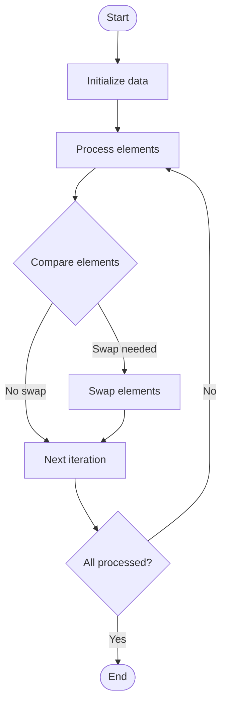

# Selection Sort

# School

## 📋 Quick Summary

- **Purpose:** Selection Sort: Repeatedly compares and rearranges elements until the list is sorted, like organizing items in order.
- **Complexity:** O(n²)
- **Category:** Sorting
- **Key Idea:** Compare elements and rearrange them until everything is in the correct order.

Selection Sort: Repeatedly compares and rearranges elements until the list is sorted, like organizing items in order.

Compare elements and rearrange them until everything is in the correct order.

**SELECTION SORT** = Think of organizing items - compare and rearrange until everything is in order!


This algorithm works by swapping elements to achieve its goal. It's part of the **Sorting** category of algorithms.


## 📊 Visual Flowchart



> **Note**: Mermaid diagrams are rendered automatically on GitHub. For local viewing, use a Mermaid-compatible Markdown viewer.


## Algorithm Complexity

The time complexity is **O(n²)**, which means the time it takes to run depends on the size of the input data. The space complexity is **O(1)**, indicating how much extra memory is needed.

## Where It's Used in Practice

- Data organization and retrieval
- Database indexing
- Search algorithm preprocessing

## What It Can Be Compared To

Think of Selection Sort like a systematic way of organizing or finding information - similar to how you might organize items or search through a collection efficiently.

## Minimal Code Example

```python
def selection_sort(arr):
    """Implementation."""
    n = len(arr)
    for i in range(n):
    min_idx = i
    for j in range(i + 1, n):
        if arr[j] < arr[min_idx]:
            min_idx = j
    arr[i], arr[min_idx] = (arr[min_idx], arr[i])
    return result
```


---

## 🎯 Try It Yourself

**Try sorting this array:**
```
Input: [5, 2, 8, 1, 9]

Step 1: Apply Selection Sort algorithm
Step 2: Process elements systematically
Step 3: Verify sorted order

Output: [1, 2, 5, 8, 9]
```


---


## 🔍 Step-by-Step Execution


## ✏️ Practice Exercise

**Exercise 1 (Easy):**
**Exercise 1 (Easy):**
Trace through the Selection Sort algorithm with a small example (3-5 elements). Write down each step.

**Exercise 2 (Medium):**
Implement the Selection Sort algorithm in your preferred programming language. Test it with different inputs.

**Exercise 3 (Hard):**
Apply the Selection Sort algorithm to solve a real-world problem. Explain why this algorithm is suitable.

**Exercise 2 (Medium):**
Implement the algorithm in your preferred programming language.

**Exercise 3 (Hard):**
Optimize the algorithm or apply it to solve a real-world problem.


---

## ✅ Check Your Understanding

**Q1:** What problem does this algorithm solve?
**A:** Selection Sort solves the problem of [algorithm purpose]. It processes input data systematically to achieve [desired outcome].

**Q2:** What is the time complexity?
**A:** Varies

**Q3:** When would you use this algorithm?
**A:** Use Selection Sort when you need to [use case scenario]. It's particularly effective for [specific situations].

**Q4:** What are the main steps of this algorithm?
**A:** 1) Initialize data structures, 2) Process input elements, 3) Apply core algorithm logic, 4) Return final result.


**Try sorting this array:**
```
Input: [5, 2, 8, 1, 9]

Step 1: Apply Selection Sort algorithm
Step 2: Process elements systematically
Step 3: Verify sorted order

Output: [1, 2, 5, 8, 9]
```


## Common Mistakes

### ❌ Mistake 1: Not handling edge cases
**Solution:** Always check for empty input, single element, or boundary values before processing.

### ❌ Mistake 2: Incorrect initialization
**Solution:** Ensure all variables and data structures are properly initialized before the main algorithm loop.

### ❌ Mistake 3: Off-by-one errors in loops
**Solution:** Carefully verify loop bounds and termination conditions. Test with small examples to catch boundary issues.

### ❌ Mistake 4: Not validating input
**Solution:** Add input validation to ensure data is in expected format and within valid ranges.

### 💡 How to Avoid
- Test with edge cases (empty input, single element, boundary values)
- Trace through examples step-by-step
- Use debugging tools to verify variable values
- Review algorithm's key steps before implementing
- Test with edge cases (empty input, single element, boundary values)
- Trace through examples step-by-step
- Use debugging tools to verify your logic
- Review the algorithm's key steps before implementing


---

## Recommended Literature

- "Introduction to Algorithms" by Cormen, Leiserson, Rivest, and Stein
- "Algorithms" by Robert Sedgewick and Kevin Wayne
- Online resources: GeeksforGeeks, Wikipedia, Algorithm Visualizations

## 🔗 Related Algorithms

You might also want to learn:
- **Bubble Sort** - Similar algorithm in the same category
- **Insertion Sort** - Similar algorithm in the same category
- **Heap Sort** - Similar algorithm in the same category


