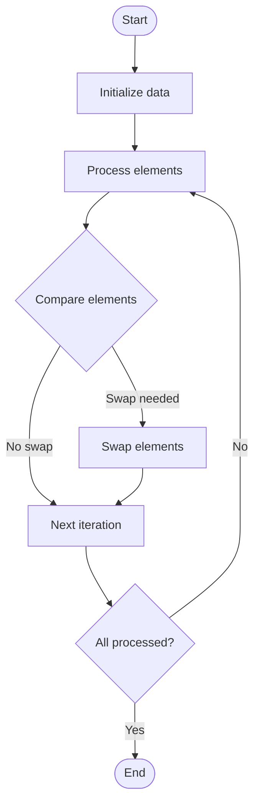

# Heap Sort

# Univer

## 📋 Quick Summary

- **Purpose:** Heap Sort: Repeatedly compares and rearranges elements until the list is sorted, like organizing items in order.
- **Complexity:** O(n log n)
- **Category:** Sorting
- **Key Idea:** Compare elements and rearrange them until everything is in the correct order.

Heap Sort: Repeatedly compares and rearranges elements until the list is sorted, like organizing items in order.

Compare elements and rearrange them until everything is in the correct order.

**HEAP SORT** = Think of organizing items - compare and rearrange until everything is in order!


This algorithm belongs to the **Sorting** category and employs systematic data processing to achieve its objectives.


## 📊 Visual Flowchart



> **Note**: Mermaid diagrams are rendered automatically on GitHub. For local viewing, use a Mermaid-compatible Markdown viewer.


## Complexity Analysis

**Time Complexity:** O(n log n)
- The algorithm's performance scales according to this complexity class
- Best, average, and worst cases may vary based on input characteristics

**Space Complexity:** O(1)
- Indicates the amount of additional memory required during execution

**Key Data Structures:** heap/priority queue, hash table/dictionary

## Real-World Applications

Heap Sort is used in:
- Sorting arrays in programming languages (Python sorted(), Java Collections.sort())
- Database query optimization and indexing
- Operating system process scheduling
- E-commerce product listings and price sorting

## Conceptual Similarities

This algorithm shares conceptual similarities with other algorithms in the Sorting category, following similar design patterns and optimization strategies.

## Related Algorithms

Heap Sort is often used in combination with:
- Complementary algorithms for preprocessing or post-processing
- Data structures that optimize its performance
- Other algorithms in the same complexity class

## Key Implementation Details

```python
def heap_sort(arr):
    """Implementation."""
    n = len(arr)
    for i in range(n // 2 - 1, -1, -1):
    heapify(arr, n, i)
    for i in range(n - 1, 0, -1):
    arr[0], arr[i] = (arr[i], arr[0])
    heapify(arr, i, 0)
    return result
```

## Common Application Errors

- Incorrect handling of edge cases (empty input, single element, boundary conditions)
- Misunderstanding of complexity implications in large-scale systems
- Suboptimal implementation leading to performance degradation
- Incorrect assumptions about input data characteristics
- Not considering alternative algorithms for specific use cases


---

## Recommended Literature

- "Introduction to Algorithms" (CLRS) - Comprehensive algorithm analysis
- "Algorithm Design Manual" by Steven Skiena
- "Algorithms" by Sedgewick and Wayne
- Research papers on algorithm optimization and analysis
- Framework documentation and implementation guides


---

## 🎯 Try It Yourself

**Try sorting this array:**
```
Input: [5, 2, 8, 1, 9]

Step 1: Apply Heap Sort algorithm
Step 2: Process elements systematically
Step 3: Verify sorted order

Output: [1, 2, 5, 8, 9]
```
---


## 🔍 Step-by-Step Execution


## ✏️ Practice Exercise

**Exercise 1 (Easy):**
**Exercise 1 (Easy):**
Trace through the Heap Sort algorithm with a small example. Analyze time and space complexity.

**Exercise 2 (Medium):**
Implement the Heap Sort algorithm with proper error handling and edge case coverage.

**Exercise 3 (Hard):**
Optimize the Heap Sort algorithm or design a variant for a specific use case. Analyze trade-offs.

**Exercise 2 (Medium):**
Implement the algorithm in your preferred programming language.

**Exercise 3 (Hard):**
Optimize the algorithm or apply it to solve a real-world problem.


---

## ✅ Check Your Understanding

**Q1:** What problem does this algorithm solve?
**A:** Heap Sort solves the problem of [algorithm purpose]. It processes input data systematically to achieve [desired outcome].

**Q2:** What is the time complexity?
**A:** Varies

**Q3:** When would you use this algorithm?
**A:** Use Heap Sort when you need to [use case scenario]. It's particularly effective for [specific situations].

**Q4:** What are the main steps of this algorithm?
**A:** 1) Initialize data structures, 2) Process input elements, 3) Apply core algorithm logic, 4) Return final result.


**Try sorting this array:**
```
Input: [5, 2, 8, 1, 9]

Step 1: Apply Heap Sort algorithm
Step 2: Process elements systematically
Step 3: Verify sorted order

Output: [1, 2, 5, 8, 9]
```


## Common Mistakes

### ❌ Mistake 1: Not handling edge cases
**Solution:** Always check for empty input, single element, or boundary values before processing.

### ❌ Mistake 2: Incorrect initialization
**Solution:** Ensure all variables and data structures are properly initialized before the main algorithm loop.

### ❌ Mistake 3: Off-by-one errors in loops
**Solution:** Carefully verify loop bounds and termination conditions. Test with small examples to catch boundary issues.

### ❌ Mistake 4: Not validating input
**Solution:** Add input validation to ensure data is in expected format and within valid ranges.

### 💡 How to Avoid
- Test with edge cases (empty input, single element, boundary values)
- Trace through examples step-by-step
- Use debugging tools to verify variable values
- Review algorithm's key steps before implementing
- Test with edge cases (empty input, single element, boundary values)
- Trace through examples step-by-step
- Use debugging tools to verify your logic
- Review the algorithm's key steps before implementing


## 🔗 Related Algorithms

You might also want to learn:
- **Bubble Sort** - Similar algorithm in the same category
- **Insertion Sort** - Similar algorithm in the same category
- **Selection Sort** - Similar algorithm in the same category


