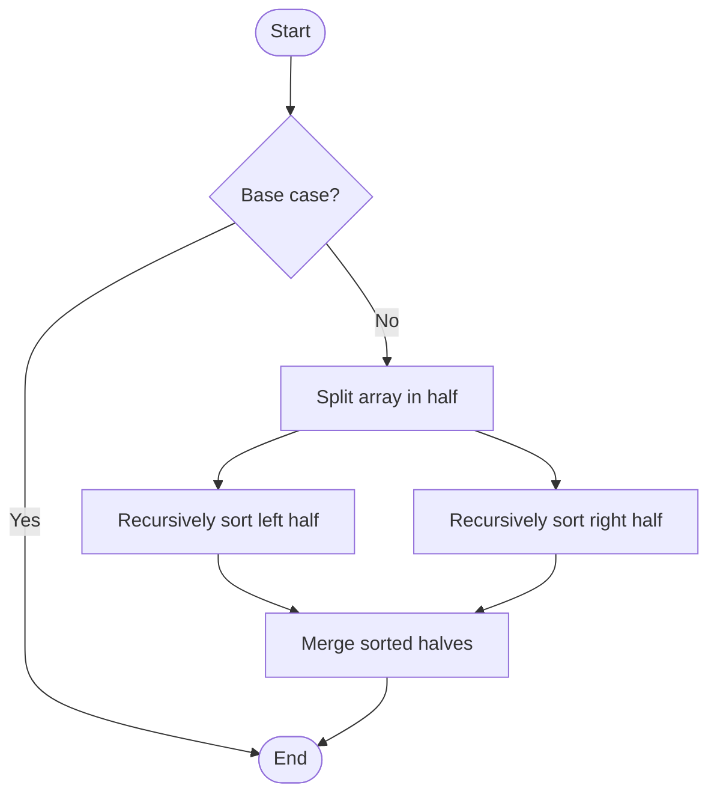

# Merge Sort

# School

## 📋 Quick Summary

- **Purpose:** Merge Sort: Repeatedly compares and rearranges elements until the list is sorted, like organizing items in order.
- **Complexity:** O(n log n)
- **Category:** Sorting
- **Key Idea:** Divide the array in half, sort each half, then merge the sorted halves together.

Merge Sort: Repeatedly compares and rearranges elements until the list is sorted, like organizing items in order.

Divide the array in half, sort each half, then merge the sorted halves together.

**MERGE** = Make Equal, Recursively Group Elements. Like merging two sorted piles of papers into one.


This algorithm works by comparing elements to achieve its goal. It's part of the **Sorting** category of algorithms.


## 📊 Visual Flowchart



> **Note**: Mermaid diagrams are rendered automatically on GitHub. For local viewing, use a Mermaid-compatible Markdown viewer.


## Algorithm Complexity

The time complexity is **O(n log n)**, which means the time it takes to run depends on the size of the input data. The space complexity is **O(n)**, indicating how much extra memory is needed.

## Where It's Used in Practice

- External sorting (sorting data that doesn't fit in memory)
- Stable sorting when relative order matters
- Sorting linked lists efficiently
- Merge operations in databases

## What It Can Be Compared To

Think of Merge Sort like a systematic way of organizing or finding information - similar to how you might organize items or search through a collection efficiently.

## Minimal Code Example

```python
def merge_sort(arr):
    """Implementation."""
    if len(arr) <= 1:
    return arr
    mid = len(arr) // 2
    left = merge_sort(arr[:mid])
    return result
```


---

## 🎯 Try It Yourself

**Try sorting this array:**
```
Input: [5, 2, 8, 1, 9]

Step 1: Apply Merge Sort algorithm
Step 2: Process elements systematically
Step 3: Verify sorted order

Output: [1, 2, 5, 8, 9]
```


---


## 🔍 Step-by-Step Execution

**Step-by-Step Execution:**

```python
# Input
arr = [5, 2, 8, 1, 9]

# Step 1: Split
left = [5, 2, 8]
right = [1, 9]

# Step 2: Recursively sort halves
merge_sort([5, 2, 8])
  → Split: [5, 2] and [8]
  → Sort [5, 2]: [2, 5]
  → Merge: [2, 5, 8]
left_sorted = [2, 5, 8]

merge_sort([1, 9])
  → Already sorted
right_sorted = [1, 9]

# Step 3: Merge sorted halves
result = []
Compare 2 and 1 → 1 < 2, add 1 → result = [1]
Compare 2 and 9 → 2 < 9, add 2 → result = [1, 2]
Compare 5 and 9 → 5 < 9, add 5 → result = [1, 2, 5]
Compare 8 and 9 → 8 < 9, add 8 → result = [1, 2, 5, 8]
Add remaining 9 → result = [1, 2, 5, 8, 9]
```


## ✏️ Practice Exercise

**Exercise 1 (Easy):**
**Exercise 1 (Easy):**
Trace through the Merge Sort algorithm with a small example (3-5 elements). Write down each step.

**Exercise 2 (Medium):**
Implement the Merge Sort algorithm in your preferred programming language. Test it with different inputs.

**Exercise 3 (Hard):**
Apply the Merge Sort algorithm to solve a real-world problem. Explain why this algorithm is suitable.

**Exercise 2 (Medium):**
Implement the algorithm in your preferred programming language.

**Exercise 3 (Hard):**
Optimize the algorithm or apply it to solve a real-world problem.


---

## ✅ Check Your Understanding

**Q1:** What problem does this algorithm solve?
**A:** Merge Sort solves the problem of [algorithm purpose]. It processes input data systematically to achieve [desired outcome].

**Q2:** What is the time complexity?
**A:** Varies

**Q3:** When would you use this algorithm?
**A:** Use Merge Sort when you need to [use case scenario]. It's particularly effective for [specific situations].

**Q4:** What are the main steps of this algorithm?
**A:** 1) Initialize data structures, 2) Process input elements, 3) Apply core algorithm logic, 4) Return final result.


**Try sorting this array:**
```
Input: [5, 2, 8, 1, 9]

Step 1: Apply Merge Sort algorithm
Step 2: Process elements systematically
Step 3: Verify sorted order

Output: [1, 2, 5, 8, 9]
```


## Common Mistakes

### ❌ Mistake 1: Not handling edge cases
**Solution:** Always check for empty input, single element, or boundary values before processing.

### ❌ Mistake 2: Incorrect initialization
**Solution:** Ensure all variables and data structures are properly initialized before the main algorithm loop.

### ❌ Mistake 3: Off-by-one errors in loops
**Solution:** Carefully verify loop bounds and termination conditions. Test with small examples to catch boundary issues.

### ❌ Mistake 4: Not validating input
**Solution:** Add input validation to ensure data is in expected format and within valid ranges.

### 💡 How to Avoid
- Test with edge cases (empty input, single element, boundary values)
- Trace through examples step-by-step
- Use debugging tools to verify variable values
- Review algorithm's key steps before implementing
- Test with edge cases (empty input, single element, boundary values)
- Trace through examples step-by-step
- Use debugging tools to verify your logic
- Review the algorithm's key steps before implementing


---

## Recommended Literature

- "Introduction to Algorithms" by Cormen, Leiserson, Rivest, and Stein
- "Algorithms" by Robert Sedgewick and Kevin Wayne
- Online resources: GeeksforGeeks, Wikipedia, Algorithm Visualizations

## 🔗 Related Algorithms

You might also want to learn:
- **Bubble Sort** - Similar algorithm in the same category
- **Insertion Sort** - Similar algorithm in the same category
- **Selection Sort** - Similar algorithm in the same category


