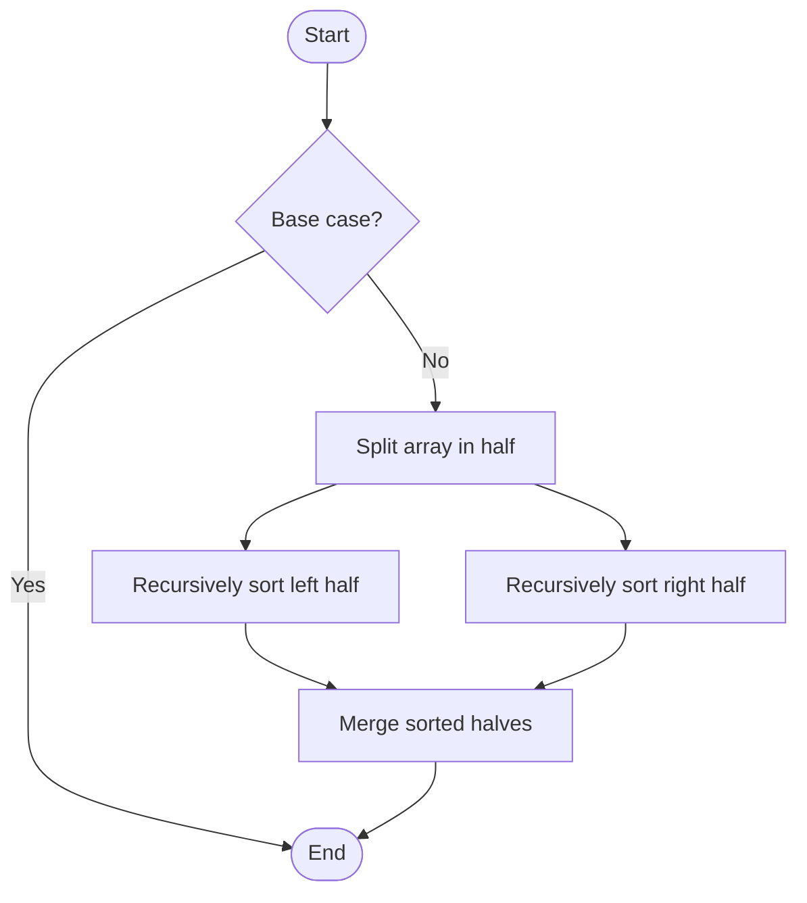

# Merge Sort

# School

## 📋 Quick Summary

- **Purpose:** Merge Sort: Repeatedly compares and rearranges elements until the list is sorted, like organizing items in order.
- **Complexity:** O(n log n)
- **Category:** Sorting
- **Key Idea:** Divide the array in half, sort each half, then merge the sorted halves together.

Merge Sort: Repeatedly compares and rearranges elements until the list is sorted, like organizing items in order.

Divide the array in half, sort each half, then merge the sorted halves together.

**MERGE** = Make Equal, Recursively Group Elements. Like merging two sorted piles of papers into one.


Этот алгоритм работает, comparing elements, чтобы достичь своей цели. Он относится к категории алгоритмов **Sorting**.


## 📊 Visual Flowchart



> **Note**: Mermaid diagrams are rendered automatically on GitHub. For local viewing, use a Mermaid-compatible Markdown viewer.


## Сложность алгоритма

Временная сложность составляет **O(n log n)**, что означает, что время выполнения зависит от размера входных данных. Пространственная сложность — **O(n)**, что указывает на количество дополнительной памяти.

## Где применяется на практике

- External sorting (sorting data that doesn't fit in memory)
- Stable sorting when relative order matters
- Sorting linked lists efficiently
- Merge operations in databases

## С чем можно сравнить

Представьте Merge Sort как систематический способ организации или поиска информации — похоже на то, как вы можете эффективно организовывать предметы или искать в коллекции.

## Минимальный пример кода

```python
def merge_sort(arr):
    """Implementation."""
    if len(arr) <= 1:
    return arr
    mid = len(arr) // 2
    left = merge_sort(arr[:mid])
    return result
```

## Частые ошибки

- Не обрабатываются граничные случаи (пустой ввод, один элемент)
- Непонимание последствий сложности
- Неправильная реализация, приводящая к неверным результатам
- Не оптимизировано для конкретного случая использования

## Рекомендуемая литература

- "Алгоритмы: построение и анализ" Томас Кормен и др.
- "Алгоритмы" Роберт Седжвик
- Онлайн-ресурсы: GeeksforGeeks, Википедия, Визуализации алгоритмов


---

## 🎯 Try It Yourself

**Try this example:**
```
Input: [example data]
Step 1: [first operation]
Step 2: [second operation]
.
Output: [result]


---


## 🔍 Step-by-Step Execution

**Step-by-Step Execution:**

```python
# Input
arr = [5, 2, 8, 1, 9]

# Step 1: Split
left = [5, 2, 8]
right = [1, 9]

# Step 2: Recursively sort halves
merge_sort([5, 2, 8])
  → Split: [5, 2] and [8]
  → Sort [5, 2]: [2, 5]
  → Merge: [2, 5, 8]
left_sorted = [2, 5, 8]

merge_sort([1, 9])
  → Already sorted
right_sorted = [1, 9]

# Step 3: Merge sorted halves
result = []
Compare 2 and 1 → 1 < 2, add 1 → result = [1]
Compare 2 and 9 → 2 < 9, add 2 → result = [1, 2]
Compare 5 and 9 → 5 < 9, add 5 → result = [1, 2, 5]
Compare 8 and 9 → 8 < 9, add 8 → result = [1, 2, 5, 8]
Add remaining 9 → result = [1, 2, 5, 8, 9]
```

**Expected Output:**

```
Input: [example]
Processing...
Result: [output]
```

## ✏️ Practice Exercise

**Exercise 1 (Easy):**
Trace through the algorithm with a small example (3-5 elements).

**Exercise 2 (Medium):**
Implement the algorithm in your preferred programming language.

**Exercise 3 (Hard):**
Optimize the algorithm or apply it to solve a real-world problem.


---

## ✅ Check Your Understanding

**Q1:** What problem does this algorithm solve?
**A:** [Answer based on algorithm purpose]

**Q2:** What is the time complexity?
**A:** O(n log n)

**Q3:** When would you use this algorithm?
**A:** [Answer based on use cases]

**Q4:** What are the main steps of this algorithm?
**A:** [List 3-5 key steps]


**Try this example:**
```
Input: [example data]
Step 1: [first operation]
Step 2: [second operation]
.
Output: [result]


**Exercise 1 (Easy):**
Trace through the algorithm with a small example (3-5 elements).

**Exercise 2 (Medium):**
Implement the algorithm in your preferred programming language.

**Exercise 3 (Hard):**
Optimize the algorithm or apply it to solve a real-world problem.


**Q1:** What problem does this algorithm solve?
**A:** [Answer based on algorithm purpose]

**Q2:** What is the time complexity?
**A:** O(n log n)

**Q3:** When would you use this algorithm?
**A:** [Answer based on use cases]

**Q4:** What are the main steps of this algorithm?
**A:** [List 3-5 key steps]


---

## Common Mistakes

### ❌ Mistake 1: Test with edge cases (empty input, single element, boundary values)
**Solution:** Check base case: `if len(data) <= 1: return data`

### ❌ Mistake 2: Trace through examples step-by-step
**Solution:** Manually trace through a small example (3-5 elements) to verify each step matches the algorithm logic

### ❌ Mistake 3: Use debugging tools to verify your logic
**Solution:** Use print statements or debugger to check variable values at each step, compare with expected behavior

### ❌ Mistake 4: Review the algorithm's key steps before implementing
**Solution:** Study the algorithm's pseudocode or description, identify the core steps, then implement one step at a time

### 💡 How to Avoid
- Test with edge cases (empty input, single element, boundary values)
- Trace through examples step-by-step
- Use debugging tools to verify your logic
- Review the algorithm's key steps before implementing


## 🔗 Related Algorithms

You might also want to learn:
- **Bubble Sort** - Similar algorithm in the same category
- **Insertion Sort** - Similar algorithm in the same category
- **Selection Sort** - Similar algorithm in the same category


