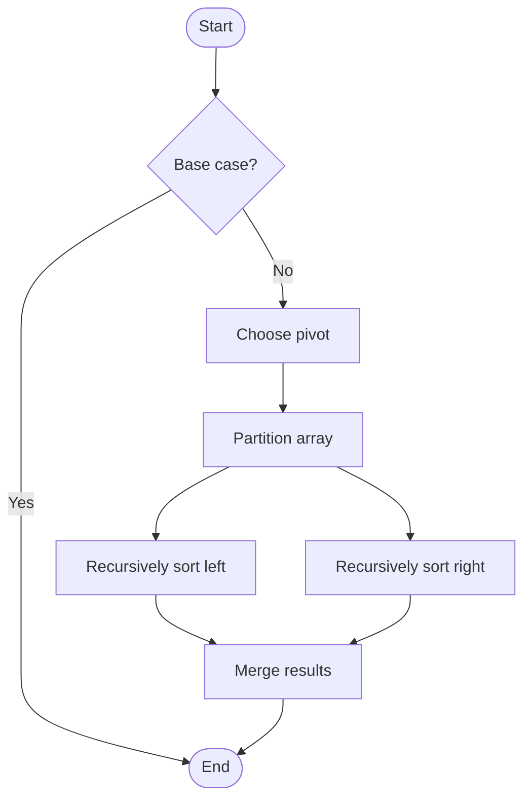

# Quick Sort

# School

## 📋 Quick Summary

- **Purpose:** Quick Sort: Repeatedly compares and rearranges elements until the list is sorted, like organizing items in order.
- **Complexity:** O(n log n)
- **Category:** Sorting
- **Key Idea:** Divide and conquer: pick a pivot, partition around it, then recursively sort the partitions.

Quick Sort: Repeatedly compares and rearranges elements until the list is sorted, like organizing items in order.

Divide and conquer: pick a pivot, partition around it, then recursively sort the partitions.

**QUICK** = Quickly Use Index, Compare & Keep. Like organizing a deck of cards by picking a card and sorting others around it.


This algorithm works by processing data systematically to achieve its goal. It's part of the **Sorting** category of algorithms.


## 📊 Visual Flowchart



> **Note**: Mermaid diagrams are rendered automatically on GitHub. For local viewing, use a Mermaid-compatible Markdown viewer.


## Algorithm Complexity

The time complexity is **O(n log n)**, which means the time it takes to run depends on the size of the input data. The space complexity is **O(log n)**, indicating how much extra memory is needed.

## Where It's Used in Practice

- General-purpose sorting in programming languages (Python, Java)
- Database query optimization and indexing
- Operating system process scheduling
- In-memory sorting of large datasets

## What It Can Be Compared To

Think of Quick Sort like a systematic way of organizing or finding information - similar to how you might organize items or search through a collection efficiently.

## Minimal Code Example

```python
def quick_sort(arr, low, high):
    """Implementation."""
    if high is None:
    high = len(arr) - 1
    if low < high:
    pivot_idx = partition(arr, low, high)
    quick_sort(arr, low, pivot_idx - 1)
    quick_sort(arr, pivot_idx + 1, high)
    return result
```


---

## 🎯 Try It Yourself

**Try this example:**
Input: [example data]
Step 1: [first operation]
Step 2: [second operation]
.
Output: [result]


---


## 🔍 Step-by-Step Execution

**Step-by-Step Execution:**

```python
# Input
arr = [5, 2, 8, 1, 9]

# Step 1: Choose pivot (middle element)
pivot = arr[2] = 8

# Step 2: Partition
# Elements < 8: [5, 2, 1]
# Elements = 8: [8]
# Elements > 8: [9]
left = [5, 2, 1]
right = [9]

# Step 3: Recursively sort left
quick_sort([5, 2, 1])
  → pivot = 2
  → left = [1], right = [5]
  → sorted_left = [1, 2, 5]

# Step 4: Combine
result = [1, 2, 5] + [8] + [9] = [1, 2, 5, 8, 9]
```

**Expected Output:**

```
Input: [example]
Processing...
Result: [output]
```

## ✏️ Practice Exercise

**Exercise 1 (Easy):**
Trace through the algorithm with a small example (3-5 elements).

**Exercise 2 (Medium):**
Implement the algorithm in your preferred programming language.

**Exercise 3 (Hard):**
Optimize the algorithm or apply it to solve a real-world problem.


---

## ✅ Check Your Understanding

**Q1:** What problem does this algorithm solve?
**A:** [Answer based on algorithm purpose]

**Q2:** What is the time complexity?
**A:** O(n log n)

**Q3:** When would you use this algorithm?
**A:** [Answer based on use cases]

**Q4:** What are the main steps of this algorithm?
**A:** [List 3-5 key steps]


**Try this example:**
```
Input: [example data]
Step 1: [first operation]
Step 2: [second operation]
.
Output: [result]


**Exercise 1 (Easy):**
Trace through the algorithm with a small example (3-5 elements).

**Exercise 2 (Medium):**
Implement the algorithm in your preferred programming language.

**Exercise 3 (Hard):**
Optimize the algorithm or apply it to solve a real-world problem.


**Q1:** What problem does this algorithm solve?
**A:** [Answer based on algorithm purpose]

**Q2:** What is the time complexity?
**A:** O(n log n)

**Q3:** When would you use this algorithm?
**A:** [Answer based on use cases]

**Q4:** What are the main steps of this algorithm?
**A:** [List 3-5 key steps]


---

## Common Mistakes

### ❌ Mistake 1: Test with edge cases (empty input, single element, boundary values)
**Solution:** Always check: `if start >= end: return` to prevent infinite recursion

### ❌ Mistake 2: Trace through examples step-by-step
**Solution:** Manually trace through a small example (3-5 elements) to verify each step matches the algorithm logic

### ❌ Mistake 3: Use debugging tools to verify your logic
**Solution:** Use print statements or debugger to check variable values at each step, compare with expected behavior

### ❌ Mistake 4: Review the algorithm's key steps before implementing
**Solution:** Study the algorithm's pseudocode or description, identify the core steps, then implement one step at a time

### 💡 How to Avoid
- Test with edge cases (empty input, single element, boundary values)
- Trace through examples step-by-step
- Use debugging tools to verify your logic
- Review the algorithm's key steps before implementing


---

## Recommended Literature

- "Introduction to Algorithms" by Cormen, Leiserson, Rivest, and Stein
- "Algorithms" by Robert Sedgewick and Kevin Wayne
- Online resources: GeeksforGeeks, Wikipedia, Algorithm Visualizations

## 🔗 Related Algorithms

You might also want to learn:
- **Bubble Sort** - Similar algorithm in the same category
- **Insertion Sort** - Similar algorithm in the same category
- **Selection Sort** - Similar algorithm in the same category


