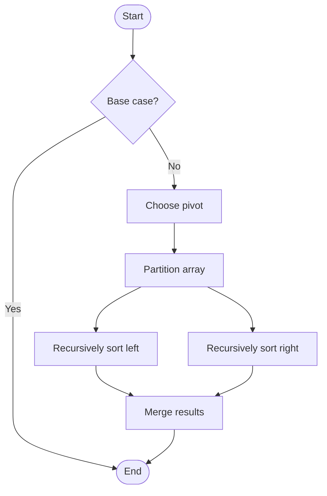

# Quick Sort

# Univer

## 📋 Quick Summary

- **Purpose:** Quick Sort: Repeatedly compares and rearranges elements until the list is sorted, like organizing items in order.
- **Complexity:** O(n log n)
- **Category:** Sorting
- **Key Idea:** Divide and conquer: pick a pivot, partition around it, then recursively sort the partitions.

Quick Sort: Repeatedly compares and rearranges elements until the list is sorted, like organizing items in order.

Divide and conquer: pick a pivot, partition around it, then recursively sort the partitions.

**QUICK** = Quickly Use Index, Compare & Keep. Like organizing a deck of cards by picking a card and sorting others around it.


Этот алгоритм относится к категории **Sorting** и использует систематическую обработку данных для достижения своих целей.


## 📊 Visual Flowchart



> **Note**: Mermaid diagrams are rendered automatically on GitHub. For local viewing, use a Mermaid-compatible Markdown viewer.


## Анализ сложности

**Временная сложность:** O(n log n)
- Производительность алгоритма масштабируется согласно этому классу сложности
- Лучший, средний и худший случаи могут различаться в зависимости от характеристик входных данных

**Пространственная сложность:** O(log n)
- Указывает на количество дополнительной памяти, необходимой во время выполнения

**Ключевые структуры данных:** stack

## Применение в реальных системах

Quick Sort используется в:
- Sorting arrays in programming languages (Python sorted(), Java Collections.sort())
- Database query optimization and indexing
- Operating system process scheduling
- E-commerce product listings and price sorting

## Концептуальные сходства

Этот алгоритм имеет концептуальное сходство с другими алгоритмами в категории Sorting, следуя аналогичным паттернам проектирования и стратегиям оптимизации.

## Связанные алгоритмы

Quick Sort часто используется в сочетании с:
- Дополнительными алгоритмами для предобработки или постобработки
- Структурами данных, оптимизирующими его производительность
- Другими алгоритмами того же класса сложности

## Ключевые детали реализации

```python
def quick_sort(arr, low, high):
    """Implementation."""
    if high is None:
    high = len(arr) - 1
    if low < high:
    pivot_idx = partition(arr, low, high)
    quick_sort(arr, low, pivot_idx - 1)
    quick_sort(arr, pivot_idx + 1, high)
    return result
```

## Распространённые ошибки применения

- Неправильная обработка граничных случаев (пустой ввод, один элемент, граничные условия)
- Непонимание последствий сложности в крупномасштабных системах
- Субоптимальная реализация, приводящая к деградации производительности
- Неверные предположения о характеристиках входных данных
- Не рассмотрение альтернативных алгоритмов для конкретных случаев использования

## Рекомендуемая литература

- "Алгоритмы: построение и анализ" (CLRS) - Комплексный анализ алгоритмов
- "Руководство по проектированию алгоритмов" Стивена Скиены
- "Алгоритмы" Седжвика и Уэйна
- Научные статьи по оптимизации и анализу алгоритмов
- Документация фреймворков и руководства по реализации


---

## 🎯 Try It Yourself

**Try this example:**
```
Input: [example data]
Step 1: [first operation]
Step 2: [second operation]
.
Output: [result]


---

## ✏️ Practice Exercise

**Exercise 1 (Easy):**
Trace through the algorithm with a small example (3-5 elements).

**Exercise 2 (Medium):**
Implement the algorithm in your preferred programming language.

**Exercise 3 (Hard):**
Optimize the algorithm or apply it to solve a real-world problem.


---

## ✅ Check Your Understanding

**Q1:** What problem does this algorithm solve?
**A:** [Answer based on algorithm purpose]

**Q2:** What is the time complexity?
**A:** O(n log n)

**Q3:** When would you use this algorithm?
**A:** [Answer based on use cases]

**Q4:** What are the main steps of this algorithm?
**A:** [List 3-5 key steps]


**Try this example:**
```
Input: [example data]
Step 1: [first operation]
Step 2: [second operation]
.
Output: [result]


**Exercise 1 (Easy):**
Trace through the algorithm with a small example (3-5 elements).

**Exercise 2 (Medium):**
Implement the algorithm in your preferred programming language.

**Exercise 3 (Hard):**
Optimize the algorithm or apply it to solve a real-world problem.


**Q1:** What problem does this algorithm solve?
**A:** [Answer based on algorithm purpose]

**Q2:** What is the time complexity?
**A:** O(n log n)

**Q3:** When would you use this algorithm?
**A:** [Answer based on use cases]

**Q4:** What are the main steps of this algorithm?
**A:** [List 3-5 key steps]


---

## Common Mistakes

### ❌ Mistake 1: Test with edge cases (empty input, single element, boundary values)
**Solution:** Always check: `if start >= end: return` to prevent infinite recursion

### ❌ Mistake 2: Trace through examples step-by-step
**Solution:** Manually trace through a small example (3-5 elements) to verify each step matches the algorithm logic

### ❌ Mistake 3: Use debugging tools to verify your logic
**Solution:** Use print statements or debugger to check variable values at each step, compare with expected behavior

### ❌ Mistake 4: Review the algorithm's key steps before implementing
**Solution:** Study the algorithm's pseudocode or description, identify the core steps, then implement one step at a time

### 💡 How to Avoid
- Test with edge cases (empty input, single element, boundary values)
- Trace through examples step-by-step
- Use debugging tools to verify your logic
- Review the algorithm's key steps before implementing


## 🔗 Related Algorithms

You might also want to learn:
- **Bubble Sort** - Similar algorithm in the same category
- **Insertion Sort** - Similar algorithm in the same category
- **Selection Sort** - Similar algorithm in the same category


