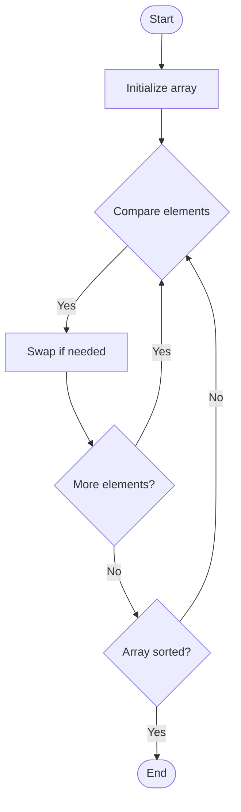

# Bucket Sort

## Учебные материалы

- [Школьный уровень](school.ru.md)
- [Университетский уровень](univer.ru.md)

## Algorithm Visualization

### Flowchart (ASCII)

```
Bucket Sort Flowchart:

┌─────────────┐
│   Start     │
└──────┬──────┘
       │
       ▼
┌─────────────┐
│ Initialize  │
│   array     │
└──────┬──────┘
       │
       ▼
┌─────────────┐      Yes
│  Compare    ├──────┐
│  elements?  │      │
└──────┬──────┘      │
       │ No          │
       ▼             │
┌─────────────┐      │
│   Swap if   │      │
│  needed     │      │
└──────┬──────┘      │
       │             │
       └─────────────┘
       │
       ▼
┌─────────────┐
│   Sorted?   │
└──────┬──────┘
       │ No
       └──────┐
              │
       Yes    │
       │      │
       ▼      ▼
┌─────────────┐
│    End      │
└─────────────┘
```

### Step-by-Step Execution

```
Bucket Sort Step-by-Step Execution:

Input: [5, 3, 2, 8, 1]

Pass 1:
[5, 3, 2, 8, 1]
 ↑  ↑
Swap: 5 > 3
[3, 5, 2, 8, 1]
    ↑  ↑
Swap: 5 > 2
[3, 2, 5, 8, 1]
       ↑  ↑
No swap: 5 < 8
[3, 2, 5, 8, 1]
          ↑  ↑
Swap: 8 > 1
Result: [3, 2, 5, 1, 8]

Pass 2:
[3, 2, 5, 1, 8]
 ↑  ↑
Swap: 3 > 2
[2, 3, 5, 1, 8]
    ↑  ↑
No swap: 3 < 5
[2, 3, 5, 1, 8]
       ↑  ↑
Swap: 5 > 1
Result: [2, 3, 1, 5, 8]

Final: [1, 2, 3, 5, 8]
```

### Interactive Flowchart (Mermaid)



> **Note**: Mermaid diagrams are rendered automatically on GitHub. For local viewing, use a Mermaid-compatible Markdown viewer.

- [Python Implementation](/code/semester_01/lecture_03_specialized_sorting/bucket_sort/algorithm.py)
- [Java Implementation](/code/semester_01/lecture_03_specialized_sorting/bucket_sort/Algorithm.java)
- [Python Tests](/code/semester_01/lecture_03_specialized_sorting/bucket_sort/test_algorithm.py)


## References

- [Bucket sort](https://en.wikipedia.org/wiki/Bucket_sort) - Wikipedia


## Real-World Applications

- Database query optimization
- Operating system process scheduling

- Database query optimization
- Operating system process scheduling
## Historical Context

Bucket sort, or bin sort, is a sorting algorithm that works by distributing the elements of an array into a number of buckets. Each bucket is then sorted individually, either using a different sorting algorithm, or by recursively applying the bucket sorting algorithm
