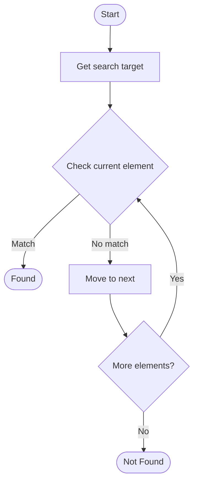

# Binary Search Tree

## Учебные материалы

- [Школьный уровень](school.ru.md)
- [Университетский уровень](univer.ru.md)

## Algorithm Visualization

### Flowchart (ASCII)

```
Binary Search Tree Flowchart:

┌─────────────┐
│   Start     │
└──────┬──────┘
       │
       ▼
┌─────────────┐
│  Get search │
│    target   │
└──────┬──────┘
       │
       ▼
┌─────────────┐      Yes
│  Check     ├──────┐
│  current   │      │
│  element?  │      │
└──────┬──────┘      │
       │ No          │
       ▼             │
┌─────────────┐      │
│   Move to   │      │
│   next      │      │
└──────┬──────┘      │
       │             │
       └─────────────┘
       │
       ▼
┌─────────────┐
│   Found?    │
└──────┬──────┘
       │
       ▼
┌─────────────┐
│    End      │
└─────────────┘
```

### Step-by-Step Execution

```
Binary Search Tree Step-by-Step Execution:

Array: [1, 3, 5, 7, 9, 11]
Target: 7

Step 1: Check middle (index 2, value 5)
[1, 3, 5, 7, 9, 11]
         ↑
5 < 7, search right

Step 2: Check middle of right half (index 4, value 9)
[7, 9, 11]
    ↑
9 > 7, search left

Step 3: Check remaining (index 3, value 7)
[7]
 ↑
Found! Index 3
```

### Interactive Flowchart (Mermaid)



> **Note**: Mermaid diagrams are rendered automatically on GitHub. For local viewing, use a Mermaid-compatible Markdown viewer.

- [Python Implementation](/code/semester_01/lecture_05_trees/binary_search_tree/algorithm.py)
- [Java Implementation](/code/semester_01/lecture_05_trees/binary_search_tree/Algorithm.java)
- [Python Tests](/code/semester_01/lecture_05_trees/binary_search_tree/test_algorithm.py)


## References

- [Binary search tree](https://en.wikipedia.org/wiki/Binary_search_tree) - Wikipedia


## Real-World Applications

- Database query optimization
- Operating system process scheduling

- Database query optimization
- Operating system process scheduling

- Database query optimization
- Operating system process scheduling