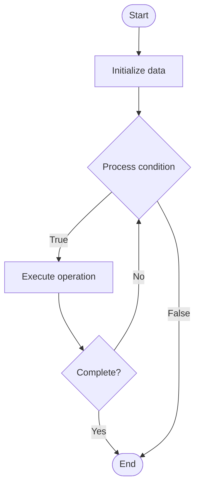

# Avl Tree

## Учебные материалы

- [Школьный уровень](school.ru.md)
- [Университетский уровень](univer.ru.md)

## Algorithm Visualization

### Flowchart (ASCII)

```
Avl Tree Flowchart:

┌─────────────┐
│   Start     │
└──────┬──────┘
       │
       ▼
┌─────────────┐
│  Initialize │
│    root     │
└──────┬──────┘
       │
       ▼
┌─────────────┐      Yes
│  Node       ├──────┐
│  exists?    │      │
└──────┬──────┘      │
       │ No          │
       ▼             │
┌─────────────┐      │
│  Process    │      │
│   node      │      │
└──────┬──────┘      │
       │             │
       ▼             │
┌─────────────┐      │
│  Traverse   │      │
│  children   │      │
└──────┬──────┘      │
       │             │
       └─────────────┘
       │
       ▼
┌─────────────┐
│    End      │
└─────────────┘
```

### Step-by-Step Execution

```
Avl Tree Step-by-Step Execution:

Input: [example data]

Step 1: Initialize
State: [initial state]

Step 2: Process
State: [intermediate state]

Step 3: Finalize
State: [final state]

Result: [output]
```

### Interactive Flowchart (Mermaid)



> **Note**: Mermaid diagrams are rendered automatically on GitHub. For local viewing, use a Mermaid-compatible Markdown viewer.

- [Python Implementation](/code/semester_01/lecture_06_advanced_trees/avl_tree/algorithm.py)
- [Java Implementation](/code/semester_01/lecture_06_advanced_trees/avl_tree/Algorithm.java)
- [Python Tests](/code/semester_01/lecture_06_advanced_trees/avl_tree/test_algorithm.py)


## References

- [AVL tree](https://en.wikipedia.org/wiki/AVL_tree) - Wikipedia


## Real-World Applications

- Search engines and indexing
- Database lookups

- Search engines and indexing
- Database lookups

- Search engines and indexing
- Database lookups
## Historical Context

In an AVL tree, the heights of the two child subtrees of any node differ by at most one; if at any time they differ by more than one, rebalancing is done to restore this property. Insertions and deletions may require the tree to be rebalanced by one or more tree rotations
