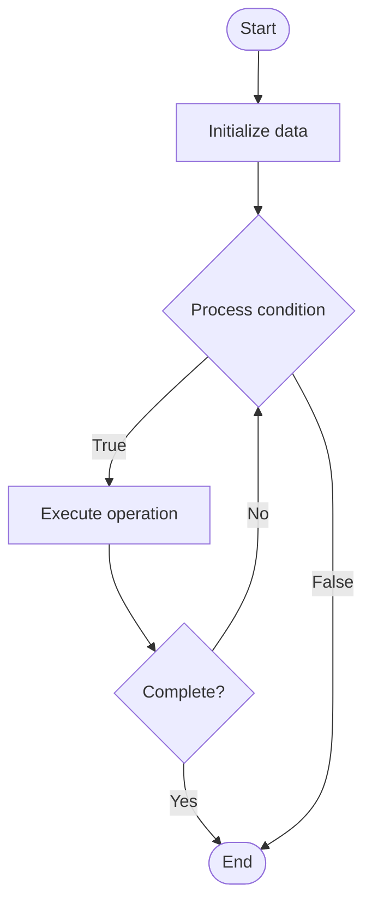

# Binary Heap

## Учебные материалы

- [Школьный уровень](school.ru.md)
- [Университетский уровень](univer.ru.md)

## Algorithm Visualization

### Flowchart (ASCII)

```
Binary Heap Flowchart:

┌─────────────┐
│   Start     │
└──────┬──────┘
       │
       ▼
┌─────────────┐
│  Initialize │
│   data      │
└──────┬──────┘
       │
       ▼
┌─────────────┐      Yes
│  Process   ├──────┐
│  condition?│      │
└──────┬──────┘      │
       │ No          │
       ▼             │
┌─────────────┐      │
│  Execute   │      │
│  operation │      │
└──────┬──────┘      │
       │             │
       └─────────────┘
       │
       ▼
┌─────────────┐
│    End      │
└─────────────┘
```

### Step-by-Step Execution

```
Binary Heap Step-by-Step Execution:

Input: [example data]

Step 1: Initialize
State: [initial state]

Step 2: Process
State: [intermediate state]

Step 3: Finalize
State: [final state]

Result: [output]
```

### Interactive Flowchart (Mermaid)



> **Note**: Mermaid diagrams are rendered automatically on GitHub. For local viewing, use a Mermaid-compatible Markdown viewer.

- [Python Implementation](/code/semester_01/lecture_07_heaps_priority/binary_heap/algorithm.py)
- [Java Implementation](/code/semester_01/lecture_07_heaps_priority/binary_heap/Algorithm.java)
- [Python Tests](/code/semester_01/lecture_07_heaps_priority/binary_heap/test_algorithm.py)


## Historical Context

A binary heap is a heap data structure that takes the form of a binary tree. Binary heaps are a common way of implementing priority queues. The binary heap was introduced by J. W. J. Williams in 1964 as a data structure for implementing heapsort.


## References

- [Binary heap](https://en.wikipedia.org/wiki/Binary_heap) - Wikipedia


## Real-World Applications

- Database query optimization
- Operating system process scheduling

- Database query optimization
- Operating system process scheduling

- Database query optimization
- Operating system process scheduling