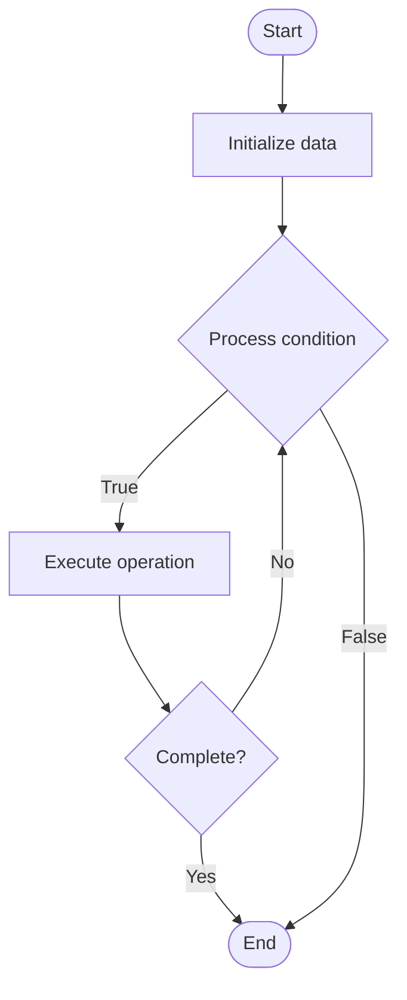

# Open Addressing

## Учебные материалы

- [Школьный уровень](school.ru.md)
- [Университетский уровень](univer.ru.md)

## Algorithm Visualization

### Flowchart (ASCII)

```
Open Addressing Flowchart:

┌─────────────┐
│   Start     │
└──────┬──────┘
       │
       ▼
┌─────────────┐
│  Initialize │
│   data      │
└──────┬──────┘
       │
       ▼
┌─────────────┐      Yes
│  Process   ├──────┐
│  condition?│      │
└──────┬──────┘      │
       │ No          │
       ▼             │
┌─────────────┐      │
│  Execute   │      │
│  operation │      │
└──────┬──────┘      │
       │             │
       └─────────────┘
       │
       ▼
┌─────────────┐
│    End      │
└─────────────┘
```

### Step-by-Step Execution

```
Open Addressing Step-by-Step Execution:

Input: [example data]

Step 1: Initialize
State: [initial state]

Step 2: Process
State: [intermediate state]

Step 3: Finalize
State: [final state]

Result: [output]
```

### Interactive Flowchart (Mermaid)



> **Note**: Mermaid diagrams are rendered automatically on GitHub. For local viewing, use a Mermaid-compatible Markdown viewer.

- [Python Implementation](/code/semester_01/lecture_08_hash_tables/open_addressing/algorithm.py)
- [Java Implementation](/code/semester_01/lecture_08_hash_tables/open_addressing/Algorithm.java)
- [Python Tests](/code/semester_01/lecture_08_hash_tables/open_addressing/test_algorithm.py)


## References

- [Open addressing](https://en.wikipedia.org/wiki/Open_addressing) - Wikipedia


## Real-World Applications

- Search engines and indexing
- Database lookups

- Search engines and indexing
- Database lookups
## Historical Context

With this method a hash collision is resolved by probing, or searching through alternative locations in the array until either the target record is found, or an unused array slot is found, which indicates that there is no such key in the table. Double hashingin which the interval between probes is fixed for each record but is computed by another hash function
