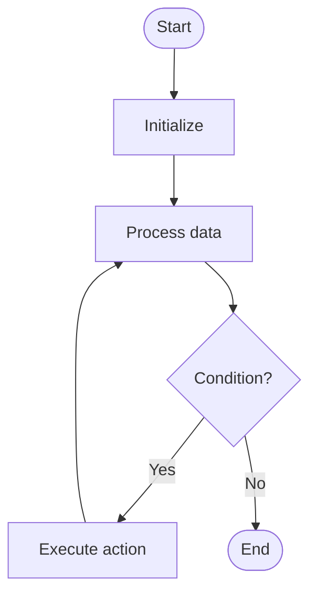

# Bfs

# Univer

## 📋 Quick Summary

- **Purpose:** Bfs: Explore level by level - visit all neighbors before moving to the next level, like ripples in water.
- **Complexity:** O(V + E)
- **Category:** Algorithms
- **Key Idea:** Explore level by level - visit all neighbors before moving to the next level, like ripples in water.

Bfs: Explore level by level - visit all neighbors before moving to the next level, like ripples in water.

Explore level by level - visit all neighbors before moving to the next level, like ripples in water.

**BFS** = Breadth First Search. Like exploring a maze room by room, level by level - visit all neighbors first!


This algorithm belongs to the **Sorting** category and employs systematic data processing to achieve its objectives.


## 📊 Visual Flowchart



> **Note**: Mermaid diagrams are rendered automatically on GitHub. For local viewing, use a Mermaid-compatible Markdown viewer.


## Complexity Analysis

**Time Complexity:** O(n²)
- The algorithm's performance scales according to this complexity class
- Best, average, and worst cases may vary based on input characteristics

**Space Complexity:** O(1)
- Indicates the amount of additional memory required during execution

**Key Data Structures:** queue, stack, hash table/dictionary

## Real-World Applications

Bfs is used in:
- Sorting arrays in programming languages (Python sorted(), Java Collections.sort())
- Database query optimization and indexing
- Operating system process scheduling
- E-commerce product listings and price sorting

## Conceptual Similarities

This algorithm shares conceptual similarities with other algorithms in the Sorting category, following similar design patterns and optimization strategies.

## Related Algorithms

Bfs is often used in combination with:
- Complementary algorithms for preprocessing or post-processing
- Data structures that optimize its performance
- Other algorithms in the same complexity class

## Key Implementation Details

```python
def bfs(data):
    """Implementation of Bfs."""
    # Core algorithm logic
    return result
```

## Common Application Errors

- Incorrect handling of edge cases (empty input, single element, boundary conditions)
- Misunderstanding of complexity implications in large-scale systems
- Suboptimal implementation leading to performance degradation
- Incorrect assumptions about input data characteristics
- Not considering alternative algorithms for specific use cases


---

## Recommended Literature

- "Introduction to Algorithms" (CLRS) - Comprehensive algorithm analysis
- "Algorithm Design Manual" by Steven Skiena
- "Algorithms" by Sedgewick and Wayne
- Research papers on algorithm optimization and analysis
- Framework documentation and implementation guides


---

## 🎯 Try It Yourself

**Try this example:**
```
Input: [example data]

Step 1: Initialize algorithm state
Step 2: Process input data
Step 3: Generate result

Output: [algorithm result]
```


## Common Mistakes

### ❌ Mistake 1: Not handling edge cases
**Solution:** Always check for empty input, single element, or boundary values before processing.

### ❌ Mistake 2: Incorrect initialization
**Solution:** Ensure all variables and data structures are properly initialized before the main algorithm loop.

### ❌ Mistake 3: Off-by-one errors in loops
**Solution:** Carefully verify loop bounds and termination conditions. Test with small examples to catch boundary issues.

### ❌ Mistake 4: Not validating input
**Solution:** Add input validation to ensure data is in expected format and within valid ranges.

### 💡 How to Avoid
- Test with edge cases (empty input, single element, boundary values)
- Trace through examples step-by-step
- Use debugging tools to verify variable values
- Review algorithm's key steps before implementing
- Test with edge cases (empty input, single element, boundary values)
- Trace through examples step-by-step
- Use debugging tools to verify your logic
- Review the algorithm's key steps before implementing