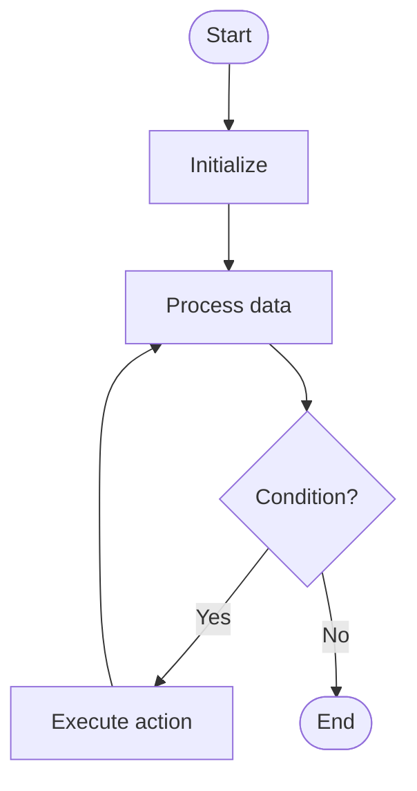

# Dfs

# Univer

## 📋 Quick Summary

- **Purpose:** Dfs: Go deep first - explore as far as possible along each branch before backtracking.
- **Complexity:** O(V + E)
- **Category:** Algorithms
- **Key Idea:** Go deep first - explore as far as possible along each branch before backtracking.

Dfs: Go deep first - explore as far as possible along each branch before backtracking.

Go deep first - explore as far as possible along each branch before backtracking.

**DFS** = Depth First Search. Like exploring a maze - go as deep as possible down one path before trying another.


Этот алгоритм относится к категории **Sorting** и использует систематическую обработку данных для достижения своих целей.


## 📊 Visual Flowchart



> **Note**: Mermaid diagrams are rendered automatically on GitHub. For local viewing, use a Mermaid-compatible Markdown viewer.


## Анализ сложности

**Временная сложность:** O(n²)
- Производительность алгоритма масштабируется согласно этому классу сложности
- Лучший, средний и худший случаи могут различаться в зависимости от характеристик входных данных

**Пространственная сложность:** O(1)
- Указывает на количество дополнительной памяти, необходимой во время выполнения

**Ключевые структуры данных:** stack, hash table/dictionary

## Применение в реальных системах

Dfs используется в:
- Sorting arrays in programming languages (Python sorted(), Java Collections.sort())
- Database query optimization and indexing
- Operating system process scheduling
- E-commerce product listings and price sorting

## Концептуальные сходства

Этот алгоритм имеет концептуальное сходство с другими алгоритмами в категории Sorting, следуя аналогичным паттернам проектирования и стратегиям оптимизации.

## Связанные алгоритмы

Dfs часто используется в сочетании с:
- Дополнительными алгоритмами для предобработки или постобработки
- Структурами данных, оптимизирующими его производительность
- Другими алгоритмами того же класса сложности

## Ключевые детали реализации

```python
def dfs(data):
    """Implementation of Dfs."""
    # Core algorithm logic
    return result
```

## Распространённые ошибки применения

- Неправильная обработка граничных случаев (пустой ввод, один элемент, граничные условия)
- Непонимание последствий сложности в крупномасштабных системах
- Субоптимальная реализация, приводящая к деградации производительности
- Неверные предположения о характеристиках входных данных
- Не рассмотрение альтернативных алгоритмов для конкретных случаев использования

## Рекомендуемая литература

- "Алгоритмы: построение и анализ" (CLRS) - Комплексный анализ алгоритмов
- "Руководство по проектированию алгоритмов" Стивена Скиены
- "Алгоритмы" Седжвика и Уэйна
- Научные статьи по оптимизации и анализу алгоритмов
- Документация фреймворков и руководства по реализации


---

## 🎯 Try It Yourself

**Try this example:**
```
Input: [example data]

Step 1: Initialize algorithm state
Step 2: Process input data
Step 3: Generate result

Output: [algorithm result]
```


## Common Mistakes

### ❌ Mistake 1: Not handling edge cases
**Solution:** Always check for empty input, single element, or boundary values before processing.

### ❌ Mistake 2: Incorrect initialization
**Solution:** Ensure all variables and data structures are properly initialized before the main algorithm loop.

### ❌ Mistake 3: Off-by-one errors in loops
**Solution:** Carefully verify loop bounds and termination conditions. Test with small examples to catch boundary issues.

### ❌ Mistake 4: Not validating input
**Solution:** Add input validation to ensure data is in expected format and within valid ranges.

### 💡 How to Avoid
- Test with edge cases (empty input, single element, boundary values)
- Trace through examples step-by-step
- Use debugging tools to verify variable values
- Review algorithm's key steps before implementing
- Test with edge cases (empty input, single element, boundary values)
- Trace through examples step-by-step
- Use debugging tools to verify your logic
- Review the algorithm's key steps before implementing