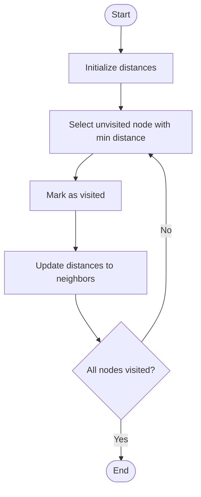

# Dijkstra

# School

## 📋 Quick Summary

- **Purpose:** Dijkstra: Greedy approach: always process the closest unvisited node first, ensuring shortest paths are found.
- **Complexity:** O(n²)
- **Category:** Algorithms
- **Key Idea:** Greedy approach: always process the closest unvisited node first, ensuring shortest paths are found.

Dijkstra: Greedy approach: always process the closest unvisited node first, ensuring shortest paths are found.

Greedy approach: always process the closest unvisited node first, ensuring shortest paths are found.

**DIJKSTRA** = Distance Increases, Just Keep Shortest Track Record Always. Always pick the closest unvisited node first.


Этот алгоритм работает, систематически обрабатывая данные, чтобы достичь своей цели. Он относится к категории алгоритмов **Graph Algorithms**.


## 📊 Visual Flowchart



> **Note**: Mermaid diagrams are rendered automatically on GitHub. For local viewing, use a Mermaid-compatible Markdown viewer.


## Сложность алгоритма

Временная сложность составляет **O(n²)**, что означает, что время выполнения зависит от размера входных данных. Пространственная сложность — **O(1)**, что указывает на количество дополнительной памяти.

## Где применяется на практике

- GPS navigation systems (finding shortest routes)
- Network routing protocols
- Social network analysis (shortest path between users)
- Game development (pathfinding in games)

## С чем можно сравнить

Представьте Dijkstra как систематический способ организации или поиска информации — похоже на то, как вы можете эффективно организовывать предметы или искать в коллекции.

## Минимальный пример кода

```python
def dijkstra(graph, start):
    """Implementation."""
    distances = {node: float('inf') for node in graph}
    distances[start] = 0
    pq = [(0, start)]
    return result
```

## Частые ошибки

- Не обрабатываются граничные случаи (пустой ввод, один элемент)
- Непонимание последствий сложности
- Неправильная реализация, приводящая к неверным результатам
- Не оптимизировано для конкретного случая использования

## Рекомендуемая литература

- "Алгоритмы: построение и анализ" Томас Кормен и др.
- "Алгоритмы" Роберт Седжвик
- Онлайн-ресурсы: GeeksforGeeks, Википедия, Визуализации алгоритмов


---

## 🎯 Try It Yourself

**Try this example:**
```
Input: [example data]
Step 1: [first operation]
Step 2: [second operation]
.
Output: [result]


---


## 🔍 Step-by-Step Execution

**Step-by-Step Execution:**

```python
# Input
data = [example input]

# Step 1: Initialize
state = initial_state

# Step 2: Process
# [Processing steps]

# Step 3: Finalize
result = final_state

# Output
return result
```

**Expected Output:**

```
Input: [example]
Processing...
Result: [output]
```

## ✏️ Practice Exercise

**Exercise 1 (Easy):**
Trace through the algorithm with a small example (3-5 elements).

**Exercise 2 (Medium):**
Implement the algorithm in your preferred programming language.

**Exercise 3 (Hard):**
Optimize the algorithm or apply it to solve a real-world problem.


---

## ✅ Check Your Understanding

**Q1:** What problem does this algorithm solve?
**A:** [Answer based on algorithm purpose]

**Q2:** What is the time complexity?
**A:** O(n²)

**Q3:** When would you use this algorithm?
**A:** [Answer based on use cases]

**Q4:** What are the main steps of this algorithm?
**A:** [List 3-5 key steps]


**Try this example:**
```
Input: [example data]
Step 1: [first operation]
Step 2: [second operation]
.
Output: [result]


**Exercise 1 (Easy):**
Trace through the algorithm with a small example (3-5 elements).

**Exercise 2 (Medium):**
Implement the algorithm in your preferred programming language.

**Exercise 3 (Hard):**
Optimize the algorithm or apply it to solve a real-world problem.


**Q1:** What problem does this algorithm solve?
**A:** [Answer based on algorithm purpose]

**Q2:** What is the time complexity?
**A:** O(n²)

**Q3:** When would you use this algorithm?
**A:** [Answer based on use cases]

**Q4:** What are the main steps of this algorithm?
**A:** [List 3-5 key steps]


---

## Common Mistakes

### ❌ Mistake 1: Test with edge cases (empty input, single element, boundary values)
**Solution:** Initialize distances: `dist[start] = 0`, all others to infinity

### ❌ Mistake 2: Trace through examples step-by-step
**Solution:** Manually trace through a small example (3-5 elements) to verify each step matches the algorithm logic

### ❌ Mistake 3: Use debugging tools to verify your logic
**Solution:** Use print statements or debugger to check variable values at each step, compare with expected behavior

### ❌ Mistake 4: Review the algorithm's key steps before implementing
**Solution:** Study the algorithm's pseudocode or description, identify the core steps, then implement one step at a time

### 💡 How to Avoid
- Test with edge cases (empty input, single element, boundary values)
- Trace through examples step-by-step
- Use debugging tools to verify your logic
- Review the algorithm's key steps before implementing