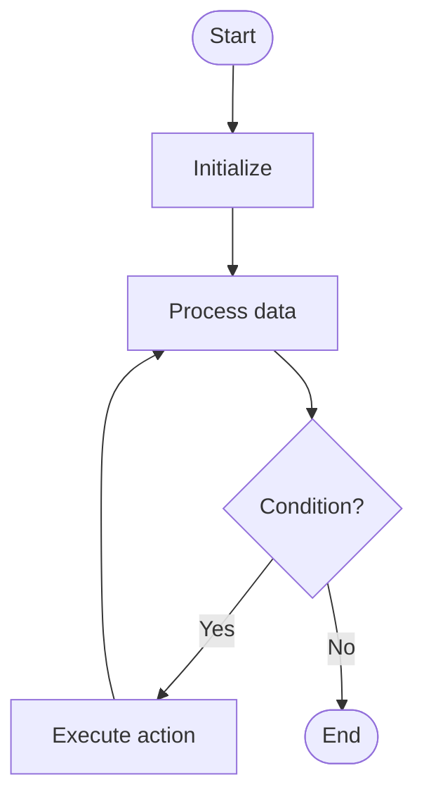

# Floyd Warshall

# Univer

## 📋 Quick Summary

- **Purpose:** Floyd Warshall: The algorithm works by systematically processing data according to a specific strategy.
- **Complexity:** O(n²)
- **Category:** Algorithms
- **Key Idea:** The algorithm works by systematically processing data according to a specific strategy.

Floyd Warshall: The algorithm works by systematically processing data according to a specific strategy.

The algorithm works by systematically processing data according to a specific strategy.

**FLOYD WARSHALL** = Remember the key steps: step 1, step 2, step 3


Этот алгоритм относится к категории **Graph Algorithms** и использует систематическую обработку данных для достижения своих целей.


## 📊 Visual Flowchart




## Анализ сложности

**Временная сложность:** O(n²)
- Производительность алгоритма масштабируется согласно этому классу сложности
- Лучший, средний и худший случаи могут различаться в зависимости от характеристик входных данных

**Пространственная сложность:** O(1)
- Указывает на количество дополнительной памяти, необходимой во время выполнения

**Ключевые структуры данных:** hash table/dictionary

## Применение в реальных системах

Floyd Warshall используется в:
- Social network analysis
- Recommendation systems
- Network topology analysis
- Dependency resolution

## Концептуальные сходства

Этот алгоритм имеет концептуальное сходство с другими алгоритмами в категории Graph Algorithms, следуя аналогичным паттернам проектирования и стратегиям оптимизации.

## Связанные алгоритмы

Floyd Warshall часто используется в сочетании с:
- Дополнительными алгоритмами для предобработки или постобработки
- Структурами данных, оптимизирующими его производительность
- Другими алгоритмами того же класса сложности

## Ключевые детали реализации

```python
def floyd_warshall(graph, n):
    """Implementation."""
    dist = [row[:] for row in graph]
    for k in range(n):
    for i in range(n):
        for j in range(n):
            if dist[i][k] != float('inf') and dist[k][j] != float('inf'):
                dist[i][j] = min(dist[i][j], dist[i][k] + dist[k][j])
    return result
```

## Распространённые ошибки применения

- Неправильная обработка граничных случаев (пустой ввод, один элемент, граничные условия)
- Непонимание последствий сложности в крупномасштабных системах
- Субоптимальная реализация, приводящая к деградации производительности
- Неверные предположения о характеристиках входных данных
- Не рассмотрение альтернативных алгоритмов для конкретных случаев использования

## Рекомендуемая литература

- "Алгоритмы: построение и анализ" (CLRS) - Комплексный анализ алгоритмов
- "Руководство по проектированию алгоритмов" Стивена Скиены
- "Алгоритмы" Седжвика и Уэйна
- Научные статьи по оптимизации и анализу алгоритмов
- Документация фреймворков и руководства по реализации


---

## 🎯 Try It Yourself

**Try this example:**
```
Input: [example data]

Step 1: Initialize algorithm state
Step 2: Process input data
Step 3: Generate result

Output: [algorithm result]
```


## Common Mistakes

### ❌ Mistake 1: Not handling edge cases
**Solution:** Always check for empty input, single element, or boundary values before processing.

### ❌ Mistake 2: Incorrect initialization
**Solution:** Ensure all variables and data structures are properly initialized before the main algorithm loop.

### ❌ Mistake 3: Off-by-one errors in loops
**Solution:** Carefully verify loop bounds and termination conditions. Test with small examples to catch boundary issues.

### ❌ Mistake 4: Not validating input
**Solution:** Add input validation to ensure data is in expected format and within valid ranges.

### 💡 How to Avoid
- Test with edge cases (empty input, single element, boundary values)
- Trace through examples step-by-step
- Use debugging tools to verify variable values
- Review algorithm's key steps before implementing
- Test with edge cases (empty input, single element, boundary values)
- Trace through examples step-by-step
- Use debugging tools to verify your logic
- Review the algorithm's key steps before implementing