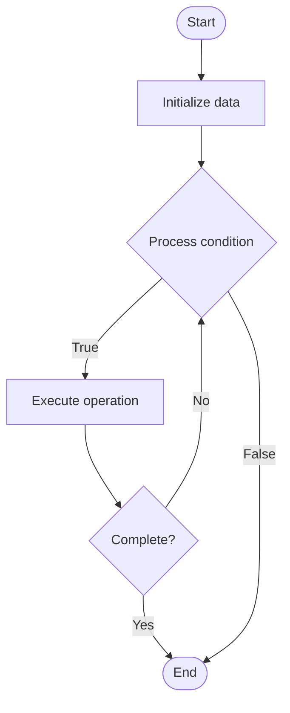

# Chain of Responsibility

## Учебные материалы

- [Школьный уровень](school.ru.md)
- [Университетский уровень](univer.ru.md)

## Algorithm Visualization

### Flowchart (ASCII)

```
Chain of Responsibility Flowchart:

┌─────────────┐
│   Start     │
└──────┬──────┘
       │
       ▼
┌─────────────┐
│  Initialize │
│   data      │
└──────┬──────┘
       │
       ▼
┌─────────────┐      Yes
│  Process   ├──────┐
│  condition?│      │
└──────┬──────┘      │
       │ No          │
       ▼             │
┌─────────────┐      │
│  Execute   │      │
│  operation │      │
└──────┬──────┘      │
       │             │
       └─────────────┘
       │
       ▼
┌─────────────┐
│    End      │
└─────────────┘
```

### Step-by-Step Execution

```
Chain of Responsibility Step-by-Step Execution:

Input: [example data]

Step 1: Initialize
State: [initial state]

Step 2: Process
State: [intermediate state]

Step 3: Finalize
State: [final state]

Result: [output]
```

### Interactive Flowchart (Mermaid)



> **Note**: Mermaid diagrams are rendered automatically on GitHub. For local viewing, use a Mermaid-compatible Markdown viewer.

- [Python Implementation](/code/semester_02/lecture_09_behavioral_patterns/chain_of_responsibility/algorithm.py)
- [Java Implementation](/code/semester_02/lecture_09_behavioral_patterns/chain_of_responsibility/Algorithm.java)
- [Python Tests](/code/semester_02/lecture_09_behavioral_patterns/chain_of_responsibility/test_algorithm.py)


## Historical Context

The chain of responsibility is a policy concept used in Australian transport legislation to place legal obligations on parties in the transport supply chain or across transport industries generally. The concept was initially developed to apply in the heavy vehicle industry in regulated areas such as


## References

- [Chain of responsibility](https://en.wikipedia.org/wiki/Chain_of_responsibility) - Wikipedia
