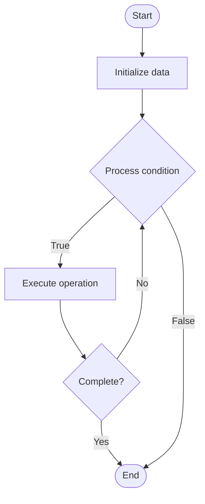

# Template Method Pattern

## Учебные материалы

- [Школьный уровень](school.ru.md)
- [Университетский уровень](univer.ru.md)

## Algorithm Visualization

### Flowchart (ASCII)

```
Template Method Pattern Flowchart:

┌─────────────┐
│   Start     │
└──────┬──────┘
       │
       ▼
┌─────────────┐
│  Initialize │
│   data      │
└──────┬──────┘
       │
       ▼
┌─────────────┐      Yes
│  Process   ├──────┐
│  condition?│      │
└──────┬──────┘      │
       │ No          │
       ▼             │
┌─────────────┐      │
│  Execute   │      │
│  operation │      │
└──────┬──────┘      │
       │             │
       └─────────────┘
       │
       ▼
┌─────────────┐
│    End      │
└─────────────┘
```

### Step-by-Step Execution

```
Template Method Pattern Step-by-Step Execution:

Input: [example data]

Step 1: Initialize
State: [initial state]

Step 2: Process
State: [intermediate state]

Step 3: Finalize
State: [final state]

Result: [output]
```

### Interactive Flowchart (Mermaid)



> **Note**: Mermaid diagrams are rendered automatically on GitHub. For local viewing, use a Mermaid-compatible Markdown viewer.

- [Python Implementation](/code/semester_02/lecture_09_behavioral_patterns/template_method/algorithm.py)
- [Java Implementation](/code/semester_02/lecture_09_behavioral_patterns/template_method/Algorithm.java)
- [Python Tests](/code/semester_02/lecture_09_behavioral_patterns/template_method/test_algorithm.py)


## References

- [Template method pattern](https://en.wikipedia.org/wiki/Template_method_pattern) - Wikipedia


## Historical Context

In object-oriented programming, the template method is one of the behavioral design patterns identified by Gamma et al. These steps are themselves implemented by additional helper methods in the same class as the template method
