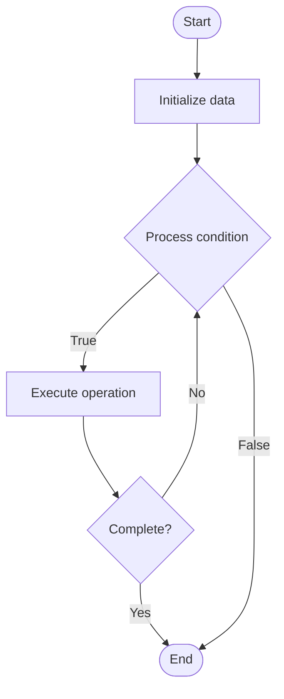

# Edit Distance (Levenshtein)

## Учебные материалы

- [Школьный уровень](school.ru.md)
- [Университетский уровень](univer.ru.md)

## Algorithm Visualization

### Flowchart (ASCII)

```
Edit Distance (Levenshtein) Flowchart:

┌─────────────┐
│   Start     │
└──────┬──────┘
       │
       ▼
┌─────────────┐
│  Initialize │
│   data      │
└──────┬──────┘
       │
       ▼
┌─────────────┐      Yes
│  Process   ├──────┐
│  condition?│      │
└──────┬──────┘      │
       │ No          │
       ▼             │
┌─────────────┐      │
│  Execute   │      │
│  operation │      │
└──────┬──────┘      │
       │             │
       └─────────────┘
       │
       ▼
┌─────────────┐
│    End      │
└─────────────┘
```

### Step-by-Step Execution

```
Edit Distance (Levenshtein) Step-by-Step Execution:

Input: [example data]

Step 1: Initialize
State: [initial state]

Step 2: Process
State: [intermediate state]

Step 3: Finalize
State: [final state]

Result: [output]
```

### Interactive Flowchart (Mermaid)



> **Note**: Mermaid diagrams are rendered automatically on GitHub. For local viewing, use a Mermaid-compatible Markdown viewer.

- [Python Implementation](/code/semester_03/lecture_11_dynamic_programming/edit_distance/algorithm.py)
- [Java Implementation](/code/semester_03/lecture_11_dynamic_programming/edit_distance/Algorithm.java)
- [Python Tests](/code/semester_03/lecture_11_dynamic_programming/edit_distance/test_algorithm.py)


## References

- [Edit distance](https://en.wikipedia.org/wiki/Edit_distance) - Wikipedia


## Historical Context

a way of quantifying how dissimilar two strings are to one another, that is measured by counting the minimum number of operations required to transform one string into the other. Edit distances find applications in natural language processing, where automatic spelling correction can determine candidate corrections for a misspelled word by selecting words from a dictionary that have a low distance 
