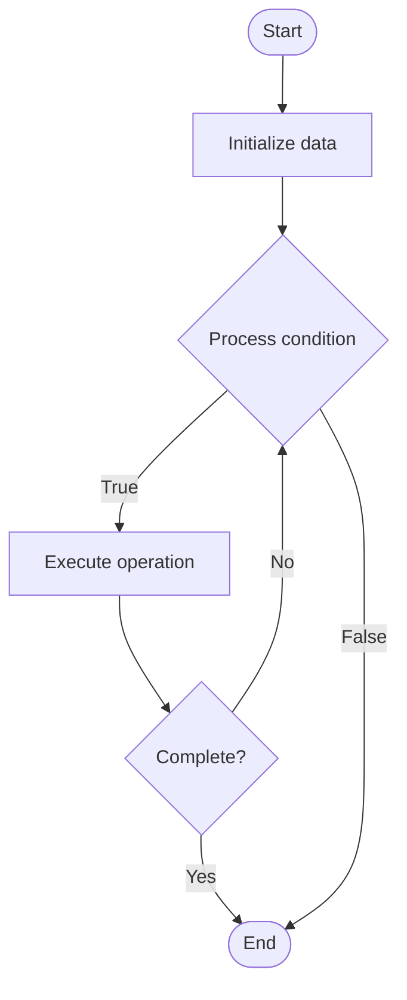

# K-Nearest Neighbors (KNN)

## Учебные материалы

- [Школьный уровень](school.ru.md)
- [Университетский уровень](univer.ru.md)

## Algorithm Visualization

### Flowchart (ASCII)

```
K-Nearest Neighbors (KNN) Flowchart:

┌─────────────┐
│   Start     │
└──────┬──────┘
       │
       ▼
┌─────────────┐
│  Initialize │
│   data      │
└──────┬──────┘
       │
       ▼
┌─────────────┐      Yes
│  Process   ├──────┐
│  condition?│      │
└──────┬──────┘      │
       │ No          │
       ▼             │
┌─────────────┐      │
│  Execute   │      │
│  operation │      │
└──────┬──────┘      │
       │             │
       └─────────────┘
       │
       ▼
┌─────────────┐
│    End      │
└─────────────┘
```

### Step-by-Step Execution

```
K-Nearest Neighbors (KNN) Step-by-Step Execution:

Input: [example data]

Step 1: Initialize
State: [initial state]

Step 2: Process
State: [intermediate state]

Step 3: Finalize
State: [final state]

Result: [output]
```

### Interactive Flowchart (Mermaid)



> **Note**: Mermaid diagrams are rendered automatically on GitHub. For local viewing, use a Mermaid-compatible Markdown viewer.

- [Python Implementation](/code/semester_03/lecture_12_ml_algorithms/knn/algorithm.py)
- [Java Implementation](/code/semester_03/lecture_12_ml_algorithms/knn/Algorithm.java)
- [Python Tests](/code/semester_03/lecture_12_ml_algorithms/knn/test_algorithm.py)


## References

- [KNN](https://en.wikipedia.org/wiki/KNN) - Wikipedia


## Real-World Applications

- Social network analysis
- Route planning and navigation

- Social network analysis
- Route planning and navigation
## Historical Context

KNN may refer to:k-nearest neighbors algorithm (k-NN), a method for classifying objects
Nearest neighbor graph (k-NNG), a graph connecting each point to its k nearest neighbors
Khanna railway station, in Khanna, Punjab, India (by Indian Railways code)
Kings Norton railway station, in Birmingham, England (by National Rail code)
Knighton News Network, the recurring TV station which hosts the news re
