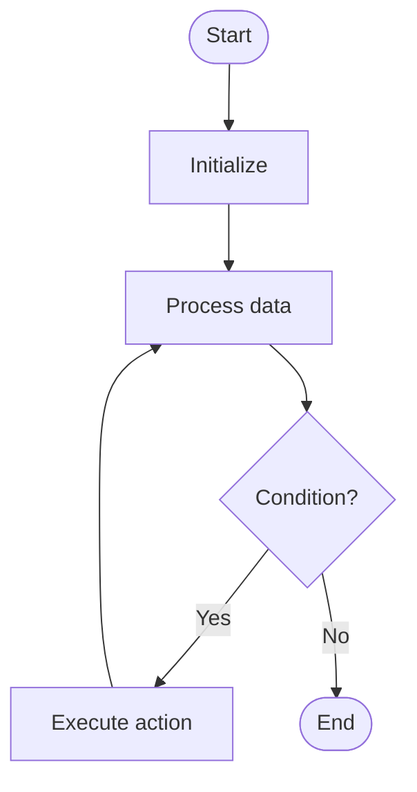

# Huffman

# School

## 📋 Quick Summary

- **Purpose:** Huffman: The algorithm works by systematically processing data according to a specific strategy.
- **Complexity:** O(n log n)
- **Category:** Greedy Algorithm
- **Key Idea:** The algorithm works by systematically processing data according to a specific strategy.

Huffman: The algorithm works by systematically processing data according to a specific strategy.

The algorithm works by systematically processing data according to a specific strategy.

**HUFFMAN** = Remember the key steps: step 1, step 2, step 3


This algorithm works by processing data systematically to achieve its goal. It's part of the **Greedy Algorithm** category of algorithms.


## 📊 Visual Flowchart




## Algorithm Complexity

The time complexity is **O(n log n)**, which means the time it takes to run depends on the size of the input data. The space complexity is **O(n)**, indicating how much extra memory is needed.

## Where It's Used in Practice

- General algorithmic problem solving

## What It Can Be Compared To

Think of Huffman like a systematic way of organizing or finding information - similar to how you might organize items or search through a collection efficiently.

## Minimal Code Example

```python
def huffman(data):
    """Implementation of Huffman."""
    # Core algorithm logic
    return result
```


---

## 🎯 Try It Yourself

**Try this example:**
```
Input: [example data]

Step 1: Initialize algorithm state
Step 2: Process input data
Step 3: Generate result

Output: [algorithm result]
```


## Common Mistakes

### ❌ Mistake 1: Not handling edge cases
**Solution:** Always check for empty input, single element, or boundary values before processing.

### ❌ Mistake 2: Incorrect initialization
**Solution:** Ensure all variables and data structures are properly initialized before the main algorithm loop.

### ❌ Mistake 3: Off-by-one errors in loops
**Solution:** Carefully verify loop bounds and termination conditions. Test with small examples to catch boundary issues.

### ❌ Mistake 4: Not validating input
**Solution:** Add input validation to ensure data is in expected format and within valid ranges.

### 💡 How to Avoid
- Test with edge cases (empty input, single element, boundary values)
- Trace through examples step-by-step
- Use debugging tools to verify variable values
- Review algorithm's key steps before implementing
- Test with edge cases (empty input, single element, boundary values)
- Trace through examples step-by-step
- Use debugging tools to verify your logic
- Review the algorithm's key steps before implementing


---

## Recommended Literature

- "Introduction to Algorithms" by Cormen, Leiserson, Rivest, and Stein
- "Algorithms" by Robert Sedgewick and Kevin Wayne
- Online resources: GeeksforGeeks, Wikipedia, Algorithm Visualizations


