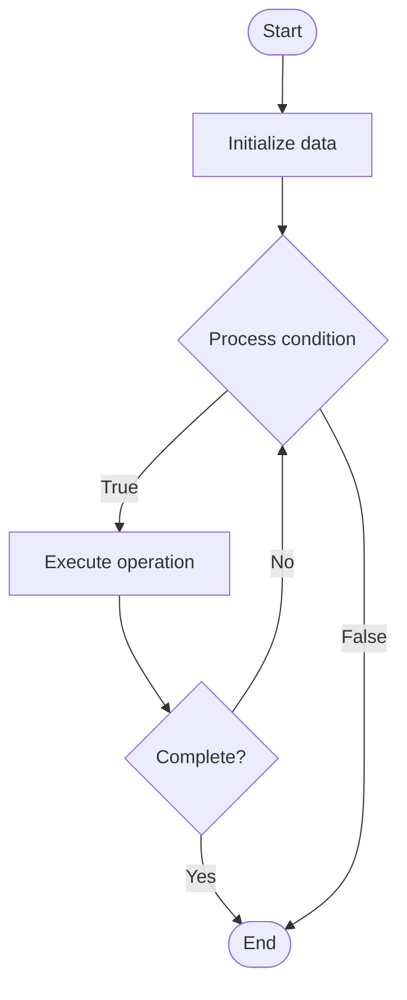

# Load Balancing

## Учебные материалы

- [Школьный уровень](school.ru.md)
- [Университетский уровень](univer.ru.md)

## Algorithm Visualization

### Flowchart (ASCII)

```
Load Balancing Flowchart:

┌─────────────┐
│   Start     │
└──────┬──────┘
       │
       ▼
┌─────────────┐
│  Initialize │
│   data      │
└──────┬──────┘
       │
       ▼
┌─────────────┐      Yes
│  Process   ├──────┐
│  condition?│      │
└──────┬──────┘      │
       │ No          │
       ▼             │
┌─────────────┐      │
│  Execute   │      │
│  operation │      │
└──────┬──────┘      │
       │             │
       └─────────────┘
       │
       ▼
┌─────────────┐
│    End      │
└─────────────┘
```

### Step-by-Step Execution

```
Load Balancing Step-by-Step Execution:

Input: [example data]

Step 1: Initialize
State: [initial state]

Step 2: Process
State: [intermediate state]

Step 3: Finalize
State: [final state]

Result: [output]
```

### Interactive Flowchart (Mermaid)



> **Note**: Mermaid diagrams are rendered automatically on GitHub. For local viewing, use a Mermaid-compatible Markdown viewer.

- [Python Implementation](/code/semester_04/lecture_17_performance/load_balancing/algorithm.py)
- [Java Implementation](/code/semester_04/lecture_17_performance/load_balancing/Algorithm.java)
- [Python Tests](/code/semester_04/lecture_17_performance/load_balancing/test_algorithm.py)


## References

- [Load balancing](https://en.wikipedia.org/wiki/Load_balancing) - Wikipedia


## Historical Context

Load balancing or load distribution may refer to:Load balancing (computing), balancing a workload among multiple computer devices
Load balancing, the storing of excess electrical power by power stations during low demand periods, for release as demand rises
Network load balancing, balancing network traffic across multiple links
Weight distribution, the apportioning of weight within a vehicle, espe
