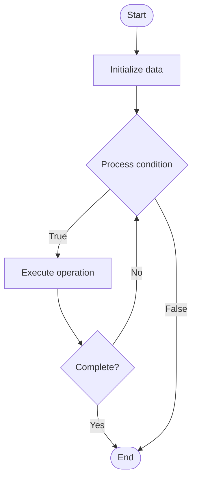

# Consistent Hashing

## Учебные материалы

- [Школьный уровень](school.ru.md)
- [Университетский уровень](univer.ru.md)

## Algorithm Visualization

### Flowchart (ASCII)

```
Consistent Hashing Flowchart:

┌─────────────┐
│   Start     │
└──────┬──────┘
       │
       ▼
┌─────────────┐
│  Initialize │
│   data      │
└──────┬──────┘
       │
       ▼
┌─────────────┐      Yes
│  Process   ├──────┐
│  condition?│      │
└──────┬──────┘      │
       │ No          │
       ▼             │
┌─────────────┐      │
│  Execute   │      │
│  operation │      │
└──────┬──────┘      │
       │             │
       └─────────────┘
       │
       ▼
┌─────────────┐
│    End      │
└─────────────┘
```

### Step-by-Step Execution

```
Consistent Hashing Step-by-Step Execution:

Input: [example data]

Step 1: Initialize
State: [initial state]

Step 2: Process
State: [intermediate state]

Step 3: Finalize
State: [final state]

Result: [output]
```

### Interactive Flowchart (Mermaid)



> **Note**: Mermaid diagrams are rendered automatically on GitHub. For local viewing, use a Mermaid-compatible Markdown viewer.

- [Python Implementation](/code/semester_04/lecture_19_distributed_patterns/consistent_hashing/algorithm.py)
- [Java Implementation](/code/semester_04/lecture_19_distributed_patterns/consistent_hashing/Algorithm.java)
- [Python Tests](/code/semester_04/lecture_19_distributed_patterns/consistent_hashing/test_algorithm.py)


## References

- [Consistent hashing](https://en.wikipedia.org/wiki/Consistent_hashing) - Wikipedia


## Historical Context

In contrast, in most traditional hash tables, a change in the number of array slots causes nearly all keys to be remapped because the mapping between the keys and the slots is defined by a modular operation
