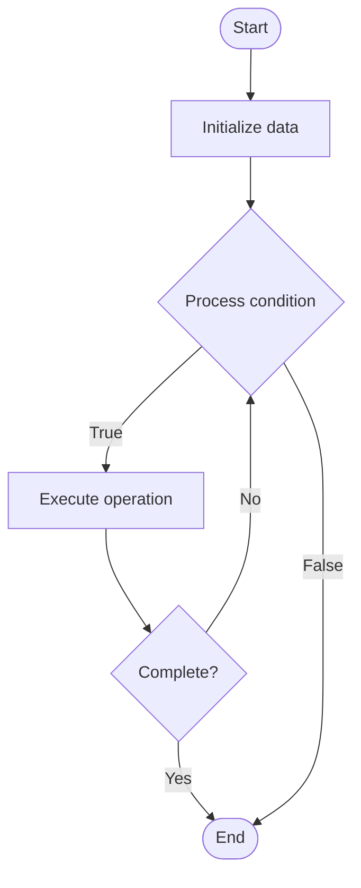

# ResNet (Residual Network)

## Учебные материалы

- [Школьный уровень](school.ru.md)
- [Университетский уровень](univer.ru.md)

## Algorithm Visualization

### Flowchart (ASCII)

```
ResNet (Residual Network) Flowchart:

┌─────────────┐
│   Start     │
└──────┬──────┘
       │
       ▼
┌─────────────┐
│  Initialize │
│   data      │
└──────┬──────┘
       │
       ▼
┌─────────────┐      Yes
│  Process   ├──────┐
│  condition?│      │
└──────┬──────┘      │
       │ No          │
       ▼             │
┌─────────────┐      │
│  Execute   │      │
│  operation │      │
└──────┬──────┘      │
       │             │
       └─────────────┘
       │
       ▼
┌─────────────┐
│    End      │
└─────────────┘
```

### Step-by-Step Execution

```
ResNet (Residual Network) Step-by-Step Execution:

Input: [example data]

Step 1: Initialize
State: [initial state]

Step 2: Process
State: [intermediate state]

Step 3: Finalize
State: [final state]

Result: [output]
```

### Interactive Flowchart (Mermaid)



> **Note**: Mermaid diagrams are rendered automatically on GitHub. For local viewing, use a Mermaid-compatible Markdown viewer.

- [Python Implementation](/code/semester_05/lecture_22_cnn_architectures/resnet/algorithm.py)
- [Java Implementation](/code/semester_05/lecture_22_cnn_architectures/resnet/Algorithm.java)
- [Python Tests](/code/semester_05/lecture_22_cnn_architectures/resnet/test_algorithm.py)


## Historical Context

A residual neural network is a deep learning architecture in which the layers learn residual functions with reference to the layer inputs. It was developed in 2015 for image recognition, and won the ImageNet Large Scale Visual Recognition Challenge of that year.


## References

- [Residual neural network](https://en.wikipedia.org/wiki/Residual_neural_network) - Wikipedia
