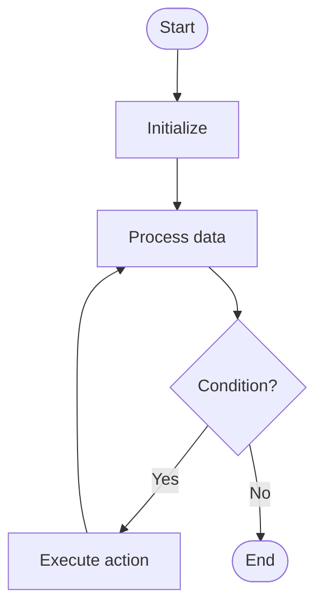

# Attention

# School

## 📋 Quick Summary

- **Purpose:** Attention: The algorithm works by systematically processing data according to a specific strategy.
- **Complexity:** O(n²*d)
- **Category:** NLP
- **Key Idea:** The algorithm works by systematically processing data according to a specific strategy.

Attention: The algorithm works by systematically processing data according to a specific strategy.

The algorithm works by systematically processing data according to a specific strategy.

**ATTENTION** = Remember the key steps: step 1, step 2, step 3


This algorithm works by processing data systematically to achieve its goal. It's part of the **NLP** category of algorithms.


## 📊 Visual Flowchart




## Algorithm Complexity

The time complexity is **O(n²*d)**, which means the time it takes to run depends on the size of the input data. The space complexity is **O(n²)**, indicating how much extra memory is needed.

## Where It's Used in Practice

- General algorithmic problem solving

## What It Can Be Compared To

Think of Attention like a systematic way of organizing or finding information - similar to how you might organize items or search through a collection efficiently.

## Minimal Code Example

```python
def attention(query, keys, values):
    """Implementation."""
    scores = []
    for key in keys:
    score = sum((q * k for q, k in zip(query, key)))
    scores.append(score)
    max_score = max(scores)
    return result
```


---

## 🎯 Try It Yourself

**Try this example:**
Input: [example data]
Step 1: [first operation]
Step 2: [second operation]
.
Output: [result]


---


## 🔍 Step-by-Step Execution

**Step-by-Step Execution:**

```python
# Input
data = [example input]

# Step 1: Initialize
state = initial_state

# Step 2: Process
# [Processing steps]

# Step 3: Finalize
result = final_state

# Output
return result
```

**Expected Output:**

```
Input: [example]
Processing...
Result: [output]
```

## ✏️ Practice Exercise

**Exercise 1 (Easy):**
Trace through the algorithm with a small example (3-5 elements).

**Exercise 2 (Medium):**
Implement the algorithm in your preferred programming language.

**Exercise 3 (Hard):**
Optimize the algorithm or apply it to solve a real-world problem.


---

## ✅ Check Your Understanding

**Q1:** What problem does this algorithm solve?
**A:** [Answer based on algorithm purpose]

**Q2:** What is the time complexity?
**A:** O(n²*d)

**Q3:** When would you use this algorithm?
**A:** [Answer based on use cases]

**Q4:** What are the main steps of this algorithm?
**A:** [List 3-5 key steps]


**Try this example:**
```
Input: [example data]
Step 1: [first operation]
Step 2: [second operation]
.
Output: [result]


**Exercise 1 (Easy):**
Trace through the algorithm with a small example (3-5 elements).

**Exercise 2 (Medium):**
Implement the algorithm in your preferred programming language.

**Exercise 3 (Hard):**
Optimize the algorithm or apply it to solve a real-world problem.


**Q1:** What problem does this algorithm solve?
**A:** [Answer based on algorithm purpose]

**Q2:** What is the time complexity?
**A:** O(n²*d)

**Q3:** When would you use this algorithm?
**A:** [Answer based on use cases]

**Q4:** What are the main steps of this algorithm?
**A:** [List 3-5 key steps]


---

## Common Mistakes

### ❌ Mistake 1: Test with edge cases (empty input, single element, boundary values)
**Solution:** Add validation: `if not data or len(data) <= 1: return data`

### ❌ Mistake 2: Trace through examples step-by-step
**Solution:** Manually trace through a small example (3-5 elements) to verify each step matches the algorithm logic

### ❌ Mistake 3: Use debugging tools to verify your logic
**Solution:** Use print statements or debugger to check variable values at each step, compare with expected behavior

### ❌ Mistake 4: Review the algorithm's key steps before implementing
**Solution:** Study the algorithm's pseudocode or description, identify the core steps, then implement one step at a time

### 💡 How to Avoid
- Test with edge cases (empty input, single element, boundary values)
- Trace through examples step-by-step
- Use debugging tools to verify your logic
- Review the algorithm's key steps before implementing


---

## Recommended Literature

- "Introduction to Algorithms" by Cormen, Leiserson, Rivest, and Stein
- "Algorithms" by Robert Sedgewick and Kevin Wayne
- Online resources: GeeksforGeeks, Wikipedia, Algorithm Visualizations


