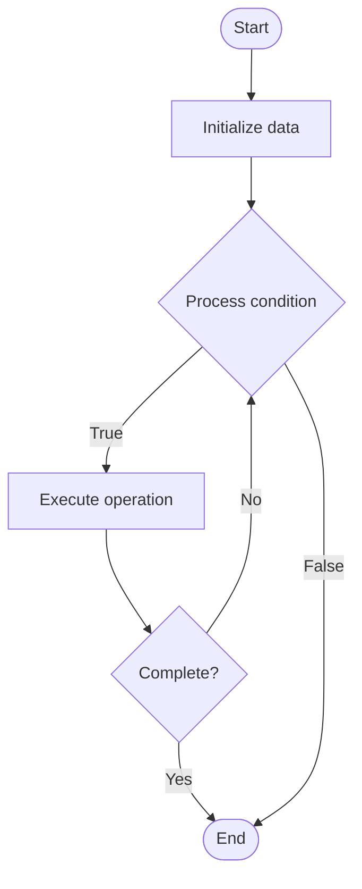

# Optuna

## Учебные материалы

- [Школьный уровень](school.ru.md)
- [Университетский уровень](univer.ru.md)

## Algorithm Visualization

### Flowchart (ASCII)

```
Optuna Flowchart:

┌─────────────┐
│   Start     │
└──────┬──────┘
       │
       ▼
┌─────────────┐
│  Initialize │
│   data      │
└──────┬──────┘
       │
       ▼
┌─────────────┐      Yes
│  Process   ├──────┐
│  condition?│      │
└──────┬──────┘      │
       │ No          │
       ▼             │
┌─────────────┐      │
│  Execute   │      │
│  operation │      │
└──────┬──────┘      │
       │             │
       └─────────────┘
       │
       ▼
┌─────────────┐
│    End      │
└─────────────┘
```

### Step-by-Step Execution

```
Optuna Step-by-Step Execution:

Input: [example data]

Step 1: Initialize
State: [initial state]

Step 2: Process
State: [intermediate state]

Step 3: Finalize
State: [final state]

Result: [output]
```

### Interactive Flowchart (Mermaid)



> **Note**: Mermaid diagrams are rendered automatically on GitHub. For local viewing, use a Mermaid-compatible Markdown viewer.

- [Python Implementation](/code/semester_05/lecture_27_hyperparameter_optimization/optuna/algorithm.py)
- [Java Implementation](/code/semester_05/lecture_27_hyperparameter_optimization/optuna/Algorithm.java)
- [Python Tests](/code/semester_05/lecture_27_hyperparameter_optimization/optuna/test_algorithm.py)


## Historical Context

Optuna is an open-source Python library for automatic hyperparameter tuning of machine learning models. It was first introduced in 2018 by Preferred Networks, a Japanese startup that works on practical applications of deep learning in various fields. The beta version of Optuna was released at the en


## References

- [Optuna](https://en.wikipedia.org/wiki/Optuna) - Wikipedia
