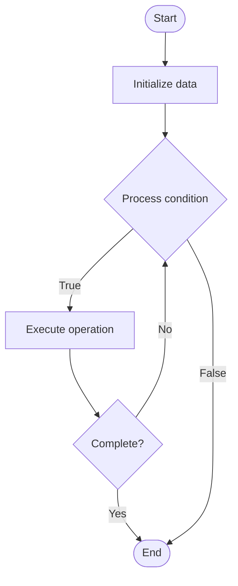

# Word2Vec

## Учебные материалы

- [Школьный уровень](school.ru.md)
- [Университетский уровень](univer.ru.md)

## Algorithm Visualization

### Flowchart (ASCII)

```
Word2Vec Flowchart:

┌─────────────┐
│   Start     │
└──────┬──────┘
       │
       ▼
┌─────────────┐
│  Initialize │
│   data      │
└──────┬──────┘
       │
       ▼
┌─────────────┐      Yes
│  Process   ├──────┐
│  condition?│      │
└──────┬──────┘      │
       │ No          │
       ▼             │
┌─────────────┐      │
│  Execute   │      │
│  operation │      │
└──────┬──────┘      │
       │             │
       └─────────────┘
       │
       ▼
┌─────────────┐
│    End      │
└─────────────┘
```

### Step-by-Step Execution

```
Word2Vec Step-by-Step Execution:

Input: [example data]

Step 1: Initialize
State: [initial state]

Step 2: Process
State: [intermediate state]

Step 3: Finalize
State: [final state]

Result: [output]
```

### Interactive Flowchart (Mermaid)



> **Note**: Mermaid diagrams are rendered automatically on GitHub. For local viewing, use a Mermaid-compatible Markdown viewer.

- [Python Implementation](/code/semester_05/lecture_29_nlp_advanced/word2vec/algorithm.py)
- [Java Implementation](/code/semester_05/lecture_29_nlp_advanced/word2vec/Algorithm.java)
- [Python Tests](/code/semester_05/lecture_29_nlp_advanced/word2vec/test_algorithm.py)


## Historical Context

Word2vec is a technique in natural language processing for obtaining vector representations of words. These vectors capture information about the meaning of the word based on the surrounding words. The word2vec algorithm estimates these representations by modeling text in a large corpus. Once traine


## References

- [Word2vec](https://en.wikipedia.org/wiki/Word2vec) - Wikipedia
