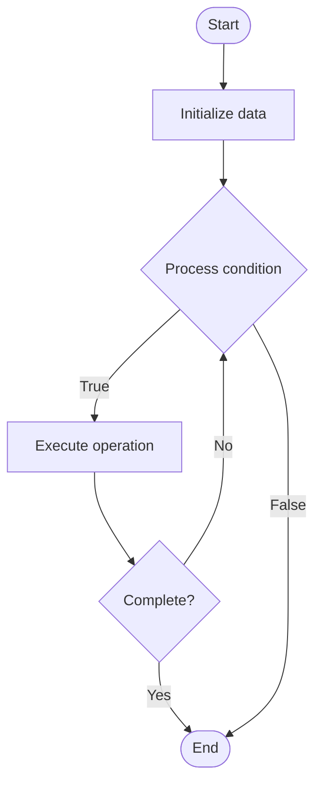

# NAS (Neural Architecture Search)

Name of Algorithm  

## Code Files


## Algorithm Visualization

### Flowchart (ASCII)


```
NAS (Neural Architecture Search) Flowchart:

┌─────────────┐
│   Start     │
└──────┬──────┘
       │
       ▼
┌─────────────┐
│  Initialize │
│   data      │
└──────┬──────┘
       │
       ▼
┌─────────────┐      Yes
│  Process   ├──────┐
│  condition?│      │
└──────┬──────┘      │
       │ No          │
       ▼             │
┌─────────────┐      │
│  Execute   │      │
│  operation │      │
└──────┬──────┘      │
       │             │
       └─────────────┘
       │
       ▼
┌─────────────┐
│    End      │
└─────────────┘
```


### Step-by-Step Execution


```
NAS (Neural Architecture Search) Step-by-Step Execution:

Input: [example data]

Step 1: Initialize
State: [initial state]

Step 2: Process
State: [intermediate state]

Step 3: Finalize
State: [final state]

Result: [output]
```


### Interactive Flowchart (Mermaid)





> **Note**: Mermaid diagrams are rendered automatically on GitHub. For local viewing, use a Mermaid-compatible Markdown viewer.
- [Python Implementation](/code/semester_06/lecture_33_model_optimization/nas/algorithm.py)
- [Java Implementation](/code/semester_06/lecture_33_model_optimization/nas/Algorithm.java)
- [Python Tests](/code/semester_06/lecture_33_model_optimization/nas/test_algorithm.py)

