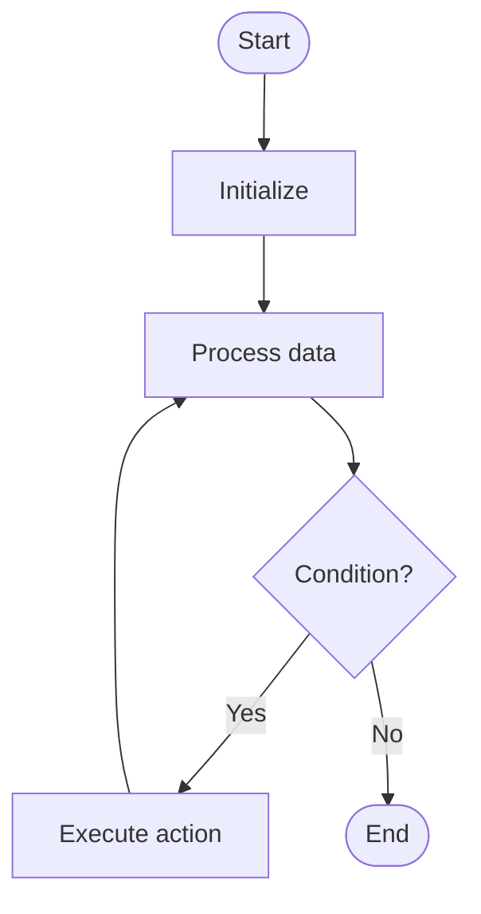

# Deadlock Detection

# Univer

## 📋 Quick Summary

- **Purpose:** Deadlock Detection: The algorithm works by systematically processing data according to a specific strategy.
- **Complexity:** Varies
- **Category:** Operating Systems Fundamentals
- **Key Idea:** The algorithm works by systematically processing data according to a specific strategy.

Deadlock Detection: The algorithm works by systematically processing data according to a specific strategy.

The algorithm works by systematically processing data according to a specific strategy.

**DEADLOCK DETECTION** = Remember the key steps: step 1, step 2, step 3


This algorithm belongs to the **Operating Systems Fundamentals** category and employs systematic data processing to achieve its objectives.


## 📊 Visual Flowchart




## Complexity Analysis

**Time Complexity:** Varies
- The algorithm's performance scales according to this complexity class
- Best, average, and worst cases may vary based on input characteristics

**Space Complexity:** Varies
- Indicates the amount of additional memory required during execution

**Key Data Structures:** stack, hash table/dictionary

## Real-World Applications

Deadlock Detection is used in:
- Software development frameworks
- System optimization
- Data processing pipelines
- Algorithm libraries

## Conceptual Similarities

This algorithm shares conceptual similarities with other algorithms in the Operating Systems Fundamentals category, following similar design patterns and optimization strategies.

## Related Algorithms

Deadlock Detection is often used in combination with:
- Complementary algorithms for preprocessing or post-processing
- Data structures that optimize its performance
- Other algorithms in the same complexity class

## Key Implementation Details

```python
def deadlock_detection(data):
    """Implementation of Deadlock Detection."""
    # Core algorithm logic
    return result
```

## Common Application Errors

- Incorrect handling of edge cases (empty input, single element, boundary conditions)
- Misunderstanding of complexity implications in large-scale systems
- Suboptimal implementation leading to performance degradation
- Incorrect assumptions about input data characteristics
- Not considering alternative algorithms for specific use cases


---

## Recommended Literature

- "Introduction to Algorithms" (CLRS) - Comprehensive algorithm analysis
- "Algorithm Design Manual" by Steven Skiena
- "Algorithms" by Sedgewick and Wayne
- Research papers on algorithm optimization and analysis
- Framework documentation and implementation guides


---

## 🎯 Try It Yourself

**Try detecting a deadlock:**
```
Wait-for graph:
  Process 1 → Resource 2
  Process 2 → Resource 3
  Process 3 → Resource 1

Step 1: Start DFS from Process 1
  Visit Process 1 → Resource 2

Step 2: Follow Resource 2 → Process 2
  Visit Process 2 → Resource 3

Step 3: Follow Resource 3 → Process 3
  Visit Process 3 → Resource 1

Step 4: Process 1 is already in recursion stack!
  Found cycle: 1 → 2 → 3 → 1
  Deadlock detected!

Output: Deadlock found in cycle [1, 2, 3, 1]
```
---


## 🔍 Step-by-Step Execution

**Step-by-Step Execution:**

```python
# Initialize wait-for graph
detector = DeadlockDetection()
detector.add_wait(1, 2)  # Process 1 waits for Resource 2
detector.add_wait(2, 3)  # Process 2 waits for Resource 3
detector.add_wait(3, 1)  # Process 3 waits for Resource 1

# Step 1: Start DFS from Process 1
visited = {1}
rec_stack = {1}
path = [1]

# Step 2: Process 1 → Resource 2 → Process 2
visited = {1, 2}
rec_stack = {1, 2}
path = [1, 2]

# Step 3: Process 2 → Resource 3 → Process 3
visited = {1, 2, 3}
rec_stack = {1, 2, 3}
path = [1, 2, 3]

# Step 4: Process 3 → Resource 1 → Process 1 (already in rec_stack!)
# Found cycle: [1, 2, 3, 1]
cycles = [[1, 2, 3, 1]]

# Result
return [[1, 2, 3, 1]]  # Deadlock detected!
```

**Expected Output:**

```
Wait-for graph:
  Process 1 → Resource 2
  Process 2 → Resource 3
  Process 3 → Resource 1

DFS traversal:
  Start: Process 1
  Visit: Process 2
  Visit: Process 3
  Cycle detected: Process 1 (already in recursion stack)

Deadlock found!
Cycle: [1, 2, 3, 1]
```


**Expected Output:**

```
Wait-for graph:
  Process 1 → Resource 2
  Process 2 → Resource 3
  Process 3 → Resource 1

DFS traversal:
  Start: Process 1
  Visit: Process 2
  Visit: Process 3
  Cycle detected: Process 1 (already in recursion stack)

Deadlock found!
Cycle: [1, 2, 3, 1]
```

## ✏️ Practice Exercise

**Exercise 1 (Easy):**
Create a wait-for graph with 3 processes and detect if there's a deadlock. Draw the graph and trace the DFS.

**Exercise 2 (Medium):**
Implement deadlock detection for a system with multiple processes and resources. Handle edge cases (no cycles, multiple cycles).

**Exercise 3 (Hard):**
Design a deadlock detection system that runs periodically in an operating system. Consider performance and false positives.


---

## ✅ Check Your Understanding

**Q1:** What problem does this algorithm solve?
**A:** Deadlock Detection identifies when processes are waiting for each other in a circular manner, causing all processes to be blocked indefinitely.

**Q2:** What is the time complexity?
**A:** O(V + E) where V is the number of processes/resources and E is the number of wait relationships. Uses DFS for cycle detection.

**Q3:** When would you use this algorithm?
**A:** In operating systems to periodically check for deadlocks, in database systems to detect transaction deadlocks, and in distributed systems to identify circular dependencies.

**Q4:** What are the main steps of this algorithm?
**A:** 1) Build wait-for graph from process-resource relationships, 2) Use DFS to traverse the graph, 3) Detect cycles using recursion stack, 4) Return all detected cycles as deadlocks.


**Try detecting a deadlock:**
```
Wait-for graph:
  Process 1 → Resource 2
  Process 2 → Resource 3
  Process 3 → Resource 1

Step 1: Start DFS from Process 1
  Visit Process 1 → Resource 2

Step 2: Follow Resource 2 → Process 2
  Visit Process 2 → Resource 3

Step 3: Follow Resource 3 → Process 3
  Visit Process 3 → Resource 1

Step 4: Process 1 is already in recursion stack!
  Found cycle: 1 → 2 → 3 → 1
  Deadlock detected!

Output: Deadlock found in cycle [1, 2, 3, 1]
```


## Common Mistakes

### ❌ Mistake 1: Not tracking recursion stack properly
**Solution:** Use a separate `rec_stack` set to track nodes in the current DFS path. Only nodes in `rec_stack` indicate a back edge (cycle).

### ❌ Mistake 2: Not handling disconnected components
**Solution:** Iterate through all nodes in the graph and start DFS from each unvisited node to ensure all cycles are detected.

### ❌ Mistake 3: Confusing visited nodes with recursion stack
**Solution:** `visited` tracks all explored nodes, while `rec_stack` tracks nodes in current path. A node can be visited but not in current path.

### ❌ Mistake 4: Not removing node from recursion stack after DFS
**Solution:** Always remove the node from `rec_stack` after processing all neighbors to allow detection of multiple cycles.

### 💡 How to Avoid
- Use two separate sets: `visited` for all explored nodes, `rec_stack` for current path
- Always clean up `rec_stack` after processing
- Test with graphs containing multiple cycles
- Verify with simple examples first (2-3 nodes)
- Test with edge cases (empty input, single element, boundary values)
- Trace through examples step-by-step
- Use debugging tools to verify your logic
- Review the algorithm's key steps before implementing