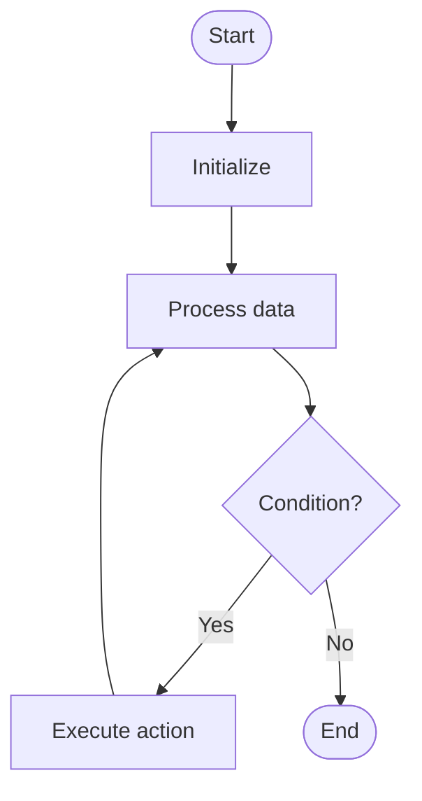

# Grover Algorithm

# School

## 📋 Quick Summary

- **Purpose:** Grover Algorithm is a quantum search algorithm that finds a marked item in an unsorted database with O(√N) queries, providing quadratic speedup over classical search.
- **Complexity:** Varies
- **Category:** Quantum Computing Fundamentals
- **Key Idea:** Grover Algorithm is a quantum search algorithm that finds a marked item in an unsorted database with O(√N) queries, providing quadratic speedup over classical search.

Grover Algorithm is a quantum search algorithm that finds a marked item in an unsorted database with O(√N) queries, providing quadratic speedup over classical search.

Grover Algorithm is a quantum search algorithm that finds a marked item in an unsorted database with O(√N) queries, providing quadratic speedup over classical search.

**GROVER ALGORITHM** = Remember the key steps: step 1, step 2, step 3


Этот алгоритм работает, систематически обрабатывая данные, чтобы достичь своей цели. Он относится к категории алгоритмов **Quantum Computing Fundamentals**.


## 📊 Visual Flowchart



> **Note**: Mermaid diagrams are rendered automatically on GitHub. For local viewing, use a Mermaid-compatible Markdown viewer.


## Сложность алгоритма

Временная сложность составляет **Varies**, что означает, что время выполнения зависит от размера входных данных. Пространственная сложность — **Varies**, что указывает на количество дополнительной памяти.

## Где применяется на практике

- Quantum database search
- Optimization problems in quantum computing
- Cryptographic applications
- Quantum machine learning

## С чем можно сравнить

Представьте Grover Algorithm как систематический способ организации или поиска информации — похоже на то, как вы можете эффективно организовывать предметы или искать в коллекции.

## Минимальный пример кода

```python
def grover_algorithm(n_qubits, target):
    """Implementation."""
    N = 2 ** n_qubits
    iterations = int(math.pi / 4 * math.sqrt(N))
    probability = 1.0 - 1.0 / N
    return result
```

## Частые ошибки

- Не обрабатываются граничные случаи (пустой ввод, один элемент)
- Непонимание последствий сложности
- Неправильная реализация, приводящая к неверным результатам
- Не оптимизировано для конкретного случая использования

## Рекомендуемая литература

- "Алгоритмы: построение и анализ" Томас Кормен и др.
- "Алгоритмы" Роберт Седжвик
- Онлайн-ресурсы: GeeksforGeeks, Википедия, Визуализации алгоритмов


---

## 🎯 Try It Yourself

**Try this example:**
```
Input: [example data]

Step 1: Initialize algorithm state
Step 2: Process input data
Step 3: Generate result

Output: [algorithm result]
```


## Common Mistakes

### ❌ Mistake 1: Not handling edge cases
**Solution:** Always check for empty input, single element, or boundary values before processing.

### ❌ Mistake 2: Incorrect initialization
**Solution:** Ensure all variables and data structures are properly initialized before the main algorithm loop.

### ❌ Mistake 3: Off-by-one errors in loops
**Solution:** Carefully verify loop bounds and termination conditions. Test with small examples to catch boundary issues.

### ❌ Mistake 4: Not validating input
**Solution:** Add input validation to ensure data is in expected format and within valid ranges.

### 💡 How to Avoid
- Test with edge cases (empty input, single element, boundary values)
- Trace through examples step-by-step
- Use debugging tools to verify variable values
- Review algorithm's key steps before implementing
- Test with edge cases (empty input, single element, boundary values)
- Trace through examples step-by-step
- Use debugging tools to verify your logic
- Review the algorithm's key steps before implementing