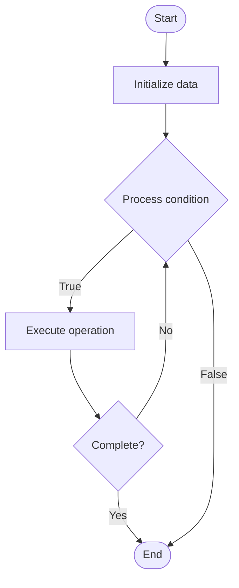

# Quantum Entanglement

## Учебные материалы

- [Школьный уровень](school.ru.md)
- [Университетский уровень](univer.ru.md)

## Algorithm Visualization

### Flowchart (ASCII)

```
Quantum Entanglement Flowchart:

┌─────────────┐
│   Start     │
└──────┬──────┘
       │
       ▼
┌─────────────┐
│  Initialize │
│   data      │
└──────┬──────┘
       │
       ▼
┌─────────────┐      Yes
│  Process   ├──────┐
│  condition?│      │
└──────┬──────┘      │
       │ No          │
       ▼             │
┌─────────────┐      │
│  Execute   │      │
│  operation │      │
└──────┬──────┘      │
       │             │
       └─────────────┘
       │
       ▼
┌─────────────┐
│    End      │
└─────────────┘
```

### Step-by-Step Execution

```
Quantum Entanglement Step-by-Step Execution:

Input: [example data]

Step 1: Initialize
State: [initial state]

Step 2: Process
State: [intermediate state]

Step 3: Finalize
State: [final state]

Result: [output]
```

### Interactive Flowchart (Mermaid)



> **Note**: Mermaid diagrams are rendered automatically on GitHub. For local viewing, use a Mermaid-compatible Markdown viewer.

- [Python Implementation](/code/semester_07/lecture_44_quantum_computing/quantum_entanglement/algorithm.py)
- [Java Implementation](/code/semester_07/lecture_44_quantum_computing/quantum_entanglement/Algorithm.java)
- [Python Tests](/code/semester_07/lecture_44_quantum_computing/quantum_entanglement/test_algorithm.py)


## References

- [Quantum entanglement](https://en.wikipedia.org/wiki/Quantum_entanglement) - Wikipedia


## Historical Context

Quantum entanglement is the phenomenon wherein the quantum state of each particle in a group cannot be described independently of the state of the others, even when the particles are separated by a large distance
