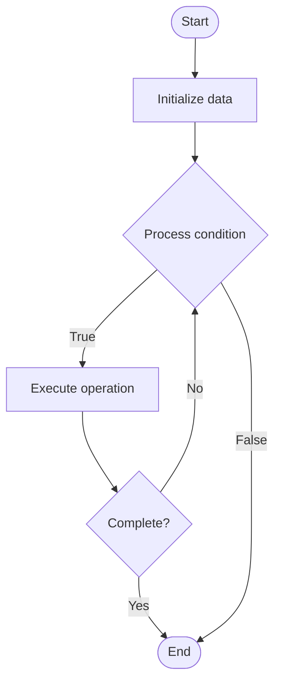

# Proof of Stake (PoS)

## Учебные материалы

- [Школьный уровень](school.ru.md)
- [Университетский уровень](univer.ru.md)

## Algorithm Visualization

### Flowchart (ASCII)

```
Proof of Stake (PoS) Flowchart:

┌─────────────┐
│   Start     │
└──────┬──────┘
       │
       ▼
┌─────────────┐
│  Initialize │
│   data      │
└──────┬──────┘
       │
       ▼
┌─────────────┐      Yes
│  Process   ├──────┐
│  condition?│      │
└──────┬──────┘      │
       │ No          │
       ▼             │
┌─────────────┐      │
│  Execute   │      │
│  operation │      │
└──────┬──────┘      │
       │             │
       └─────────────┘
       │
       ▼
┌─────────────┐
│    End      │
└─────────────┘
```

### Step-by-Step Execution

```
Proof of Stake (PoS) Step-by-Step Execution:

Input: [example data]

Step 1: Initialize
State: [initial state]

Step 2: Process
State: [intermediate state]

Step 3: Finalize
State: [final state]

Result: [output]
```

### Interactive Flowchart (Mermaid)



> **Note**: Mermaid diagrams are rendered automatically on GitHub. For local viewing, use a Mermaid-compatible Markdown viewer.

- [Python Implementation](/code/semester_07/lecture_45_blockchain_fundamentals/proof_of_stake/algorithm.py)
- [Java Implementation](/code/semester_07/lecture_45_blockchain_fundamentals/proof_of_stake/Algorithm.java)
- [Python Tests](/code/semester_07/lecture_45_blockchain_fundamentals/proof_of_stake/test_algorithm.py)

   Proof of Stake (PoS)

What problem does it solve? (1 sentence)  
   Selects validators to create blocks based on amount of cryptocurrency staked, reducing energy consumption while maintaining network security through economic incentives.

Intuition (plain-language explanation)  
   Like a weighted lottery: instead of solving puzzles (expensive), validators 'stake' their coins as collateral - the more coins you stake, the higher your chance of being selected to validate blocks. If you validate incorrectly, you lose your stake (economic penalty), so validators are incentivized to be honest.

Inputs & Outputs  

- Input: Staked cryptocurrency, validator selection algorithm, block candidate, validator's stake amount.
  - Output: Validated block, validator rewards, updated stake balances.

Step-by-step description (5–10 lines max)  
Stake coins: validators lock cryptocurrency as stake (collateral).
Select validator: algorithm selects validator based on stake amount and randomness.
Propose block: selected validator creates and proposes new block.
Validate: other validators verify proposed block is valid.
Approve: validators vote to approve or reject block.
Finalize: if majority approve, block added to chain, validator earns reward.
Slash (if malicious): if validator acts maliciously, stake is slashed (penalty).
Update stake: adjust validator stakes based on rewards/penalties.

Tiny example (hand-simulated)  
   Validator stakes 1000 ETH → selected to validate block (probability proportional to stake) → proposes block → other validators verify → 2/3 approve → block finalized → validator earns 0.1 ETH reward → stake increases to 1000.1 ETH. If malicious: stake slashed, lose 100 ETH.

Time & Space Complexity  

  - Time: O(1) to select validator (deterministic/random selection), O(1) to validate block.  
  - Space: O(v) where v is number of validators (track stake amounts).

Strengths  

- Energy efficient: requires minimal computational resources (no mining).
- Fast: enables faster block times and higher throughput.
- Economic security: validators have financial stake in network security.

Weaknesses / limitations  

- Wealth concentration: those with more stake have more influence.
- Nothing at stake: validators might validate on multiple chains (addressed by slashing).
- Complexity: more complex validator selection and slashing mechanisms.

Compare with alternatives  
    Alternatives: Proof of Work, Delegated Proof of Stake, Proof of Authority, Hybrid PoW/PoS

30-second explanation (your own words)  
    Selects validators to create blocks based on amount of cryptocurrency staked, reducing energy consumption while maintaining network security through economic incentives.

*Sources: Adapted from standard university textbooks and Wikipedia summaries.*


## References

- [Proof of stake](https://en.wikipedia.org/wiki/Proof_of_stake) - Wikipedia


## Historical Context

Proof-of-stake (PoS) protocols are a class of consensus mechanisms for blockchains that work by selecting validators in proportion to their quantity of holdings in the associated cryptocurrency
