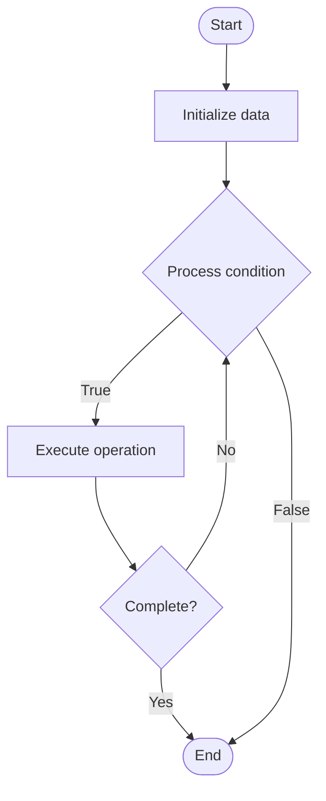

# Proof of Work (PoW)

## Учебные материалы

- [Школьный уровень](school.ru.md)
- [Университетский уровень](univer.ru.md)

## Algorithm Visualization

### Flowchart (ASCII)

```
Proof of Work (PoW) Flowchart:

┌─────────────┐
│   Start     │
└──────┬──────┘
       │
       ▼
┌─────────────┐
│  Initialize │
│   data      │
└──────┬──────┘
       │
       ▼
┌─────────────┐      Yes
│  Process   ├──────┐
│  condition?│      │
└──────┬──────┘      │
       │ No          │
       ▼             │
┌─────────────┐      │
│  Execute   │      │
│  operation │      │
└──────┬──────┘      │
       │             │
       └─────────────┘
       │
       ▼
┌─────────────┐
│    End      │
└─────────────┘
```

### Step-by-Step Execution

```
Proof of Work (PoW) Step-by-Step Execution:

Input: [example data]

Step 1: Initialize
State: [initial state]

Step 2: Process
State: [intermediate state]

Step 3: Finalize
State: [final state]

Result: [output]
```

### Interactive Flowchart (Mermaid)



> **Note**: Mermaid diagrams are rendered automatically on GitHub. For local viewing, use a Mermaid-compatible Markdown viewer.

- [Python Implementation](/code/semester_07/lecture_45_blockchain_fundamentals/proof_of_work/algorithm.py)
- [Java Implementation](/code/semester_07/lecture_45_blockchain_fundamentals/proof_of_work/Algorithm.java)
- [Python Tests](/code/semester_07/lecture_45_blockchain_fundamentals/proof_of_work/test_algorithm.py)

   Proof of Work (PoW)

What problem does it solve? (1 sentence)  
   Requires miners to solve computationally expensive cryptographic puzzles to validate blocks, securing blockchain network by making attacks economically infeasible.

Intuition (plain-language explanation)  
   Like a lottery where you buy tickets by doing hard math: miners compete to solve a difficult puzzle (finding a number that makes block hash start with many zeros) - the first to solve gets to add the block and earn rewards. The difficulty ensures blocks are added at steady rate, and attacking requires enormous computational power (expensive).

Inputs & Outputs  

  - Input: Block candidate with transactions, previous block hash, difficulty target, nonce (variable to adjust).  
  - Output: Valid block with nonce meeting difficulty, block hash, mining reward.

Step-by-step description (5–10 lines max)  
Prepare block: create block with transactions, previous hash, timestamp.
Set difficulty: network adjusts target hash (number of leading zeros required).
Try nonce: start with nonce = 0, increment and recompute block hash.
Check hash: verify if hash meets difficulty target (hash < target).
Repeat: if hash doesn't meet target, increment nonce and try again.
Find solution: when hash meets target, nonce is valid proof of work.
Broadcast: miner broadcasts block with valid nonce to network.
Verify: other nodes verify hash meets difficulty (quick verification).
Accept: if valid, network accepts block, miner receives reward.

Tiny example (hand-simulated)  
   Block with transactions → hash with nonce=0: 7a3f9... (doesn't meet target) → nonce=1: 9b2e1... → ... → nonce=1234567: 0000a3f9... (meets target, 4 leading zeros) → broadcast block → network verifies → block accepted → miner earns Bitcoin reward.

Time & Space Complexity  

  - Time: O(2^d) expected attempts where d is difficulty (exponential in difficulty), O(1) to verify.  
  - Space: O(1) per mining attempt (constant space for hash computation).

Strengths  

- Security: requires enormous computational power to attack (51% attack expensive).
- Proven: Bitcoin's security model proven over 15+ years.
- Decentralization: anyone with hardware can participate in mining.

Weaknesses / limitations  

- Energy consumption: extremely energy-intensive (Bitcoin uses more energy than some countries).
- Slow: block time typically 10+ minutes (Bitcoin), limiting throughput.
- Hardware arms race: favors those with specialized mining hardware (ASICs).

Compare with alternatives  
    Alternatives: Proof of Stake, Proof of Authority, Delegated Proof of Stake, Proof of Space

30-second explanation (your own words)  
    Requires miners to solve computationally expensive cryptographic puzzles to validate blocks, securing blockchain network by making attacks economically infeasible.

*Sources: Adapted from standard university textbooks and Wikipedia summaries.*
