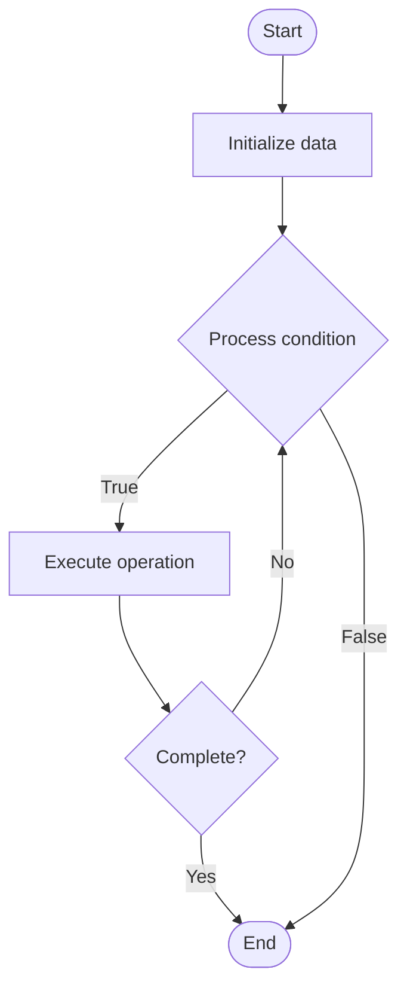

# Smart Contracts

## Учебные материалы

- [Школьный уровень](school.ru.md)
- [Университетский уровень](univer.ru.md)

## Algorithm Visualization

### Flowchart (ASCII)

```
Smart Contracts Flowchart:

┌─────────────┐
│   Start     │
└──────┬──────┘
       │
       ▼
┌─────────────┐
│  Initialize │
│   data      │
└──────┬──────┘
       │
       ▼
┌─────────────┐      Yes
│  Process   ├──────┐
│  condition?│      │
└──────┬──────┘      │
       │ No          │
       ▼             │
┌─────────────┐      │
│  Execute   │      │
│  operation │      │
└──────┬──────┘      │
       │             │
       └─────────────┘
       │
       ▼
┌─────────────┐
│    End      │
└─────────────┘
```

### Step-by-Step Execution

```
Smart Contracts Step-by-Step Execution:

Input: [example data]

Step 1: Initialize
State: [initial state]

Step 2: Process
State: [intermediate state]

Step 3: Finalize
State: [final state]

Result: [output]
```

### Interactive Flowchart (Mermaid)



> **Note**: Mermaid diagrams are rendered automatically on GitHub. For local viewing, use a Mermaid-compatible Markdown viewer.

- [Python Implementation](/code/semester_07/lecture_45_blockchain_fundamentals/smart_contracts/algorithm.py)
- [Java Implementation](/code/semester_07/lecture_45_blockchain_fundamentals/smart_contracts/Algorithm.java)
- [Python Tests](/code/semester_07/lecture_45_blockchain_fundamentals/smart_contracts/test_algorithm.py)

What problem does it solve? (1 sentence)  
   Executes programmable code automatically on blockchain when conditions are met, enabling trustless automation of agreements and decentralized applications without intermediaries.

Intuition (plain-language explanation)  
   Like a vending machine: you put in money (send transaction) and select a product (call function) - the machine automatically gives you the product (executes code) without needing a cashier. Smart contracts are like vending machines on blockchain: code that automatically executes when conditions are met, with no one able to stop or change it once deployed.

Inputs & Outputs  

  - Input: Contract code, function calls, transaction data, blockchain state, gas (execution fee).  
  - Output: Contract execution results, state changes, events, transaction receipts.

Step-by-step description (5–10 lines max)  
Deploy contract: developer writes and deploys smart contract code to blockchain.
Store code: contract bytecode stored on blockchain (immutable once deployed).
Call function: user sends transaction calling contract function with parameters.
Validate: network validates transaction (signature, gas, permissions).
Execute: blockchain node executes contract code in virtual machine (EVM, etc.).
Update state: contract execution modifies blockchain state (balances, variables, etc.).
Emit events: contract can emit events for off-chain monitoring.
Return result: execution result returned, transaction recorded on blockchain.
Pay gas: user pays gas fees for computation (prevents infinite loops).

Tiny example (hand-simulated)  
   Deploy 'Token' contract → user calls transfer(recipient, amount) → contract checks sender balance → if sufficient, deducts from sender, adds to recipient → emits Transfer event → transaction recorded → balance updated on blockchain → no intermediary needed.

Time & Space Complexity  

  - Time: O(1) per operation typically, but depends on contract complexity (gas limits prevent infinite loops).  
  - Space: O(1) per contract variable, O(n) for arrays/mappings where n is data size.

Strengths  

- Trustless: code executes automatically without trusted third party.
- Transparent: contract code and execution visible to all.
- Immutable: once deployed, contract cannot be changed (unless designed to be upgradeable).

Weaknesses / limitations  

- Irreversible: bugs cannot be fixed easily (code is immutable).
- Gas costs: execution requires payment (can be expensive for complex operations).
- Limited expressiveness: constrained by blockchain's computational model.

Compare with alternatives  
    Alternatives: Traditional Contracts, Centralized Automation, Off-chain Oracles, Layer 2 Solutions

30-second explanation (your own words)  
    Executes programmable code automatically on blockchain when conditions are met, enabling trustless automation of agreements and decentralized applications without intermediaries.

*Sources: Adapted from standard university textbooks and Wikipedia summaries.*


## Historical Context

A smart contract is a computer program or a transaction protocol that is intended to automatically execute, control or document events and actions according to the terms of a contract or an agreement. The objectives of smart contracts are the reduction of need for trusted intermediators, arbitration


## References

- [Smart contract](https://en.wikipedia.org/wiki/Smart_contract) - Wikipedia
