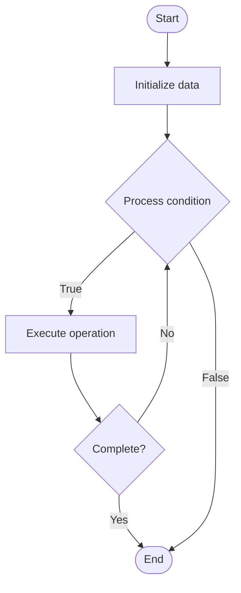

# Blockchain Scalability

## Учебные материалы

- [Школьный уровень](school.ru.md)
- [Университетский уровень](univer.ru.md)

## Algorithm Visualization

### Flowchart (ASCII)

```
Blockchain Scalability Flowchart:

┌─────────────┐
│   Start     │
└──────┬──────┘
       │
       ▼
┌─────────────┐
│  Initialize │
│   data      │
└──────┬──────┘
       │
       ▼
┌─────────────┐      Yes
│  Process   ├──────┐
│  condition?│      │
└──────┬──────┘      │
       │ No          │
       ▼             │
┌─────────────┐      │
│  Execute   │      │
│  operation │      │
└──────┬──────┘      │
       │             │
       └─────────────┘
       │
       ▼
┌─────────────┐
│    End      │
└─────────────┘
```

### Step-by-Step Execution

```
Blockchain Scalability Step-by-Step Execution:

Input: [example data]

Step 1: Initialize
State: [initial state]

Step 2: Process
State: [intermediate state]

Step 3: Finalize
State: [final state]

Result: [output]
```

### Interactive Flowchart (Mermaid)



> **Note**: Mermaid diagrams are rendered automatically on GitHub. For local viewing, use a Mermaid-compatible Markdown viewer.

- [Python Implementation](/code/semester_07/lecture_46_blockchain_advanced/blockchain_scalability/algorithm.py)
- [Java Implementation](/code/semester_07/lecture_46_blockchain_advanced/blockchain_scalability/Algorithm.java)
- [Python Tests](/code/semester_07/lecture_46_blockchain_advanced/blockchain_scalability/test_algorithm.py)

What problem does it solve? (1 sentence)  
   Addresses blockchain's limited transaction throughput and high latency by implementing solutions that increase transactions per second while maintaining decentralization and security.

Intuition (plain-language explanation)  
   Like a highway bottleneck: blockchain can only process a few transactions per second (like a single-lane road) - scalability solutions add more lanes (layer 2), faster processing (sharding), or off-ramps (sidechains) to handle more traffic without compromising security or decentralization.

Inputs & Outputs  

- Input: Blockchain transactions, scalability solution type (layer 2, sharding, sidechains, etc.), network capacity.
  - Output: Increased transaction throughput, reduced latency, maintained security and decentralization.

Step-by-step description (5–10 lines max)  
Identify bottleneck: analyze current blockchain limitations (throughput, latency, cost).
Choose solution: select scalability approach (layer 2, sharding, larger blocks, etc.).
Implement: deploy scalability solution (rollups, state channels, sidechains, etc.).
Batch transactions: group multiple transactions together (reduce on-chain load).
Process off-chain: execute transactions off main chain when possible.
Settle on-chain: periodically commit results to main blockchain (security anchor).
Verify: ensure scalability solution maintains security guarantees.
Monitor: track performance improvements (TPS, latency, cost reduction).

Tiny example (hand-simulated)  
   Ethereum: 15 TPS → implement Layer 2 rollup → batch 1000 transactions off-chain → process in rollup → commit single proof to Ethereum → effectively 2000+ TPS → 100x improvement while maintaining security.

Time & Space Complexity  

  - Time: Varies by solution: O(1) per transaction in layer 2 (batched), O(n) for sharding where n is shard size.  
  - Space: O(b) where b is batch size (layer 2), O(s) for sharding where s is number of shards.

Strengths  

- Higher throughput: enables thousands of transactions per second.
- Lower costs: reduces transaction fees through batching and off-chain processing.
- Faster confirmation: reduces transaction confirmation time.

Weaknesses / limitations  

- Complexity: adds complexity to blockchain architecture.
- Trade-offs: may require trade-offs between security, decentralization, and scalability.
- Compatibility: requires coordination between main chain and scalability solution.

Compare with alternatives  
    Alternatives: Layer 2 Solutions, Sharding, Sidechains, Larger Blocks, Off-chain Processing

30-second explanation (your own words)  
    Addresses blockchain's limited transaction throughput and high latency by implementing solutions that increase transactions per second while maintaining decentralization and security.

*Sources: Adapted from standard university textbooks and Wikipedia summaries.*
