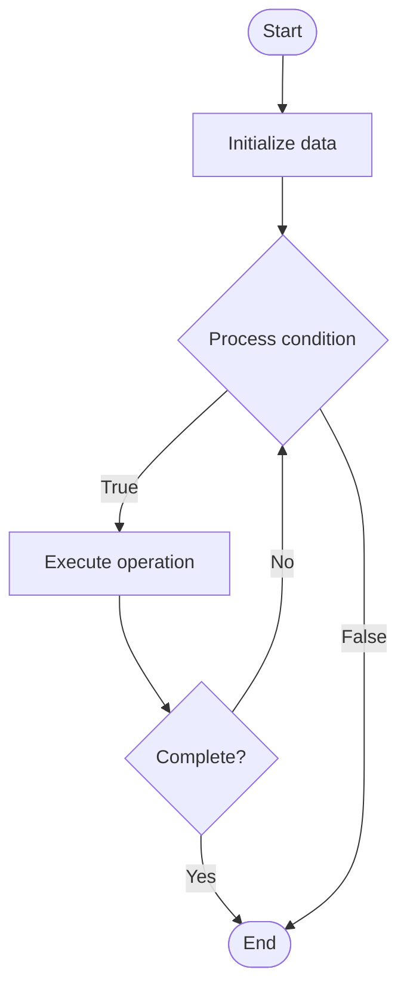

# Cross-Chain Interoperability

1. **Name of Algorithm**  

## Code Files


## Algorithm Visualization

### Flowchart (ASCII)


```
Cross-Chain Interoperability Flowchart:

┌─────────────┐
│   Start     │
└──────┬──────┘
       │
       ▼
┌─────────────┐
│  Initialize │
│   data      │
└──────┬──────┘
       │
       ▼
┌─────────────┐      Yes
│  Process   ├──────┐
│  condition?│      │
└──────┬──────┘      │
       │ No          │
       ▼             │
┌─────────────┐      │
│  Execute   │      │
│  operation │      │
└──────┬──────┘      │
       │             │
       └─────────────┘
       │
       ▼
┌─────────────┐
│    End      │
└─────────────┘
```


### Step-by-Step Execution


```
Cross-Chain Interoperability Step-by-Step Execution:

Input: [example data]

Step 1: Initialize
State: [initial state]

Step 2: Process
State: [intermediate state]

Step 3: Finalize
State: [final state]

Result: [output]
```


### Interactive Flowchart (Mermaid)





> **Note**: Mermaid diagrams are rendered automatically on GitHub. For local viewing, use a Mermaid-compatible Markdown viewer.
- [Python Implementation](semester_07/lecture_46_blockchain_advanced/cross_chain/algorithm.py)
- [Java Implementation](semester_07/lecture_46_blockchain_advanced/cross_chain/Algorithm.java)
- [Python Tests](semester_07/lecture_46_blockchain_advanced/cross_chain/test_algorithm.py)


   Cross-Chain Interoperability

2. **What problem does it solve? (1 sentence)**  
   Enables communication and value transfer between different blockchain networks, allowing users to interact with multiple blockchains seamlessly without intermediaries.

3. **Intuition (plain-language explanation)**  
   Like international banking: different blockchains are like different countries with their own currencies - cross-chain solutions are like currency exchanges and international wire transfers, allowing you to move value and data between blockchains (like converting dollars to euros and sending them).

4. **Inputs & Outputs**  
   - Input: Source blockchain, target blockchain, assets to transfer, cross-chain protocol.  
   - Output: Assets transferred to target blockchain, cross-chain transaction proof, interoperability achieved.

5. **Step-by-step description (5–10 lines max)**  
1. Lock assets: lock assets on source blockchain (prevent double-spending).
2. Generate proof: create cryptographic proof of locked assets.
3. Relay proof: relay proof to target blockchain (via bridge, relayers, or oracles).
4. Verify proof: target blockchain verifies proof of locked assets.
5. Mint/Unlock: mint equivalent assets on target blockchain or unlock on source.
6. Execute: perform desired operation on target blockchain.
7. Monitor: track cross-chain transaction status and completion.
8. Settle: finalize transaction when both chains confirm.

6. **Tiny example (hand-simulated)**  
   User wants to use Ethereum DApp but has Bitcoin → lock 1 BTC on Bitcoin → generate proof → relay to Ethereum → verify proof → mint 1 WBTC (wrapped Bitcoin) on Ethereum → use WBTC in Ethereum DApp → later, burn WBTC on Ethereum → unlock BTC on Bitcoin.

7. **Time & Space Complexity**  
   - Time: O(1) per transaction, but includes relay time between chains (minutes to hours depending on block times).  
   - Space: O(1) per cross-chain transaction (proofs stored on both chains).

8. **Strengths**  
- Interoperability: enables seamless interaction between different blockchains.
- Liquidity: allows assets to move between chains, increasing liquidity.
- Flexibility: users can choose best blockchain for each use case.

9. **Weaknesses / limitations**  
- Security risks: bridges and cross-chain protocols are attack targets.
- Complexity: requires coordination between multiple blockchains.
- Trust: some solutions require trusted intermediaries or validators.

10. **Compare with alternatives**  
    Alternatives: Atomic Swaps, Bridges, Relay Chains, Wrapped Tokens, Centralized Exchanges

11. **30-second explanation (your own words)**  
    Enables communication and value transfer between different blockchain networks, allowing users to interact with multiple blockchains seamlessly without intermediaries.

*Sources: Adapted from standard university textbooks and Wikipedia summaries.*
