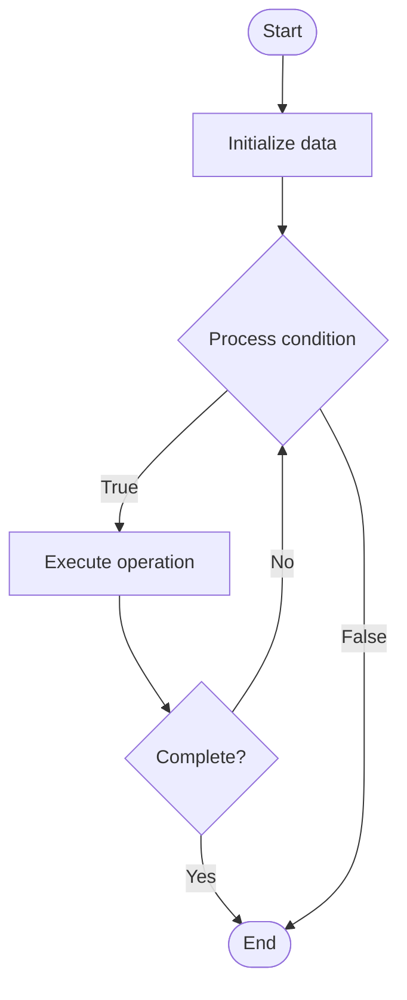

# Cryptocurrency Wallets

## Учебные материалы

- [Школьный уровень](school.ru.md)
- [Университетский уровень](univer.ru.md)

## Algorithm Visualization

### Flowchart (ASCII)

```
Cryptocurrency Wallets Flowchart:

┌─────────────┐
│   Start     │
└──────┬──────┘
       │
       ▼
┌─────────────┐
│  Initialize │
│   data      │
└──────┬──────┘
       │
       ▼
┌─────────────┐      Yes
│  Process   ├──────┐
│  condition?│      │
└──────┬──────┘      │
       │ No          │
       ▼             │
┌─────────────┐      │
│  Execute   │      │
│  operation │      │
└──────┬──────┘      │
       │             │
       └─────────────┘
       │
       ▼
┌─────────────┐
│    End      │
└─────────────┘
```

### Step-by-Step Execution

```
Cryptocurrency Wallets Step-by-Step Execution:

Input: [example data]

Step 1: Initialize
State: [initial state]

Step 2: Process
State: [intermediate state]

Step 3: Finalize
State: [final state]

Result: [output]
```

### Interactive Flowchart (Mermaid)



> **Note**: Mermaid diagrams are rendered automatically on GitHub. For local viewing, use a Mermaid-compatible Markdown viewer.

- [Python Implementation](/code/semester_07/lecture_46_blockchain_advanced/cryptocurrency_wallets/algorithm.py)
- [Java Implementation](/code/semester_07/lecture_46_blockchain_advanced/cryptocurrency_wallets/Algorithm.java)
- [Python Tests](/code/semester_07/lecture_46_blockchain_advanced/cryptocurrency_wallets/test_algorithm.py)

What problem does it solve? (1 sentence)  
   Manages cryptographic keys and enables users to send, receive, and store cryptocurrencies securely, providing interface between users and blockchain networks.

Intuition (plain-language explanation)  
   Like a digital wallet: instead of holding physical cash and cards, a crypto wallet holds your private keys (like passwords) that prove you own your cryptocurrency - the wallet lets you check your balance, send coins, and receive coins, just like a physical wallet but for digital money.

Inputs & Outputs  

  - Input: Private keys (or seed phrase), blockchain network, transaction requests, recipient addresses.  
  - Output: Signed transactions, wallet balance, transaction history, public addresses.

Step-by-step description (5–10 lines max)  
Generate keys: create public-private key pair (or derive from seed phrase).
Store securely: encrypt and store private keys (hardware, software, or paper wallet).
Derive addresses: generate receiving addresses from public key.
Check balance: query blockchain for address balance and transaction history.
Create transaction: construct transaction with recipient, amount, fees.
Sign transaction: sign transaction with private key (proves ownership).
Broadcast: send signed transaction to blockchain network.
Monitor: track transaction status until confirmed on blockchain.

Tiny example (hand-simulated)  
   User opens wallet app → wallet generates key pair from seed phrase → displays address (0x123...) → user receives 1 ETH → wallet queries blockchain → shows balance: 1 ETH → user sends 0.5 ETH to friend → wallet signs transaction → broadcasts → transaction confirmed → balance: 0.5 ETH.

Time & Space Complexity  

  - Time: O(1) for key operations, O(1) for transaction creation, O(block_time) for confirmation.  
  - Space: O(1) for key storage (constant size keys), O(n) for transaction history where n is number of transactions.

Strengths  

- Security: private keys enable secure ownership and transactions.
- Control: users have full control over their funds (no bank needed).
- Portability: wallets can be used across devices and platforms.

Weaknesses / limitations  

- Key management: losing private keys means losing funds permanently.
- User experience: managing keys can be complex for non-technical users.
- Security risks: wallets can be compromised if keys are exposed.

Compare with alternatives  
    Alternatives: Hardware Wallets, Software Wallets, Paper Wallets, Custodial Wallets, Multi-signature Wallets

30-second explanation (your own words)  

*Sources: Adapted from standard university textbooks and Wikipedia summaries.*


## References

- [Cryptocurrency wallet](https://en.wikipedia.org/wiki/Cryptocurrency_wallet) - Wikipedia
