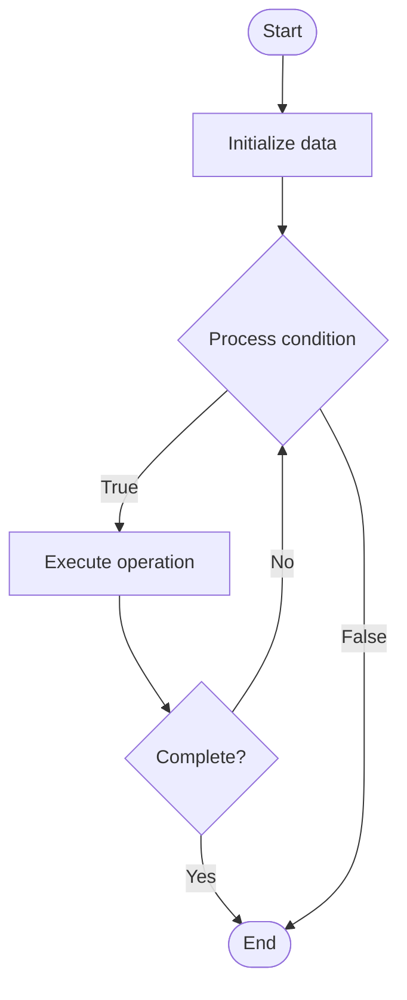

# Decentralized Storage

## Учебные материалы

- [Школьный уровень](school.ru.md)
- [Университетский уровень](univer.ru.md)

## Algorithm Visualization

### Flowchart (ASCII)

```
Decentralized Storage Flowchart:

┌─────────────┐
│   Start     │
└──────┬──────┘
       │
       ▼
┌─────────────┐
│  Initialize │
│   data      │
└──────┬──────┘
       │
       ▼
┌─────────────┐      Yes
│  Process   ├──────┐
│  condition?│      │
└──────┬──────┘      │
       │ No          │
       ▼             │
┌─────────────┐      │
│  Execute   │      │
│  operation │      │
└──────┬──────┘      │
       │             │
       └─────────────┘
       │
       ▼
┌─────────────┐
│    End      │
└─────────────┘
```

### Step-by-Step Execution

```
Decentralized Storage Step-by-Step Execution:

Input: [example data]

Step 1: Initialize
State: [initial state]

Step 2: Process
State: [intermediate state]

Step 3: Finalize
State: [final state]

Result: [output]
```

### Interactive Flowchart (Mermaid)



> **Note**: Mermaid diagrams are rendered automatically on GitHub. For local viewing, use a Mermaid-compatible Markdown viewer.

- [Python Implementation](/code/semester_07/lecture_46_blockchain_advanced/decentralized_storage/algorithm.py)
- [Java Implementation](/code/semester_07/lecture_46_blockchain_advanced/decentralized_storage/Algorithm.java)
- [Python Tests](/code/semester_07/lecture_46_blockchain_advanced/decentralized_storage/test_algorithm.py)

What problem does it solve? (1 sentence)  
   Stores data across distributed network of nodes instead of centralized servers, providing censorship-resistant, resilient, and cost-effective data storage.

Intuition (plain-language explanation)  
   Like a distributed filing cabinet: instead of storing files in one office (centralized server), files are split into pieces and stored across many offices (nodes) worldwide - even if some offices close, your files are still accessible from other offices, and no single office controls your data.

Inputs & Outputs  

  - Input: Data to store, storage network (IPFS, Arweave, Filecoin, etc.), redundancy parameters.  
  - Output: Content identifier (CID), distributed storage across nodes, retrieval capability.

Step-by-step description (5–10 lines max)  
Split data: divide data into chunks or pieces (for redundancy and distribution).
Encrypt (optional): encrypt data chunks for privacy.
Generate hash: compute content identifier (hash) for each chunk.
Distribute: upload chunks to multiple storage nodes across network.
Verify: verify chunks are stored correctly (proof of storage).
Store metadata: record chunk locations and content identifiers.
Retrieve: fetch chunks using content identifier when needed.
Reassemble: reconstruct original data from retrieved chunks.

Tiny example (hand-simulated)  
   Upload 1GB file → split into 100 chunks (10MB each) → hash each chunk → distribute to 50 nodes (2 copies each) → store metadata with content IDs → later, request file → retrieve chunks from nodes → verify hashes → reassemble → original file recovered.

Time & Space Complexity  

  - Time: O(n) to split/upload where n is data size, O(log n) to retrieve (distributed lookup).  
  - Space: O(n) for data storage, O(r·n) with redundancy factor r (multiple copies).

Strengths  

- Censorship resistance: no single entity can remove data.
- Resilience: data survives even if many nodes fail.
- Cost-effective: can be cheaper than centralized cloud storage.

Weaknesses / limitations  

- Retrieval speed: may be slower than centralized storage (depends on network).
- Incentive alignment: requires economic incentives for nodes to store data.
- Data availability: relies on nodes staying online and accessible.

Compare with alternatives  
    Alternatives: Centralized Cloud Storage, IPFS, Arweave, Filecoin, Storj

30-second explanation (your own words)  
    Stores data across distributed network of nodes instead of centralized servers, providing censorship-resistant, resilient, and cost-effective data storage.

*Sources: Adapted from standard university textbooks and Wikipedia summaries.*


## References

- [Decentralized computing](https://en.wikipedia.org/wiki/Decentralized_computing) - Wikipedia
