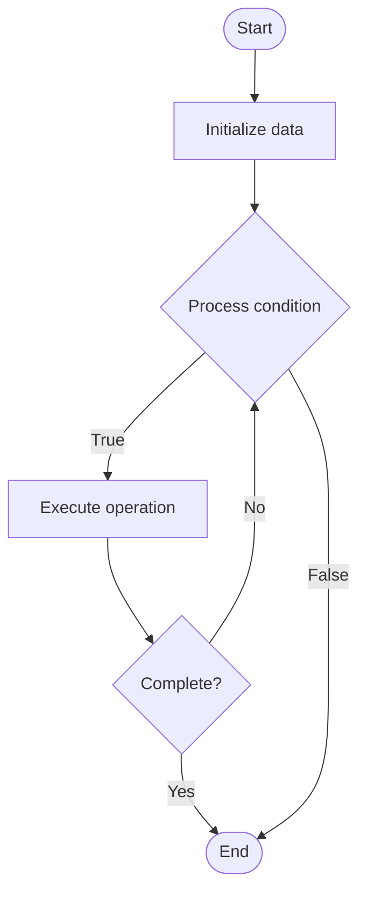

# Layer 2 Solutions

Name of Algorithm  

## Code Files


## Algorithm Visualization

### Flowchart (ASCII)


```
Layer 2 Solutions Flowchart:

┌─────────────┐
│   Start     │
└──────┬──────┘
       │
       ▼
┌─────────────┐
│  Initialize │
│   data      │
└──────┬──────┘
       │
       ▼
┌─────────────┐      Yes
│  Process   ├──────┐
│  condition?│      │
└──────┬──────┘      │
       │ No          │
       ▼             │
┌─────────────┐      │
│  Execute   │      │
│  operation │      │
└──────┬──────┘      │
       │             │
       └─────────────┘
       │
       ▼
┌─────────────┐
│    End      │
└─────────────┘
```


### Step-by-Step Execution


```
Layer 2 Solutions Step-by-Step Execution:

Input: [example data]

Step 1: Initialize
State: [initial state]

Step 2: Process
State: [intermediate state]

Step 3: Finalize
State: [final state]

Result: [output]
```


### Interactive Flowchart (Mermaid)





> **Note**: Mermaid diagrams are rendered automatically on GitHub. For local viewing, use a Mermaid-compatible Markdown viewer.
- [Python Implementation](/code/semester_07/lecture_46_blockchain_advanced/layer2_solutions/algorithm.py)
- [Java Implementation](/code/semester_07/lecture_46_blockchain_advanced/layer2_solutions/Algorithm.java)
- [Python Tests](/code/semester_07/lecture_46_blockchain_advanced/layer2_solutions/test_algorithm.py)


   Layer 2 Solutions

What problem does it solve? (1 sentence)  
   Processes transactions off the main blockchain (layer 1) and periodically settles results on-chain, dramatically increasing throughput and reducing costs while maintaining security.

Intuition (plain-language explanation)  
   Like a fast express lane: the main highway (layer 1) is slow and expensive, so layer 2 creates a parallel express lane where many transactions happen quickly and cheaply - periodically, the express lane 'merges' back to the highway, committing all the transactions at once (like a summary report).

Inputs & Outputs  
   - Input: Transactions, layer 2 protocol (rollups, state channels, sidechains), main blockchain.  
   - Output: Processed transactions, batch proofs, settled state on main chain.

Step-by-step description (5–10 lines max)  
Deposit: users deposit funds from layer 1 to layer 2 (lock on main chain).
Process off-chain: execute transactions on layer 2 (fast, cheap).
Batch: group multiple layer 2 transactions together.
Generate proof: create cryptographic proof of batch validity (for rollups).
Submit to layer 1: periodically submit batch and proof to main blockchain.
Verify: layer 1 verifies proof (ensures layer 2 transactions are valid).
Settle: update layer 1 state based on verified batch.
Withdraw: users can withdraw funds from layer 2 back to layer 1.

Tiny example (hand-simulated)  
   User deposits 1 ETH to Optimism (Layer 2) → executes 100 transactions on Optimism (instant, $0.01 each) → Optimism batches transactions → generates proof → submits batch to Ethereum → Ethereum verifies proof → settles batch → user withdraws remaining ETH to Ethereum → all transactions secured by Ethereum.

Time & Space Complexity  
   - Time: O(1) per transaction on layer 2, O(b) to verify batch where b is batch size.  
   - Space: O(b) for batch storage, O(1) per transaction on layer 2 (batched on layer 1).

Strengths  
- High throughput: enables thousands of transactions per second.
- Low costs: dramatically reduces transaction fees.
- Security: inherits security from layer 1 through proofs or checkpoints.

Weaknesses / limitations  
- Withdrawal delays: withdrawing to layer 1 may require waiting period.
- Complexity: adds complexity to user experience and development.
- Centralization risks: some solutions may have centralized components.

Compare with alternatives  
    Alternatives: Optimistic Rollups, ZK-Rollups, State Channels, Sidechains, Plasma

30-second explanation (your own words)  
    Processes transactions off the main blockchain (layer 1) and periodically settles results on-chain, dramatically increasing throughput and reducing costs while maintaining security.

*Sources: Adapted from standard university textbooks and Wikipedia summaries.*
