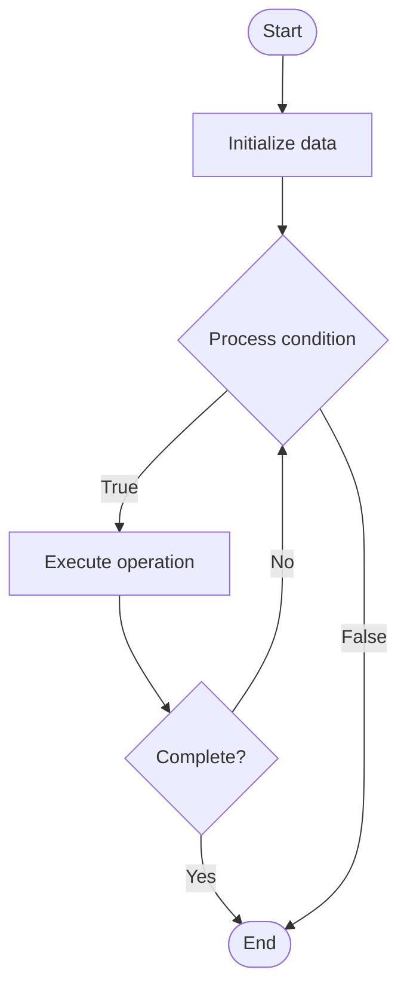

# NFT Standards

1. **Name of Algorithm**  

## Code Files


## Algorithm Visualization

### Flowchart (ASCII)


```
NFT Standards Flowchart:

┌─────────────┐
│   Start     │
└──────┬──────┘
       │
       ▼
┌─────────────┐
│  Initialize │
│   data      │
└──────┬──────┘
       │
       ▼
┌─────────────┐      Yes
│  Process   ├──────┐
│  condition?│      │
└──────┬──────┘      │
       │ No          │
       ▼             │
┌─────────────┐      │
│  Execute   │      │
│  operation │      │
└──────┬──────┘      │
       │             │
       └─────────────┘
       │
       ▼
┌─────────────┐
│    End      │
└─────────────┘
```


### Step-by-Step Execution


```
NFT Standards Step-by-Step Execution:

Input: [example data]

Step 1: Initialize
State: [initial state]

Step 2: Process
State: [intermediate state]

Step 3: Finalize
State: [final state]

Result: [output]
```


### Interactive Flowchart (Mermaid)





> **Note**: Mermaid diagrams are rendered automatically on GitHub. For local viewing, use a Mermaid-compatible Markdown viewer.
- [Python Implementation](semester_07/lecture_46_blockchain_advanced/nft_standards/algorithm.py)
- [Java Implementation](semester_07/lecture_46_blockchain_advanced/nft_standards/Algorithm.java)
- [Python Tests](semester_07/lecture_46_blockchain_advanced/nft_standards/test_algorithm.py)


   NFT Standards

2. **What problem does it solve? (1 sentence)**  
   Defines standardized interfaces and metadata formats for non-fungible tokens (NFTs), enabling interoperability, composability, and consistent behavior across NFT marketplaces and applications.

3. **Intuition (plain-language explanation)**  
   Like product barcodes: NFTs need standard formats (like barcodes on products) so different systems can understand and trade them - NFT standards define how to create, transfer, and query NFTs, ensuring they work the same way everywhere (like how all barcodes follow the same format).

4. **Inputs & Outputs**  
   - Input: NFT metadata, token ID, owner address, standard interface (ERC-721, ERC-1155, etc.).  
   - Output: Standardized NFT contract, token with unique ID, metadata URI, transferable asset.

5. **Step-by-step description (5–10 lines max)**  
1. Choose standard: select NFT standard (ERC-721 for unique, ERC-1155 for semi-fungible).
2. Implement interface: create smart contract implementing standard functions (mint, transfer, etc.).
3. Define metadata: structure metadata (name, description, image, attributes) following standard format.
4. Store metadata: store metadata off-chain (IPFS) or on-chain, reference via URI.
5. Mint token: create new NFT with unique token ID and assign to owner.
6. Transfer: implement transfer function following standard (safeTransferFrom, etc.).
7. Query: enable standard queries (ownerOf, tokenURI, balanceOf).
8. List: make NFT discoverable on marketplaces (standard interface enables compatibility).

6. **Tiny example (hand-simulated)**  
   Create NFT collection → implement ERC-721 standard → mint token #1 with metadata (name: 'Cool Art', image: ipfs://.../art1.png) → assign to user → user transfers to marketplace → marketplace reads standard interface → displays NFT → user sells → buyer receives NFT → all using standard functions.

7. **Time & Space Complexity**  
   - Time: O(1) for standard operations (mint, transfer, query), O(1) for metadata retrieval.  
   - Space: O(1) per NFT (token ID and owner), O(m) for metadata where m is metadata size.

8. **Strengths**  
- Interoperability: NFTs work across all compatible marketplaces and wallets.
- Composability: standard interface enables building on top of NFTs.
- Consistency: predictable behavior across different implementations.

9. **Weaknesses / limitations**  
- Flexibility: standards may limit customization options.
- Evolution: standards evolve, requiring updates for new features.
- Metadata: off-chain metadata may become unavailable if storage fails.

10. **Compare with alternatives**  
    Alternatives: ERC-721, ERC-1155, ERC-998, Custom Standards, On-chain Metadata

11. **30-second explanation (your own words)**  
    Defines standardized interfaces and metadata formats for non-fungible tokens (NFTs), enabling interoperability, composability, and consistent behavior across NFT marketplaces and applications.

*Sources: Adapted from standard university textbooks and Wikipedia summaries.*
