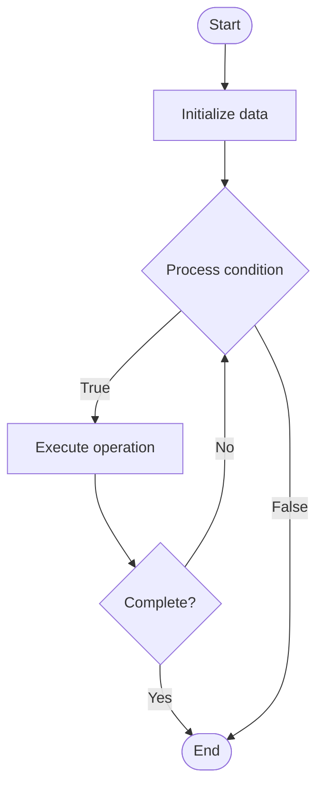

# Customer Support Automation

Name of Algorithm  

## Code Files


## Algorithm Visualization

### Flowchart (ASCII)


```
Customer Support Automation Flowchart:

┌─────────────┐
│   Start     │
└──────┬──────┘
       │
       ▼
┌─────────────┐
│  Initialize │
│   data      │
└──────┬──────┘
       │
       ▼
┌─────────────┐      Yes
│  Process   ├──────┐
│  condition?│      │
└──────┬──────┘      │
       │ No          │
       ▼             │
┌─────────────┐      │
│  Execute   │      │
│  operation │      │
└──────┬──────┘      │
       │             │
       └─────────────┘
       │
       ▼
┌─────────────┐
│    End      │
└─────────────┘
```


### Step-by-Step Execution


```
Customer Support Automation Step-by-Step Execution:

Input: [example data]

Step 1: Initialize
State: [initial state]

Step 2: Process
State: [intermediate state]

Step 3: Finalize
State: [final state]

Result: [output]
```


### Interactive Flowchart (Mermaid)





> **Note**: Mermaid diagrams are rendered automatically on GitHub. For local viewing, use a Mermaid-compatible Markdown viewer.
- [Python Implementation](/code/semester_08/lecture_47_support_systems/customer_support_automation/algorithm.py)
- [Java Implementation](/code/semester_08/lecture_47_support_systems/customer_support_automation/Algorithm.java)
- [Python Tests](/code/semester_08/lecture_47_support_systems/customer_support_automation/test_algorithm.py)


   Customer Support Automation

What problem does it solve? (1 sentence)  
   Automates customer support processes using AI, chatbots, and automated workflows to handle common inquiries, route tickets, and provide instant responses, reducing response time and support costs.

Intuition (plain-language explanation)  
   Like a smart receptionist: instead of customers waiting for a human agent (slow, expensive), automation uses chatbots and AI to answer common questions instantly (like 'What's my order status?') - only complex issues get escalated to humans, making support faster and cheaper.

Inputs & Outputs  
   - Input: Customer inquiries, support tickets, knowledge base, automation rules, AI models.  
   - Output: Automated responses, resolved tickets, routed escalations, support metrics.

Step-by-step description (5–10 lines max)  
Receive inquiry: customer submits question via chat, email, or ticket.
Classify: use AI/NLP to classify inquiry type (billing, technical, general, etc.).
Search knowledge base: query knowledge base for relevant answers.
Generate response: AI generates or retrieves appropriate response.
Respond: send automated response to customer (chatbot, email, etc.).
Verify: check if response resolves customer's issue.
Escalate (if needed): if issue unresolved or complex, route to human agent.
Learn: update automation based on successful resolutions and feedback.

Tiny example (hand-simulated)  
   Customer asks: 'How do I reset my password?' → automation classifies as 'account issue' → searches knowledge base → finds password reset guide → sends automated response with steps → customer follows steps → issue resolved → no human agent needed → response time: 5 seconds vs 10 minutes.

Time & Space Complexity  
   - Time: O(1) for simple lookups, O(log n) for knowledge base search, O(m) for AI processing where m is message length.  
   - Space: O(k) where k is knowledge base size, O(m) for AI models.

Strengths  
- Fast response: provides instant answers to common questions.
- Cost-effective: reduces need for human support agents.
- 24/7 availability: works around the clock without breaks.

Weaknesses / limitations  
- Limited understanding: may misunderstand complex or nuanced questions.
- Customer frustration: some customers prefer human interaction.
- Maintenance: requires ongoing updates to knowledge base and rules.

Compare with alternatives  
    Alternatives: Human Support, Hybrid Automation, Self-Service Portals, Community Forums

30-second explanation (your own words)  
    Automates customer support processes using AI, chatbots, and automated workflows to handle common inquiries, route tickets, and provide instant responses, reducing response time and support costs.

*Sources: Adapted from standard university textbooks and Wikipedia summaries.*
