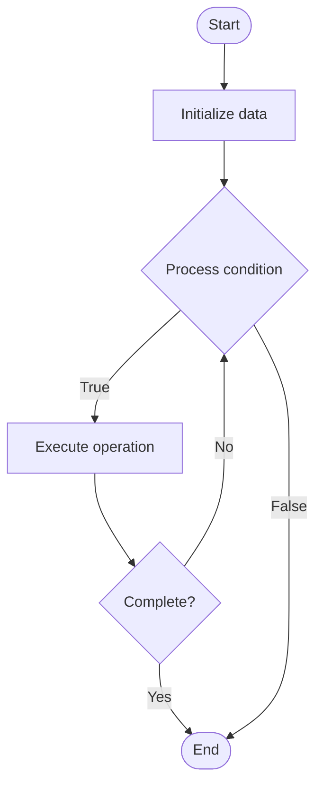

# Escalation Procedures

1. **Name of Algorithm**  

## Code Files


## Algorithm Visualization

### Flowchart (ASCII)


```
Escalation Procedures Flowchart:

┌─────────────┐
│   Start     │
└──────┬──────┘
       │
       ▼
┌─────────────┐
│  Initialize │
│   data      │
└──────┬──────┘
       │
       ▼
┌─────────────┐      Yes
│  Process   ├──────┐
│  condition?│      │
└──────┬──────┘      │
       │ No          │
       ▼             │
┌─────────────┐      │
│  Execute   │      │
│  operation │      │
└──────┬──────┘      │
       │             │
       └─────────────┘
       │
       ▼
┌─────────────┐
│    End      │
└─────────────┘
```


### Step-by-Step Execution


```
Escalation Procedures Step-by-Step Execution:

Input: [example data]

Step 1: Initialize
State: [initial state]

Step 2: Process
State: [intermediate state]

Step 3: Finalize
State: [final state]

Result: [output]
```


### Interactive Flowchart (Mermaid)





> **Note**: Mermaid diagrams are rendered automatically on GitHub. For local viewing, use a Mermaid-compatible Markdown viewer.
- [Python Implementation](semester_08/lecture_47_support_systems/escalation_procedures/algorithm.py)
- [Java Implementation](semester_08/lecture_47_support_systems/escalation_procedures/Algorithm.java)
- [Python Tests](semester_08/lecture_47_support_systems/escalation_procedures/test_algorithm.py)


   Escalation Procedures

2. **What problem does it solve? (1 sentence)**  
   Defines systematic process for routing unresolved or complex support issues to appropriate personnel or teams, ensuring timely resolution and proper handling of critical problems.

3. **Intuition (plain-language explanation)**  
   Like a hospital triage system: when a patient arrives, nurses assess severity and route to appropriate specialist (emergency, general doctor, specialist) - escalation procedures do the same for support tickets: assess complexity/urgency and route to right person or team (L1 → L2 → L3, or support → engineering → management).

4. **Inputs & Outputs**  
   - Input: Support ticket, issue details, customer priority, escalation rules, team availability.  
   - Output: Escalated ticket, assigned agent/team, escalation path, priority level.

5. **Step-by-step description (5–10 lines max)**  
1. Assess issue: evaluate ticket complexity, urgency, and customer priority.
2. Check resolution attempts: verify if lower-level support attempted resolution.
3. Determine escalation level: identify appropriate escalation level (L1 → L2 → L3, etc.).
4. Select team: choose appropriate team or specialist based on issue type.
5. Route ticket: assign ticket to selected team or agent.
6. Notify: notify customer and relevant stakeholders of escalation.
7. Set SLA: adjust service level agreement based on escalation level.
8. Monitor: track escalation resolution time and outcome.
9. Document: record escalation reason and resolution for future reference.

6. **Tiny example (hand-simulated)**  
   Customer reports critical bug → L1 support attempts fix → unable to resolve → escalates to L2 (engineering) → engineering identifies root cause → fixes bug → updates customer → ticket resolved → escalation time: 2 hours → total resolution: 4 hours.

7. **Time & Space Complexity**  
   - Time: O(1) for routing decision, O(e) where e is escalation depth (number of levels).  
   - Space: O(t) where t is number of tickets in escalation queue.

8. **Strengths**  
- Proper routing: ensures issues reach right expertise level.
- Accountability: tracks who handles what and when.
- Efficiency: prevents issues from getting stuck at wrong level.

9. **Weaknesses / limitations**  
- Delays: escalation adds time to resolution.
- Complexity: requires well-defined escalation rules and processes.
- Over-escalation: may escalate issues that could be resolved at lower level.

10. **Compare with alternatives**  
    Alternatives: Direct Assignment, Round-Robin, Skill-Based Routing, Priority-Based Routing

11. **30-second explanation (your own words)**  
    Defines systematic process for routing unresolved or complex support issues to appropriate personnel or teams, ensuring timely resolution and proper handling of critical problems.

*Sources: Adapted from standard university textbooks and Wikipedia summaries.*
