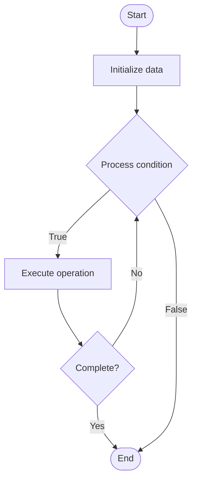

# Incident Response

## Учебные материалы

- [Школьный уровень](school.ru.md)
- [Университетский уровень](univer.ru.md)

## Algorithm Visualization

### Flowchart (ASCII)

```
Incident Response Flowchart:

┌─────────────┐
│   Start     │
└──────┬──────┘
       │
       ▼
┌─────────────┐
│  Initialize │
│   data      │
└──────┬──────┘
       │
       ▼
┌─────────────┐      Yes
│  Process   ├──────┐
│  condition?│      │
└──────┬──────┘      │
       │ No          │
       ▼             │
┌─────────────┐      │
│  Execute   │      │
│  operation │      │
└──────┬──────┘      │
       │             │
       └─────────────┘
       │
       ▼
┌─────────────┐
│    End      │
└─────────────┘
```

### Step-by-Step Execution

```
Incident Response Step-by-Step Execution:

Input: [example data]

Step 1: Initialize
State: [initial state]

Step 2: Process
State: [intermediate state]

Step 3: Finalize
State: [final state]

Result: [output]
```

### Interactive Flowchart (Mermaid)



> **Note**: Mermaid diagrams are rendered automatically on GitHub. For local viewing, use a Mermaid-compatible Markdown viewer.

- [Python Implementation](/code/semester_08/lecture_47_support_systems/incident_response/algorithm.py)
- [Java Implementation](/code/semester_08/lecture_47_support_systems/incident_response/Algorithm.java)
- [Python Tests](/code/semester_08/lecture_47_support_systems/incident_response/test_algorithm.py)

What problem does it solve? (1 sentence)  
   Provides structured approach to detect, respond to, and recover from security incidents, system outages, or critical failures, minimizing impact and restoring service quickly.

Intuition (plain-language explanation)  
   Like a fire department response: when a fire (incident) is detected, firefighters follow a systematic process (assess → contain → extinguish → investigate) - incident response does the same for IT incidents: detect → assess → contain → mitigate → recover → learn, ensuring quick, organized response.

Inputs & Outputs  

  - Input: Incident alerts, system logs, monitoring data, incident response plan, team members.  
  - Output: Contained incident, restored service, incident report, lessons learned.

Step-by-step description (5–10 lines max)  
Detect: identify incident through monitoring, alerts, or reports.
Assess: evaluate incident severity, scope, and impact.
Classify: categorize incident type (security breach, outage, data loss, etc.).
Contain: isolate affected systems to prevent further damage.
Investigate: analyze root cause and extent of incident.
Mitigate: take actions to stop ongoing damage or attack.
Recover: restore affected systems and services to normal operation.
Document: record incident details, response actions, and timeline.
Post-mortem: conduct review to identify improvements and prevent recurrence.

Tiny example (hand-simulated)  
   Security alert: suspicious login attempts → incident detected → assess: potential breach → classify: security incident → contain: disable affected accounts → investigate: find compromised credentials → mitigate: reset passwords, enable 2FA → recover: restore access for legitimate users → document: create incident report → post-mortem: improve monitoring.

Time & Space Complexity  

  - Time: O(1) for detection, O(n) for investigation where n is system size, O(r) for recovery where r is recovery steps.  
  - Space: O(l) where l is log data size, O(i) for incident documentation.

Strengths  

- Structured response: ensures systematic, thorough incident handling.
- Minimizes impact: quick containment reduces damage.
- Continuous improvement: post-mortems improve future responses.

Weaknesses / limitations  

- Time pressure: requires quick decisions under stress.
- Resource intensive: may require significant team effort.
- Complexity: incidents can be multifaceted and difficult to resolve.

Compare with alternatives  
    Alternatives: Ad-hoc Response, Automated Response, Managed Security Services, Incident Response Teams

30-second explanation (your own words)  
    Provides structured approach to detect, respond to, and recover from security incidents, system outages, or critical failures, minimizing impact and restoring service quickly.

*Sources: Adapted from standard university textbooks and Wikipedia summaries.*
