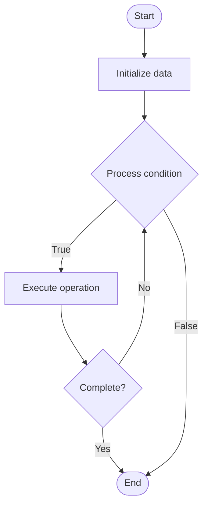

# Knowledge Base

1. **Name of Algorithm**  

## Code Files


## Algorithm Visualization

### Flowchart (ASCII)


```
Knowledge Base Flowchart:

┌─────────────┐
│   Start     │
└──────┬──────┘
       │
       ▼
┌─────────────┐
│  Initialize │
│   data      │
└──────┬──────┘
       │
       ▼
┌─────────────┐      Yes
│  Process   ├──────┐
│  condition?│      │
└──────┬──────┘      │
       │ No          │
       ▼             │
┌─────────────┐      │
│  Execute   │      │
│  operation │      │
└──────┬──────┘      │
       │             │
       └─────────────┘
       │
       ▼
┌─────────────┐
│    End      │
└─────────────┘
```


### Step-by-Step Execution


```
Knowledge Base Step-by-Step Execution:

Input: [example data]

Step 1: Initialize
State: [initial state]

Step 2: Process
State: [intermediate state]

Step 3: Finalize
State: [final state]

Result: [output]
```


### Interactive Flowchart (Mermaid)





> **Note**: Mermaid diagrams are rendered automatically on GitHub. For local viewing, use a Mermaid-compatible Markdown viewer.
- [Python Implementation](semester_08/lecture_47_support_systems/knowledge_base/algorithm.py)
- [Java Implementation](semester_08/lecture_47_support_systems/knowledge_base/Algorithm.java)
- [Python Tests](semester_08/lecture_47_support_systems/knowledge_base/test_algorithm.py)


   Knowledge Base

2. **What problem does it solve? (1 sentence)**  
   Centralizes and organizes information, documentation, and solutions to enable self-service support and provide quick answers to common questions, reducing support load and improving customer satisfaction.

3. **Intuition (plain-language explanation)**  
   Like a library reference desk: instead of asking a librarian every time (support agent), customers can look up answers in organized books (knowledge base) - articles, FAQs, guides are indexed and searchable, so customers find answers themselves (faster, cheaper) and only ask librarians for complex questions.

4. **Inputs & Outputs**  
   - Input: Documentation, FAQs, solutions, articles, search queries, user feedback.  
   - Output: Searchable knowledge base, relevant articles, solutions, updated content.

5. **Step-by-step description (5–10 lines max)**  
1. Collect content: gather documentation, FAQs, solutions, guides.
2. Organize: structure content into categories, topics, and tags.
3. Index: create searchable index of all content (full-text search).
4. Store: save content in knowledge base system (database, wiki, etc.).
5. Search: enable users to search knowledge base by keywords or topics.
6. Retrieve: return relevant articles and solutions based on query.
7. Update: regularly update content based on new information and feedback.
8. Analyze: track search queries and popular articles to improve content.

6. **Tiny example (hand-simulated)**  
   Customer searches: 'how to cancel subscription' → knowledge base searches → finds article 'Canceling Your Subscription' → displays step-by-step guide → customer follows guide → cancels subscription → no support ticket needed → self-service success.

7. **Time & Space Complexity**  
   - Time: O(log n) for indexed search, O(n) for full-text search where n is content size.  
   - Space: O(c) where c is content size, O(i) for search index.

8. **Strengths**  
- Self-service: enables customers to find answers independently.
- Reduces load: decreases number of support tickets.
- Consistency: provides standardized, accurate information.

9. **Weaknesses / limitations**  
- Maintenance: requires ongoing updates to stay current.
- Search quality: poor search can frustrate users.
- Content quality: outdated or incorrect content causes problems.

10. **Compare with alternatives**  
    Alternatives: Support Tickets, Live Chat, Community Forums, Video Tutorials, Documentation Sites

11. **30-second explanation (your own words)**  
    Centralizes and organizes information, documentation, and solutions to enable self-service support and provide quick answers to common questions, reducing support load and improving customer satisfaction.

*Sources: Adapted from standard university textbooks and Wikipedia summaries.*
