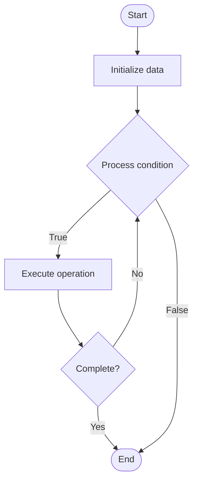

# SLA Management

1. **Name of Algorithm**  

## Code Files


## Algorithm Visualization

### Flowchart (ASCII)


```
SLA Management Flowchart:

┌─────────────┐
│   Start     │
└──────┬──────┘
       │
       ▼
┌─────────────┐
│  Initialize │
│   data      │
└──────┬──────┘
       │
       ▼
┌─────────────┐      Yes
│  Process   ├──────┐
│  condition?│      │
└──────┬──────┘      │
       │ No          │
       ▼             │
┌─────────────┐      │
│  Execute   │      │
│  operation │      │
└──────┬──────┘      │
       │             │
       └─────────────┘
       │
       ▼
┌─────────────┐
│    End      │
└─────────────┘
```


### Step-by-Step Execution


```
SLA Management Step-by-Step Execution:

Input: [example data]

Step 1: Initialize
State: [initial state]

Step 2: Process
State: [intermediate state]

Step 3: Finalize
State: [final state]

Result: [output]
```


### Interactive Flowchart (Mermaid)





> **Note**: Mermaid diagrams are rendered automatically on GitHub. For local viewing, use a Mermaid-compatible Markdown viewer.
- [Python Implementation](semester_08/lecture_47_support_systems/sla_management/algorithm.py)
- [Java Implementation](semester_08/lecture_47_support_systems/sla_management/Algorithm.java)
- [Python Tests](semester_08/lecture_47_support_systems/sla_management/test_algorithm.py)


   SLA Management

2. **What problem does it solve? (1 sentence)**  
   Monitors and enforces service level agreements (SLAs) that define expected response times, resolution times, and service quality metrics, ensuring support teams meet commitments to customers.

3. **Intuition (plain-language explanation)**  
   Like a delivery guarantee: when you order pizza, they promise delivery in 30 minutes (SLA) - if late, you get a discount (penalty). SLA management tracks if support meets promises (respond in 1 hour, resolve in 24 hours) and alerts when at risk of missing targets, ensuring customers get promised service quality.

4. **Inputs & Outputs**  
   - Input: SLA definitions, ticket timestamps, resolution times, customer priority, SLA rules.  
   - Output: SLA compliance status, alerts, performance metrics, reports.

5. **Step-by-step description (5–10 lines max)**  
1. Define SLAs: establish service level agreements (response time, resolution time, uptime, etc.).
2. Track metrics: monitor ticket creation time, first response time, resolution time.
3. Calculate remaining time: determine time remaining until SLA deadline.
4. Prioritize: adjust ticket priority based on SLA urgency.
5. Alert: notify team when tickets are at risk of breaching SLA.
6. Escalate: automatically escalate tickets approaching SLA deadline.
7. Report: generate SLA compliance reports (met, breached, at risk).
8. Analyze: identify trends and areas for improvement.

6. **Tiny example (hand-simulated)**  
   SLA: respond within 1 hour, resolve within 24 hours → ticket created at 10:00 AM → first response at 10:45 AM (within SLA) → ticket unresolved at 11:00 AM next day → SLA breached → alert sent → escalation triggered → ticket prioritized → resolved at 12:00 PM → SLA report: 95% compliance.

7. **Time & Space Complexity**  
   - Time: O(1) for SLA checks per ticket, O(n) for reporting where n is number of tickets.  
   - Space: O(s) where s is number of SLA definitions, O(t) for ticket tracking.

8. **Strengths**  
- Accountability: ensures support meets commitments.
- Customer satisfaction: meeting SLAs improves customer experience.
- Visibility: provides clear metrics on support performance.

9. **Weaknesses / limitations**  
- Pressure: can create stress for support teams.
- Gaming: teams may prioritize SLA metrics over actual problem resolution.
- Complexity: managing multiple SLAs for different customer tiers can be complex.

10. **Compare with alternatives**  
    Alternatives: No SLAs, Informal Agreements, Customer-Specific SLAs, Tiered SLAs

11. **30-second explanation (your own words)**  
    Monitors and enforces service level agreements (SLAs) that define expected response times, resolution times, and service quality metrics, ensuring support teams meet commitments to customers.

*Sources: Adapted from standard university textbooks and Wikipedia summaries.*
