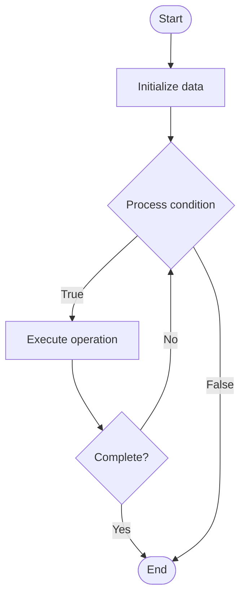

# Ticket Management

## Учебные материалы

- [Школьный уровень](school.ru.md)
- [Университетский уровень](univer.ru.md)

## Algorithm Visualization

### Flowchart (ASCII)

```
Ticket Management Flowchart:

┌─────────────┐
│   Start     │
└──────┬──────┘
       │
       ▼
┌─────────────┐
│  Initialize │
│   data      │
└──────┬──────┘
       │
       ▼
┌─────────────┐      Yes
│  Process   ├──────┐
│  condition?│      │
└──────┬──────┘      │
       │ No          │
       ▼             │
┌─────────────┐      │
│  Execute   │      │
│  operation │      │
└──────┬──────┘      │
       │             │
       └─────────────┘
       │
       ▼
┌─────────────┐
│    End      │
└─────────────┘
```

### Step-by-Step Execution

```
Ticket Management Step-by-Step Execution:

Input: [example data]

Step 1: Initialize
State: [initial state]

Step 2: Process
State: [intermediate state]

Step 3: Finalize
State: [final state]

Result: [output]
```

### Interactive Flowchart (Mermaid)



> **Note**: Mermaid diagrams are rendered automatically on GitHub. For local viewing, use a Mermaid-compatible Markdown viewer.

- [Python Implementation](/code/semester_08/lecture_47_support_systems/ticket_management/algorithm.py)
- [Java Implementation](/code/semester_08/lecture_47_support_systems/ticket_management/Algorithm.java)
- [Python Tests](/code/semester_08/lecture_47_support_systems/ticket_management/test_algorithm.py)

What problem does it solve? (1 sentence)  
   Organizes, tracks, and manages customer support requests from creation to resolution, ensuring no issues are lost and providing visibility into support workload and performance.

Intuition (plain-language explanation)  
Like a help desk queue: when customers need help, they get a ticket number (like at a deli counter) - the ticket tracks who needs help, what the problem is, who's working on it, and when it's resolved. Ticket management ensures every request is tracked, assigned, and resolved, like a well-organized help desk.

Inputs & Outputs  

  - Input: Customer requests, ticket details, agent assignments, status updates, priority levels.  
  - Output: Organized tickets, assignment status, resolution tracking, support metrics.

Step-by-step description (5–10 lines max)  
Create ticket: generate ticket from customer request (email, chat, form, etc.).
Categorize: classify ticket by type, priority, and category.
Assign: route ticket to appropriate agent or team.
Track status: monitor ticket status (new, in progress, waiting, resolved, closed).
Update: record progress, communications, and status changes.
Prioritize: adjust priority based on urgency, customer tier, or SLA.
Resolve: mark ticket as resolved when issue is fixed.
Close: close ticket after customer confirmation or timeout.
Report: generate reports on ticket volume, resolution time, agent performance.

Tiny example (hand-simulated)  
   Customer emails: 'App is crashing' → ticket #1234 created → categorized: technical, priority: high → assigned to engineering team → status: in progress → engineer investigates → finds bug → fixes → updates ticket → status: resolved → customer confirms → ticket closed → resolution time: 4 hours.

Time & Space Complexity  

  - Time: O(1) for ticket operations (create, update, assign), O(n) for reporting where n is ticket count.  
  - Space: O(t) where t is number of tickets, O(h) for ticket history.

Strengths  

- Organization: ensures all requests are tracked and managed.
- Visibility: provides clear view of support workload and status.
- Accountability: tracks who handles what and when.

Weaknesses / limitations  

- Overhead: requires time to create and manage tickets.
- Tool dependency: relies on ticket management system.
- Complexity: can become complex with many tickets and workflows.

Compare with alternatives  
    Alternatives: Email Support, Chat Support, Phone Support, Issue Trackers, Project Management Tools

30-second explanation (your own words)  
    Organizes, tracks, and manages customer support requests from creation to resolution, ensuring no issues are lost and providing visibility into support workload and performance.

*Sources: Adapted from standard university textbooks and Wikipedia summaries.*
