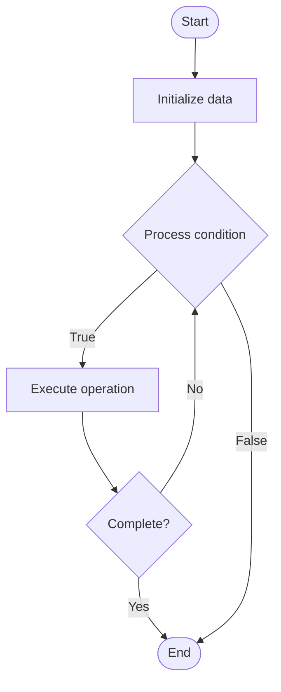

# API Documentation

Name of Algorithm  

## Code Files


## Algorithm Visualization

### Flowchart (ASCII)


```
API Documentation Flowchart:

┌─────────────┐
│   Start     │
└──────┬──────┘
       │
       ▼
┌─────────────┐
│  Initialize │
│   data      │
└──────┬──────┘
       │
       ▼
┌─────────────┐      Yes
│  Process   ├──────┐
│  condition?│      │
└──────┬──────┘      │
       │ No          │
       ▼             │
┌─────────────┐      │
│  Execute   │      │
│  operation │      │
└──────┬──────┘      │
       │             │
       └─────────────┘
       │
       ▼
┌─────────────┐
│    End      │
└─────────────┘
```


### Step-by-Step Execution


```
API Documentation Step-by-Step Execution:

Input: [example data]

Step 1: Initialize
State: [initial state]

Step 2: Process
State: [intermediate state]

Step 3: Finalize
State: [final state]

Result: [output]
```


### Interactive Flowchart (Mermaid)





> **Note**: Mermaid diagrams are rendered automatically on GitHub. For local viewing, use a Mermaid-compatible Markdown viewer.
- [Python Implementation](/code/semester_08/lecture_48_documentation/api_documentation/algorithm.py)
- [Java Implementation](/code/semester_08/lecture_48_documentation/api_documentation/Algorithm.java)
- [Python Tests](/code/semester_08/lecture_48_documentation/api_documentation/test_algorithm.py)


   API Documentation

What problem does it solve? (1 sentence)  
   Provides comprehensive reference and guides for using APIs, including endpoints, parameters, request/response formats, authentication, and examples, enabling developers to integrate with APIs effectively.

Intuition (plain-language explanation)  
   Like a restaurant menu: API documentation lists all available 'dishes' (endpoints), what ingredients they need (parameters), what you'll get (responses), and how to order (authentication) - without good documentation, developers are like diners trying to guess what's available and how to order.

Inputs & Outputs  
   - Input: API endpoints, request/response schemas, authentication methods, code examples, API specification.  
   - Output: Structured API documentation, interactive docs, code samples, reference guides.

Step-by-step description (5–10 lines max)  
Identify endpoints: list all API endpoints and their purposes.
Document parameters: describe required and optional parameters for each endpoint.
Define schemas: specify request and response data structures (JSON, XML, etc.).
Explain authentication: document authentication methods (API keys, OAuth, etc.).
Provide examples: include code examples for common use cases.
Add descriptions: write clear descriptions of what each endpoint does.
Include error codes: document possible error responses and status codes.
Generate docs: use tools (Swagger, OpenAPI) to generate interactive documentation.
Test examples: verify all code examples work correctly.
Maintain: keep documentation updated as API evolves.

Tiny example (hand-simulated)  
   API endpoint: GET /users/{id} → document: retrieves user by ID → parameters: id (required, integer) → response: {id, name, email} → authentication: Bearer token → example: curl -H 'Authorization: Bearer token' https://api.example.com/users/123 → response: 200 OK with user data.

Time & Space Complexity  
   - Time: O(1) to read documentation, O(n) to generate where n is number of endpoints.  
   - Space: O(e) where e is number of endpoints and their documentation size.

Strengths  
- Developer experience: enables quick API integration and adoption.
- Reduces support: good docs reduce support requests.
- Standardization: consistent format helps developers understand APIs.

Weaknesses / limitations  
- Maintenance: requires updates when API changes.
- Completeness: incomplete docs frustrate developers.
- Clarity: poorly written docs can confuse rather than help.

Compare with alternatives  
    Alternatives: Code Comments, README Files, Interactive Docs, Video Tutorials, SDKs

30-second explanation (your own words)  
    Provides comprehensive reference and guides for using APIs, including endpoints, parameters, request/response formats, authentication, and examples, enabling developers to integrate with APIs effectively.

*Sources: Adapted from standard university textbooks and Wikipedia summaries.*
