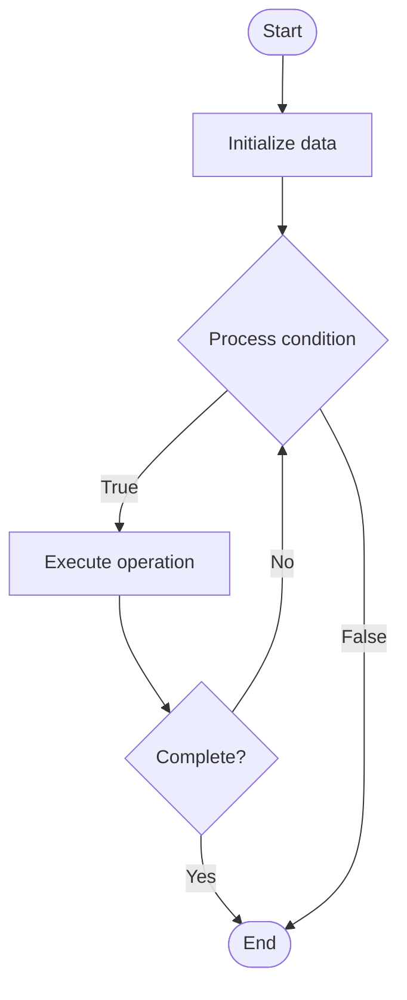

# Code Documentation

1. **Name of Algorithm**  

## Code Files


## Algorithm Visualization

### Flowchart (ASCII)


```
Code Documentation Flowchart:

┌─────────────┐
│   Start     │
└──────┬──────┘
       │
       ▼
┌─────────────┐
│  Initialize │
│   data      │
└──────┬──────┘
       │
       ▼
┌─────────────┐      Yes
│  Process   ├──────┐
│  condition?│      │
└──────┬──────┘      │
       │ No          │
       ▼             │
┌─────────────┐      │
│  Execute   │      │
│  operation │      │
└──────┬──────┘      │
       │             │
       └─────────────┘
       │
       ▼
┌─────────────┐
│    End      │
└─────────────┘
```


### Step-by-Step Execution


```
Code Documentation Step-by-Step Execution:

Input: [example data]

Step 1: Initialize
State: [initial state]

Step 2: Process
State: [intermediate state]

Step 3: Finalize
State: [final state]

Result: [output]
```


### Interactive Flowchart (Mermaid)





> **Note**: Mermaid diagrams are rendered automatically on GitHub. For local viewing, use a Mermaid-compatible Markdown viewer.
- [Python Implementation](semester_08/lecture_48_documentation/code_documentation/algorithm.py)
- [Java Implementation](semester_08/lecture_48_documentation/code_documentation/Algorithm.java)
- [Python Tests](semester_08/lecture_48_documentation/code_documentation/test_algorithm.py)


   Code Documentation

2. **What problem does it solve? (1 sentence)**  
   Explains code functionality, purpose, and usage through comments, docstrings, and inline documentation, helping developers understand and maintain code effectively.

3. **Intuition (plain-language explanation)**  
   Like comments in a recipe: code documentation explains what the code does and why (like recipe notes explaining why you add salt) - without it, code is like a recipe with just ingredients and steps, leaving you guessing why things are done a certain way.

4. **Inputs & Outputs**  
   - Input: Source code, functions, classes, modules, documentation standards (JSDoc, JavaDoc, etc.).  
   - Output: Documented code, generated documentation, API references, code comments.

5. **Step-by-step description (5–10 lines max)**  
1. Add docstrings: write function/class docstrings describing purpose, parameters, returns.
2. Comment complex logic: add inline comments explaining non-obvious code sections.
3. Document parameters: describe each parameter's type, purpose, and constraints.
4. Explain return values: specify what functions return and possible exceptions.
5. Include examples: add usage examples in docstrings or comments.
6. Follow standards: use documentation standards (JSDoc, Sphinx, JavaDoc, etc.).
7. Generate docs: use tools to generate HTML/PDF documentation from comments.
8. Review: ensure documentation stays in sync with code changes.
9. Maintain: update documentation when code is modified.

6. **Tiny example (hand-simulated)**  
   Function: def calculate_total(items, tax_rate): → docstring: 'Calculates total price including tax. Args: items (list): list of item prices, tax_rate (float): tax rate (0.0-1.0). Returns: float: total price. Raises: ValueError if tax_rate invalid.' → inline comment: # Apply tax only if items exist → documented code.

7. **Time & Space Complexity**  
   - Time: O(1) to read documentation, O(n) to generate where n is code size.  
   - Space: O(c) where c is code size plus documentation overhead.

8. **Strengths**  
- Code understanding: helps developers understand code quickly.
- Maintainability: makes code easier to maintain and modify.
- Onboarding: accelerates new developer onboarding.

9. **Weaknesses / limitations**  
- Maintenance: documentation can become outdated if not maintained.
- Over-documentation: excessive comments can clutter code.
- Time investment: writing good documentation takes time.

10. **Compare with alternatives**  
    Alternatives: Self-Documenting Code, External Documentation, Code Reviews, Pair Programming, Tests as Documentation

11. **30-second explanation (your own words)**  
    Explains code functionality, purpose, and usage through comments, docstrings, and inline documentation, helping developers understand and maintain code effectively.

*Sources: Adapted from standard university textbooks and Wikipedia summaries.*
