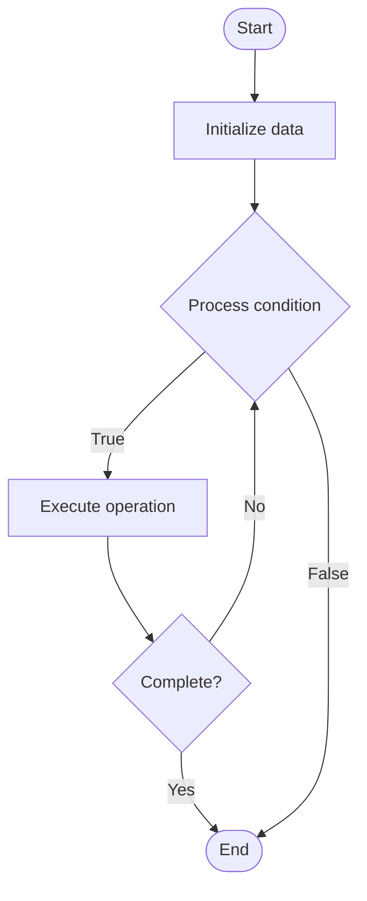

# Documentation Generation

1. **Name of Algorithm**  

## Code Files


## Algorithm Visualization

### Flowchart (ASCII)


```
Documentation Generation Flowchart:

┌─────────────┐
│   Start     │
└──────┬──────┘
       │
       ▼
┌─────────────┐
│  Initialize │
│   data      │
└──────┬──────┘
       │
       ▼
┌─────────────┐      Yes
│  Process   ├──────┐
│  condition?│      │
└──────┬──────┘      │
       │ No          │
       ▼             │
┌─────────────┐      │
│  Execute   │      │
│  operation │      │
└──────┬──────┘      │
       │             │
       └─────────────┘
       │
       ▼
┌─────────────┐
│    End      │
└─────────────┘
```


### Step-by-Step Execution


```
Documentation Generation Step-by-Step Execution:

Input: [example data]

Step 1: Initialize
State: [initial state]

Step 2: Process
State: [intermediate state]

Step 3: Finalize
State: [final state]

Result: [output]
```


### Interactive Flowchart (Mermaid)





> **Note**: Mermaid diagrams are rendered automatically on GitHub. For local viewing, use a Mermaid-compatible Markdown viewer.
- [Python Implementation](semester_08/lecture_48_documentation/documentation_generation/algorithm.py)
- [Java Implementation](semester_08/lecture_48_documentation/documentation_generation/Algorithm.java)
- [Python Tests](semester_08/lecture_48_documentation/documentation_generation/test_algorithm.py)


   Documentation Generation

2. **What problem does it solve? (1 sentence)**  
   Automatically generates documentation from source code, comments, and specifications using tools and templates, ensuring documentation stays synchronized with code and reducing manual effort.

3. **Intuition (plain-language explanation)**  
   Like an automatic report generator: instead of manually writing documentation (tedious, error-prone), documentation generation tools read code and comments (like reading a database) and automatically create formatted documentation (like generating a report) - when code changes, docs update automatically.

4. **Inputs & Outputs**  
   - Input: Source code, docstrings, comments, API specifications, documentation templates.  
   - Output: Generated documentation (HTML, PDF, Markdown), API references, formatted docs.

5. **Step-by-step description (5–10 lines max)**  
1. Parse code: extract code structure, functions, classes, docstrings.
2. Extract metadata: gather information from docstrings, annotations, comments.
3. Process specifications: parse API specifications (OpenAPI, GraphQL schema, etc.).
4. Apply templates: use templates to format documentation (HTML, Markdown, etc.).
5. Generate structure: create navigation, indexes, cross-references.
6. Format output: produce formatted documentation (HTML pages, PDF, etc.).
7. Link references: create links between related documentation sections.
8. Validate: check for missing or incomplete documentation.
9. Deploy: publish generated documentation to documentation site.

6. **Tiny example (hand-simulated)**  
   Python project with Sphinx → parse .py files → extract docstrings → read conf.py config → apply Sphinx templates → generate HTML docs → create index, API reference, tutorials → deploy to Read the Docs → documentation automatically updates on code changes.

7. **Time & Space Complexity**  
   - Time: O(n) where n is code size (parsing and processing), O(m) for template rendering where m is documentation size.  
   - Space: O(d) where d is generated documentation size.

8. **Strengths**  
- Automation: reduces manual documentation effort.
- Consistency: ensures consistent documentation format.
- Synchronization: keeps docs in sync with code automatically.

9. **Weaknesses / limitations**  
- Quality depends on source: poor code comments produce poor docs.
- Tool dependency: requires specific documentation tools and formats.
- Customization: may require customization for specific needs.

10. **Compare with alternatives**  
    Alternatives: Manual Documentation, Wiki Systems, Markdown Files, Documentation Sites, Code Hosting Docs

11. **30-second explanation (your own words)**  
    Automatically generates documentation from source code, comments, and specifications using tools and templates, ensuring documentation stays synchronized with code and reducing manual effort.

*Sources: Adapted from standard university textbooks and Wikipedia summaries.*
