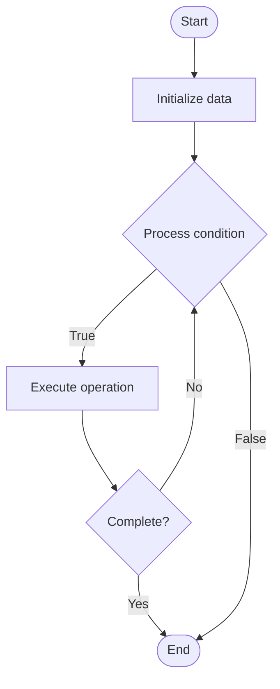

# Technical Writing

## Учебные материалы

- [Школьный уровень](school.ru.md)
- [Университетский уровень](univer.ru.md)

## Algorithm Visualization

### Flowchart (ASCII)

```
Technical Writing Flowchart:

┌─────────────┐
│   Start     │
└──────┬──────┘
       │
       ▼
┌─────────────┐
│  Initialize │
│   data      │
└──────┬──────┘
       │
       ▼
┌─────────────┐      Yes
│  Process   ├──────┐
│  condition?│      │
└──────┬──────┘      │
       │ No          │
       ▼             │
┌─────────────┐      │
│  Execute   │      │
│  operation │      │
└──────┬──────┘      │
       │             │
       └─────────────┘
       │
       ▼
┌─────────────┐
│    End      │
└─────────────┘
```

### Step-by-Step Execution

```
Technical Writing Step-by-Step Execution:

Input: [example data]

Step 1: Initialize
State: [initial state]

Step 2: Process
State: [intermediate state]

Step 3: Finalize
State: [final state]

Result: [output]
```

### Interactive Flowchart (Mermaid)



> **Note**: Mermaid diagrams are rendered automatically on GitHub. For local viewing, use a Mermaid-compatible Markdown viewer.

- [Python Implementation](/code/semester_08/lecture_48_documentation/technical_writing/algorithm.py)
- [Java Implementation](/code/semester_08/lecture_48_documentation/technical_writing/Algorithm.java)
- [Python Tests](/code/semester_08/lecture_48_documentation/technical_writing/test_algorithm.py)

What problem does it solve? (1 sentence)  
   Creates clear, accurate, and accessible technical documentation that explains complex concepts, procedures, and systems to both technical and non-technical audiences.

Intuition (plain-language explanation)  
   Like translating technical jargon into plain language: technical writing takes complex technical information (like a foreign language) and translates it into clear, understandable documentation (like a translation) - good technical writing is like a good teacher: explains complex things simply, with examples and structure.

Inputs & Outputs  

  - Input: Technical information, target audience, documentation requirements, style guides.  
  - Output: Clear technical documentation, user guides, tutorials, reference materials.

Step-by-step description (5–10 lines max)  
Understand audience: identify target audience (developers, end users, administrators).
Gather information: collect technical details, specifications, and requirements.
Structure content: organize information logically (tutorials, reference, guides).
Write clearly: use simple language, avoid jargon, explain technical terms.
Add examples: include practical examples and use cases.
Use visuals: incorporate diagrams, screenshots, and illustrations.
Review: edit for clarity, accuracy, and completeness.
Test: verify procedures and examples work correctly.
Iterate: improve based on feedback and usage.

Tiny example (hand-simulated)  
   Write deployment guide → audience: DevOps engineers → structure: prerequisites → installation → configuration → verification → troubleshooting → include: commands, config examples, diagrams → test: follow guide step-by-step → verify: all steps work → publish: clear, accurate deployment guide.

Time & Space Complexity  

  - Time: O(c) where c is content complexity (writing and editing time).  
  - Space: O(d) where d is documentation size (text, images, examples).

Strengths  

- Clarity: makes complex topics accessible to readers.
- Accuracy: ensures information is correct and up-to-date.
- Usability: helps users accomplish tasks effectively.

Weaknesses / limitations  

- Time consuming: requires significant time and effort.
- Skill required: needs technical writing expertise.
- Maintenance: requires updates as technology evolves.

Compare with alternatives  
    Alternatives: Code Comments, Video Tutorials, Interactive Guides, Community Documentation, AI-Generated Docs

30-second explanation (your own words)  
    Creates clear, accurate, and accessible technical documentation that explains complex concepts, procedures, and systems to both technical and non-technical audiences.

*Sources: Adapted from standard university textbooks and Wikipedia summaries.*


## References

- [Technical writing](https://en.wikipedia.org/wiki/Technical_writing) - Wikipedia


## Real-World Applications

- Search engines and indexing
- Database lookups

- Search engines and indexing
- Database lookups

- Search engines and indexing
- Database lookups
## Historical Context

Technical writing is a specialized form of communication used by industrial and scientific organizations to clearly and accurately convey complex information to customers, employees, assembly workers, engineers, scientists and other users who may reference this form of content to complete a task or research a subject. Most technical writing relies on plain language (PL), supported by easy-to-under
