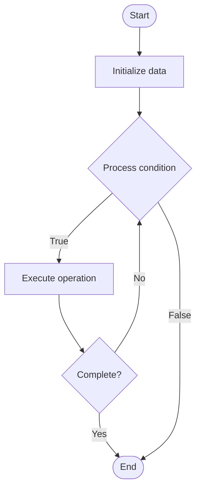

# User Guides

1. **Name of Algorithm**  

## Code Files


## Algorithm Visualization

### Flowchart (ASCII)


```
User Guides Flowchart:

┌─────────────┐
│   Start     │
└──────┬──────┘
       │
       ▼
┌─────────────┐
│  Initialize │
│   data      │
└──────┬──────┘
       │
       ▼
┌─────────────┐      Yes
│  Process   ├──────┐
│  condition?│      │
└──────┬──────┘      │
       │ No          │
       ▼             │
┌─────────────┐      │
│  Execute   │      │
│  operation │      │
└──────┬──────┘      │
       │             │
       └─────────────┘
       │
       ▼
┌─────────────┐
│    End      │
└─────────────┘
```


### Step-by-Step Execution


```
User Guides Step-by-Step Execution:

Input: [example data]

Step 1: Initialize
State: [initial state]

Step 2: Process
State: [intermediate state]

Step 3: Finalize
State: [final state]

Result: [output]
```


### Interactive Flowchart (Mermaid)





> **Note**: Mermaid diagrams are rendered automatically on GitHub. For local viewing, use a Mermaid-compatible Markdown viewer.
- [Python Implementation](semester_08/lecture_48_documentation/user_guides/algorithm.py)
- [Java Implementation](semester_08/lecture_48_documentation/user_guides/Algorithm.java)
- [Python Tests](semester_08/lecture_48_documentation/user_guides/test_algorithm.py)


   User Guides

2. **What problem does it solve? (1 sentence)**  
   Provides step-by-step instructions and explanations to help end users learn and use software applications effectively, reducing support burden and improving user satisfaction.

3. **Intuition (plain-language explanation)**  
   Like a user manual for a car: user guides explain how to use software (like a car manual explains how to drive) - they provide step-by-step instructions, explain features, and help users accomplish tasks (like 'how to change a tire' in a car manual).

4. **Inputs & Outputs**  
   - Input: Software features, user workflows, screenshots, step-by-step procedures, use cases.  
   - Output: User-friendly guides, tutorials, how-to articles, getting started guides.

5. **Step-by-step description (5–10 lines max)**  
1. Identify user tasks: determine common tasks users need to accomplish.
2. Create workflows: map out step-by-step procedures for each task.
3. Write instructions: create clear, numbered steps for each procedure.
4. Add visuals: include screenshots, diagrams, and illustrations.
5. Provide examples: include real-world examples and use cases.
6. Organize: structure guides by topic, difficulty, or user journey.
7. Test: follow guides as a new user to verify clarity.
8. Gather feedback: collect user feedback to improve guides.
9. Update: keep guides current with software changes.

6. **Tiny example (hand-simulated)**  
   User guide: 'How to Create an Account' → step 1: go to website → step 2: click 'Sign Up' → step 3: enter email and password → step 4: verify email → step 5: complete profile → includes: screenshots, tips, troubleshooting → user follows guide → successfully creates account.

7. **Time & Space Complexity**  
   - Time: O(t) where t is number of tasks and their complexity.  
   - Space: O(g) where g is guide size (text, images, examples).

8. **Strengths**  
- User empowerment: enables users to help themselves.
- Reduces support: decreases support requests and tickets.
- Better experience: improves user satisfaction and adoption.

9. **Weaknesses / limitations**  
- Maintenance: requires updates when software changes.
- Completeness: covering all features can be extensive.
- User engagement: some users may not read guides.

10. **Compare with alternatives**  
    Alternatives: Video Tutorials, Interactive Tutorials, In-App Help, Support Tickets, Community Forums

11. **30-second explanation (your own words)**  
    Provides step-by-step instructions and explanations to help end users learn and use software applications effectively, reducing support burden and improving user satisfaction.

*Sources: Adapted from standard university textbooks and Wikipedia summaries.*
